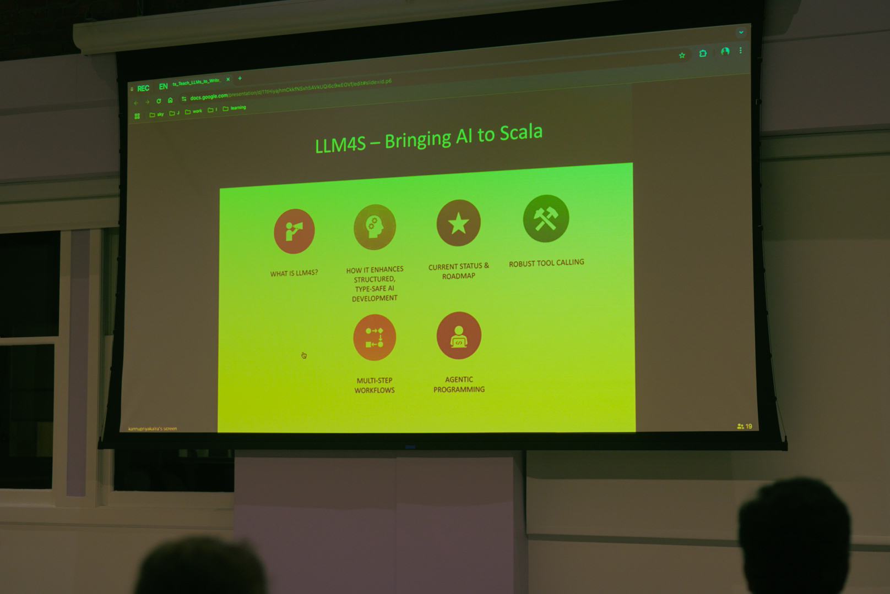
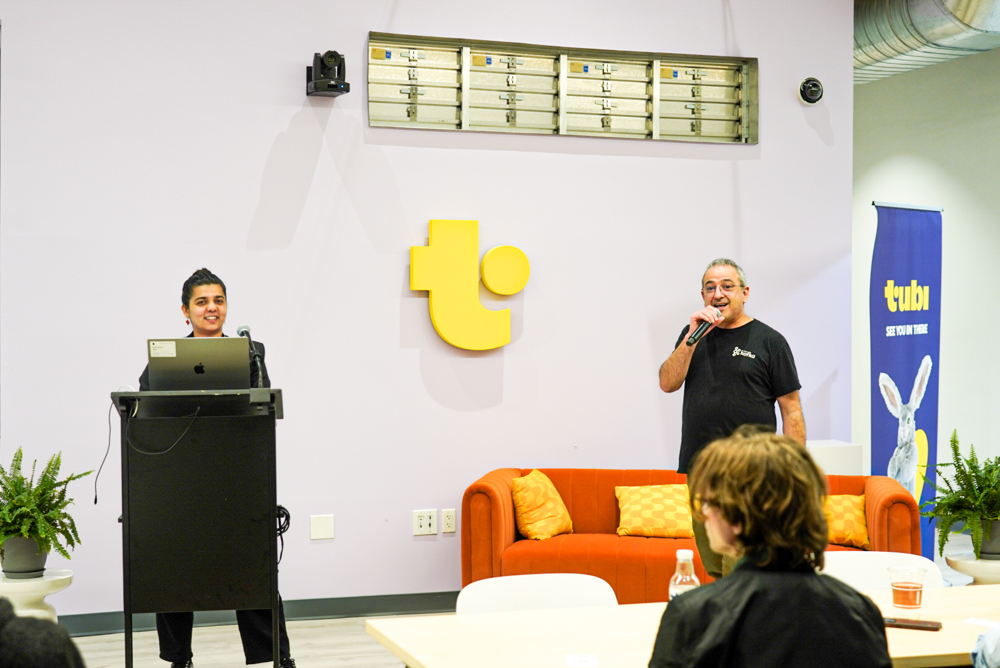
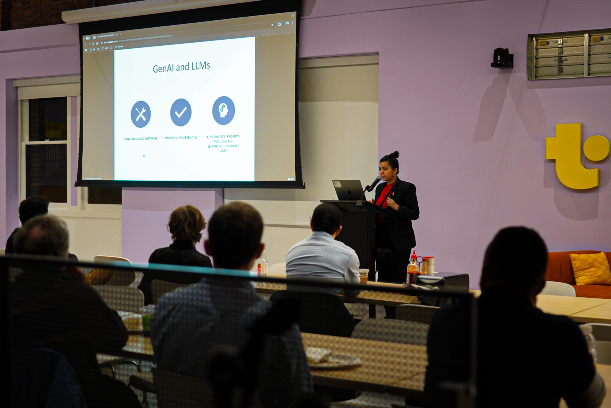
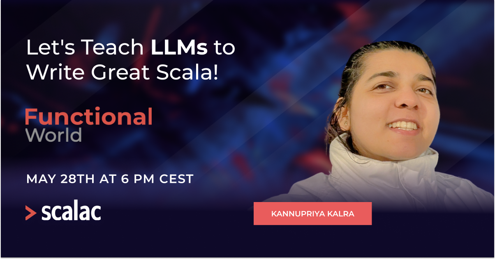
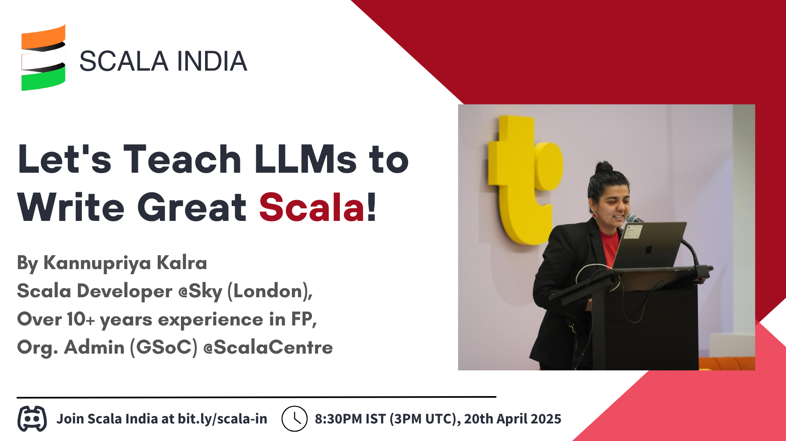
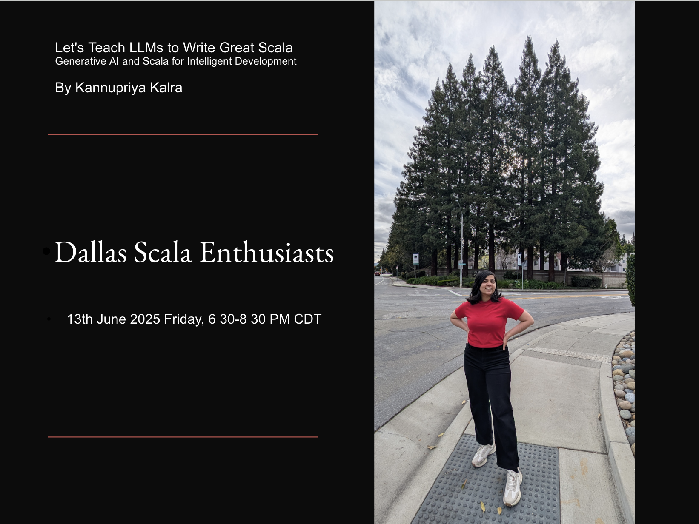
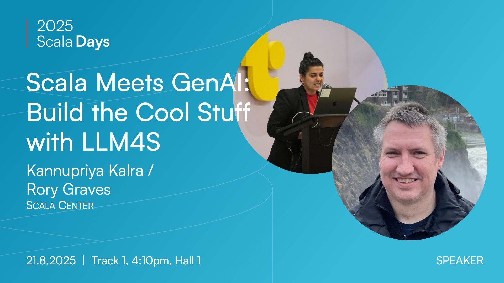
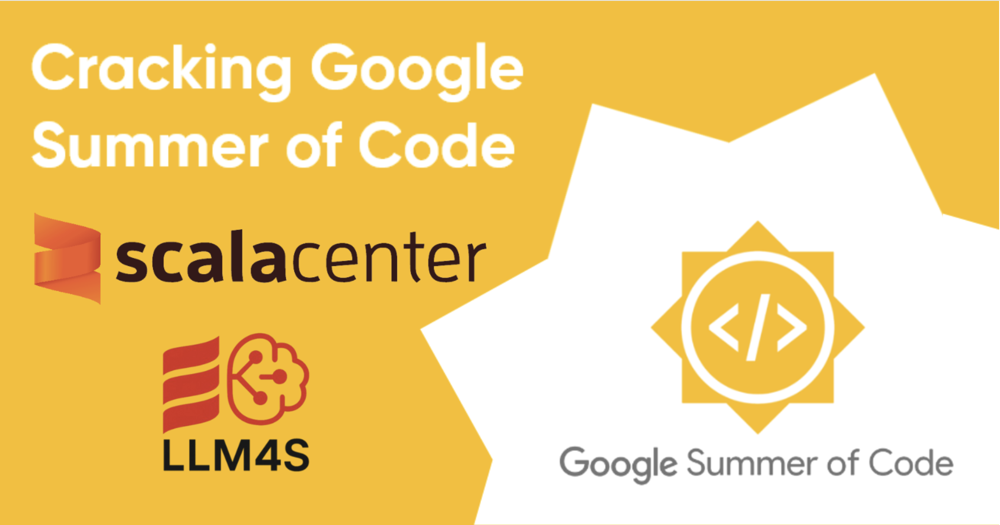

# LLM4S - Large Language Models for Scala

<h4 align="center">
    <a href="https://github.com/llm4s/llm4s/blob/main/LICENSE">
        
    </a>
    <a href="https://discord.gg/4uvTPn6qww">
        
    </a>
</h4>
<h4 align="center">
    
</h4>

## Overview

LLM4S provides a simple, robust, and scalable framework for building LLM applications in Scala. While most LLM work is done in Python, we believe that Scala offers a fundamentally better foundation for building reliable, maintainable AI-powered applications.

<br>

<p align="center">
  
  <br>
  <em></em>
</p>

<br>

> **Note:** This is a work in progress project and is likely to change significantly over time.

## Why Scala for LLMs?

- **Type Safety**: Catch errors at compile time rather than runtime
- **Functional Programming**: Immutable data structures and pure functions for more predictable code
- **JVM Ecosystem**: Access to a vast array of libraries and tools
- **Concurrency**: Better handling of concurrent operations with Scala's actor model
- **Performance**: JVM performance with functional programming elegance

## Features

- **Containerized Workspace**: Secure execution environment for LLM-driven operations
- **Workspace Agent Interface**: Standardized protocol for file operations and command execution
- **Multi-Provider Support**: Planned support for multiple LLM providers (OpenAI, Anthropic, etc.)
- **Agent Trace Logging**: Detailed markdown logs of agent execution for debugging and analysis

## Project Structure

- **llm4s**: Main project - contains the core LLM4S framework
- **shared**: Shared code between main project and workspace runner
- **workspaceRunner**: Code that performs the requested actions on the workspace within the docker container
- **samples**: Usage examples demonstrating various features

## Getting Started

To get started with the LLM4S project, check out this teaser talk presented by **Kannupriya Kalra** at the Bay Area Scala Conference. This recording is essential for understanding where we’re headed:

🎥 **Teaser Talk:** https://www.youtube.com/watch?v=SXybj2P3_DE&ab_channel=SalarRahmanian


<br>

<p align="center">
  
  
  <br>
  <em>LLM4S was officially introduced at the Bay Area Scala Conference in San Francisco on February 25, 2025.</em>
</p>

<br>

### Setting Up Pre-commit Hooks

To ensure code quality, we use a Git pre-commit hook that automatically checks code formatting and runs tests before allowing commits:

```bash
# Install the pre-commit hook
./hooks/install.sh

# The hook will automatically:
# - Check code formatting with scalafmt
# - Compile code for both Scala 2.13 and 3
# - Run tests for both Scala versions

# To skip the hook temporarily (not recommended):
# git commit --no-verify
```

### Prerequisites

- JDK 21+
- SBT
- Docker (for containerized workspace)

### Building the Project

```bash
sbt compile

# For all supported Scala versions (2.13 and 3)
sbt +compile

# Build and test all versions
sbt buildAll
```

### Setup your LLM Environment

You will need an API key for either OpenAI (https://platform.openai.com/) or Anthropic (https://console.anthropic.com/)
other LLMS may be supported in the future (see the backlog).

Set the environment variables:

```
LLM_MODEL=openai/gpt-4o
OPENAI_API_KEY=<your_openai_api_key>
```

or Anthropic:

```
LLM_MODEL=anthropic/claude-3-7-sonnet-latest
ANTHROPIC_API_KEY=<your_anthropic_api_key>
```
or OpenRouter:

```
LLM_MODEL=openai/gpt-4o
OPENAI_API_KEY=<your_openai_api_key>
OPENAI_BASE_URL=https://openrouter.ai/api/v1
```


This will allow you to run the non-containerized examples.

### Running the Examples

```bash
# Using Scala 3
sbt "samples/runMain org.llm4s.samples.basic.BasicLLMCallingExample"
```

### Run containerised test

```bash
sbt docker:publishLocal
sbt "samples/runMain org.llm4s.samples.workspace.ContainerisedWorkspaceDemo"

# Using Scala 2.13
sbt ++2.13.14 "samples/runMain org.llm4s.samples.basic.BasicLLMCallingExample"
```

### Cross Compilation

LLM4S supports both Scala 2.13 and Scala 3.3. The codebase is set up to handle version-specific code through source directories:

- `src/main/scala` - Common code for both Scala 2.13 and 3.3
- `src/main/scala-2.13` - Scala 2.13 specific code
- `src/main/scala-3` - Scala 3 specific code

When you need to use version-specific features, place the code in the appropriate directory.

We've added convenient aliases for cross-compilation:

```bash
# Compile for all Scala versions
sbt compileAll

# Test all Scala versions
sbt testAll

# Both compile and test
sbt buildAll

# Publish for all versions
sbt publishAll
```

### Cross-Compilation Testing

We use specialized test projects to verify cross-version compatibility against the published artifacts. These tests ensure that the library works correctly across different Scala versions by testing against actual published JARs rather than local target directories.

```bash
# Run tests for both Scala 2 and 3 against published JARs
sbt testCross

# Full clean, publish, and test verification
sbt fullCrossTest
```

> **Note:** For detailed information about our cross-testing strategy and setup, see [crossTest/README.md](crossTest/README.md)

## Roadmap

Our goal is to implement Scala equivalents of popular Python LLM frameworks:

- [ ] * Single API access to multiple LLM providers (like LiteLLM) - llmconnect
- [ ] A comprehensive toolchain for building LLM apps (like LangChain/LangGraph) 
  - [ ] * RAG search
  - [ ] * tool calling
  - [ ] * logging/tracking/monitoring
- [ ] * An agentic framework (like PydanticAI, CrewAI)
  - [ ] Single agent
  - [ ] Multi-agent
- [ ] Tokenization utilities (port of tiktoken)
- [ ] Examples/ support
   - [ ] * Standard tool calling libraries
   - [ ] * examples of all use-cases
- [ ] stable platform -tests etc
- [ ] Scala Coding SWE Agent - an agent that can do SWE bench type tasks on Scala codebases.
   - [ ]  code maps 
   - [ ]  generation 
   - [ ]  templates for library use?


## Tool Calling

Tool calling is a critical integration - we aim to make it as simple as possible:

### Tool Signature Generation

Using ScalaMeta to automatically generate tool definitions from Scala methods:

```scala
/** My tool does some funky things with a & b...
 * @param a The first thing
 * @param b The second thing
 */
def myTool(a: Int, b: String): ToolResponse = {
  // Implementation
}
```

ScalaMeta extracts method parameters, types, and documentation to generate OpenAI-compatible tool definitions.

### Tool Call Mapping

Mapping LLM tool call requests to actual method invocations through:

- Code generation
- Reflection-based approaches
- ScalaMeta-based parameter mapping

### Secure Execution

Tools run in a protected Docker container environment to prevent accidental system damage or data leakage.

## Comprehensive Tracing System

LLM4S provides a powerful, configurable tracing system for monitoring, debugging, and analyzing your LLM applications with support for multiple backends.

### Tracing Modes

Configure tracing behavior using the `TRACING_MODE` environment variable:

```bash
# Send traces to Langfuse (default)
TRACING_MODE=langfuse
LANGFUSE_PUBLIC_KEY=pk-lf-your-key
LANGFUSE_SECRET_KEY=sk-lf-your-secret

# Print detailed traces to console with colors and token usage
TRACING_MODE=print

# Disable tracing completely
TRACING_MODE=none
```

### Basic Usage

```scala
import org.llm4s.trace.Tracing

// Create tracer based on TRACING_MODE environment variable
val tracer = Tracing.create()

// Trace events, completions, and token usage
tracer.traceEvent("Starting LLM operation")
tracer.traceCompletion(completion, model)
tracer.traceTokenUsage(tokenUsage, model, "chat-completion")
tracer.traceAgentState(agentState)
```
### Usage using starter kit `llm4s.g8`
#### A carefully crafted starter kit to unlock the power of llm4s
llm4s.g8 is a starter kit for building AI-powered applications using [llm4s].
Improved SDK usability and developer ergonomics. You can now spin up a fully working scala project with a single `sbt` command.
The starter kit comes pre-configured with best practices, prompt execution examples, CI, formatting hooks, unit testing, documentation, and cross-platform support.

Using `sbt`, do:
```
sbt new llm4s/llm4s.g8 \
--name=<your.project.name> \
--package=<your.organization> \
--version=0.1.0-SNAPSHOT \
--llm4s_version=<llm4s.version> \ # 0.1.1 is the latest version at the time of writing
--scala_version=<scala.version> \ # 2.x.x or Scala 3.x.x
--munit_version=<munit.version> \ # 1.1.1 is the latest version at the time of writing
--directory=<your.project.name> \
--force
```
to create new project.
Use the comprehensive [documentation](docs/llm4s-g8-starter-kit.md) to get started with the project using started kit.

----

## 📢 Talks & Presentations

See the talks being given by maintainers and open source developers globally and witness the engagement by developers around the world.

Stay updated with talks, workshops, and presentations about **LLM4S** happening globally. These sessions dive into the architecture, features, and future plans of the project.

<br>

<br>

<p align="center">
  
  
  
  
  

  <br>
  <br>
  <em>Snapshots from LLM4S talks held around the world 🌍.</em>
</p>

<br>

<br>


### Upcoming & Past Talks
| Date           | Event/Conference               | Talk Title                                                       | Location                                                                                                                     | Speaker Name                | Details URL                                                                                                                                                                                                                                                                                                                                                                                                                                                                                                                                                                                                                                                                                                                                                                                                                                                                                                                                                                                                                                                                                                                                                                                                                                                | Recording Link URL                                                                                   |
|----------------|--------------------------------|------------------------------------------------------------------|------------------------------------------------------------------------------------------------------------------------------|-----------------------------|-----------------------------------------------------------------------------------------------------------------------------------------------------------------------------------------------------------------------------------------------------------------------------------------------------------------------------------------------------------------------------------------------------------------------------------------------------------------------------------------------------------------------------------------------------------------------------------------------------------------------------------------------------------------------------------------------------------------------------------------------------------------------------------------------------------------------------------------------------------------------------------------------------------------------------------------------------------------------------------------------------------------------------------------------------------------------------------------------------------------------------------------------------------------------------------------------------------------------------------------------------------|--------------------------------------------------------------------------------------------------------|
| **25-Feb-2025** | Bay Area Scala                | Let's Teach LLMs to Write Great Scala! (Original version)        | Tubi office, San Francisco, CA, USA                                                                                           | Kannupriya Kalra            | [Event Info](https://lu.ma/5fz2y9or) <br> [Reddit Discussion](https://www.reddit.com/r/scala/comments/1ipr596/scala_meetup_san_francisco_designing_the_library/?share_id=3IdgjEpmpDcwoIFgNOy1d&utm_content=1&utm_medium=android_app&utm_name=androidcss&utm_source=share&utm_term=3) <br> [Mastodon Post](https://social.softinio.com/@softinio/statuses/01JM3MD5H0R4ZS5CHXN37S878E) <br> [Bluesky Post](https://bsky.app/profile/salarrahmanian.bsky.social/post/3li6lh3funk2q) <br> [X/Twitter Post](https://x.com/SalarRahmanian/status/1890575797947388070)                                                                                                                                                                                                                                                                                                                                                                                                                                                             | [Watch Recording](https://www.youtube.com/watch?v=SXybj2P3_DE&t=779s&ab_channel=SalarRahmanian)       |
| **20-Apr-2025** | Scala India                   | Let's Teach LLMs to Write Great Scala! (Updated from Feb 2025)   | India                                                                                                                        | Kannupriya Kalra            | [Event Info](https://www.linkedin.com/posts/activity-7318299169914249216-Sec-?utm_source=share&utm_medium=member_desktop&rcm=ACoAAA8qk7UBmvcZ2O7aAJfMpsdEXBvcKSNiHWM) <br> [Reddit Discussion](https://www.reddit.com/r/scala/comments/1k0r1c7/upcoming_scala_india_talk_on_topic_lets_teach/?share_id=aPCwPdh0wOkxuPfsU7f3j&utm_content=1&utm_medium=android_app&utm_name=androidcss&utm_source=share&utm_term=3) <br> [X/Twitter Post](https://x.com/themightysid888/status/1912758284509134866)                                                                                                                                                                                                                                                                                                                                                                                                                             | [Watch Recording](https://www.youtube.com/watch?v=PiUaVKuV0dM&ab_channel=ScalaIndia)                  |
| **28-May-2025** | Functional World 2025 by Scalac | Let's Teach LLMs to Write Great Scala! (Updated from Apr 2025)    | Gdansk, Poland                                                                                                               | Kannupriya Kalra            | [LinkedIn Post 1](https://www.linkedin.com/posts/scalac_ai-functionalworld-scala-ugcPost-7326538223818563584-U2Ru?utm_source=share&utm_medium=member_desktop&rcm=ACoAAA8qk7UBmvcZ2O7aAJfMpsdEXBvcKSNiHWM) <br> [LinkedIn Post 2](https://www.linkedin.com/posts/scalac_lets-teach-llms-to-write-great-scala-ugcPost-7332752921190625281-K2YD?utm_source=share&utm_medium=member_desktop&rcm=ACoAAA8qk7UBmvcZ2O7aAJfMpsdEXBvcKSNiHWM) <br> [Reddit Discussion](https://www.reddit.com/r/scala/comments/1krvvgv/meetup_lets_teach_llms_to_write_great_scala/) <br> [Meetup Link](https://www.meetup.com/functionalworld/events/307654612/?eventOrigin=group_upcoming_events) <br> [X/Twitter Post](https://x.com/FunctionalWorld/status/1920776605015674943) <br> [Scalendar Newsletter](https://www.linkedin.com/pulse/scalendar-may-2025-scalac-qck6e/?trackingId=aSO5CkxeSB2O0U4GPUxJuw%3D%3D) <br> [Scala Times Mention 1](https://scalatimes.com/ead904f5c2) <br> [Scala Times Mention 2](https://scalatimes.com/af935bf2d5) | [Watch Recording](https://www.youtube.com/watch?v=cNAmsIpSsgk&ab_channel=Scalac)                      |
| **13-Jun-2025** | Dallas Scala Enthusiasts      | Let's Teach LLMs to Write Great Scala! (Updated from May 2025)   | Dallas, Texas, USA                                                                                                           | Kannupriya Kalra            | [Meetup Event](https://www.meetup.com/dallas-scala-enthusiasts/events/307717420/?eventOrigin=find_page%24all&recId=3039f9ea-2023-4bb5-b0f4-7d325ea02fec&recSource=event-search&searchId=a40d274c-6d49-4b6c-9b59-16e7e24e7ae6&utm_source=chatgpt.com) <br> [Scalendar June Newsletter](https://www.linkedin.com/pulse/scalendar-june-2025-scalac-fmiwe/?trackingId=ifE4kllzPvQvBqItbqXL4w%3D%3D) <br> [LinkedIn Post](https://www.linkedin.com/posts/kannupriyakalra_scala-ai-llm4s-activity-7338339521807212544-t5gT?utm_source=share&utm_medium=member_desktop&rcm=ACoAAA8qk7UBmvcZ2O7aAJfMpsdEXBvcKSNiHWM) <br> [X/Twitter Post](https://x.com/KannupriyaKalra/status/1932864594025836700) <br> [Reddit Discussion](https://www.reddit.com/r/scala/comments/1l9iheb/talk_llm4s_talk_in_dallas_scala_meets_ai_june_13/?utm_source=share&utm_medium=web3x&utm_name=web3xcss&utm_term=1&utm_content=share_button) <br> [Bluesky Post](https://bsky.app/profile/kannupriyakalra.bsky.social/post/3lrfuplb3oc2n) <br> [Mastodon Post](https://functional.cafe/@kannupriyakalra/114672918629990024) | [Watch Recording](https://www.youtube.com/watch?v=-PnsSSWTye0&ab_channel=DallasScalaEnthusiasts)     |
| **13-Aug-2025** | London Scala Users Group      | Scala Meets GenAI: Build the Cool Stuff with LLM4S               | [The Trade Desk](https://www.thetradedesk.com/) office, London, UK                                                            | Kannupriya Kalra, Rory Graves | Event details to be announced                                                                                                                                                                                                                                                                                                                                                                                                                                                                                                                                                                                                                                                                                                                                                                                                                                                                                                                                                                                                                                                           | Recording will be posted once the event is done                                                      |
| **21-Aug-2025** | Scala Days 2025               | Scala Meets GenAI: Build the Cool Stuff with LLM4S               | SwissTech Convention Center, [EPFL](https://www.epfl.ch/en/) (École Polytechnique Fédérale de Lausanne) campus, Lausanne, Switzerland | Kannupriya Kalra, Rory Graves | [Talk Info](https://scaladays.org/editions/2025/talks/scala-meets-genai-build-the) <br> [LinkedIn Post](https://www.linkedin.com/feed/update/urn:li:activity:7348123421945262080/) <br> [X/Twitter Post](https://x.com/KannupriyaKalra/status/1942369453267947900) <br> [Reddit Discussion](https://www.reddit.com/r/scala/comments/1lua1ud/talk_llm4s_at_scala_days_2025_scala_meets_genai/) <br> [Bluesky Post](https://bsky.app/profile/kannupriyakalra.bsky.social/post/3ltfyhmlsi22p) <br> [Mastodon Post](https://functional.cafe/@kannupriyakalra/114814671581110365) | Recording will be posted once the event is done                                                      |


> 📝 *Want to invite us for a talk or workshop? Reach out via our respective emails or connect on Discord: [https://discord.gg/4uvTPn6qww](https://discord.gg/4uvTPn6qww)*


### Why You Should Contribute to LLM4S?

- Build AI-powered applications in a statically typed, functional language designed for large systems.
- Help shape the Scala ecosystem’s future in the AI/LLM space.
- Learn modern LLM techniques like zero-shot prompting, tool calling, and agentic workflows.
- Collaborate with experienced Scala engineers and open-source contributors.
- Gain real-world experience working with Dockerized environments and multi-LLM providers.
- Contribute to a project that offers you the opportunity to become a mentor or contributor funded by Google through its [Google Summer of Code (GSoC)](https://summerofcode.withgoogle.com/) program.
- Join a global developer community focused on type-safe, maintainable AI systems.

## Continuous Integration (CI)

LLM4S uses GitHub Actions for continuous integration to ensure code quality and compatibility across different platforms and Scala versions.

### CI Workflows

#### Main CI Pipeline (`ci.yml`)
Our unified CI workflow runs on every push and pull request to main/master branches:

- **Quick Checks**: Fast-failing checks for code formatting and compilation
- **Cross-Platform Testing**: Tests run on Ubuntu and Windows with Scala 2.13.16 and 3.7.1
- **Template Validation**: Verifies the g8 template works correctly
- **Caching**: Optimized caching strategy with Coursier for faster builds

#### Claude Code Review (`claude-code-review.yml`)
Automated AI-powered code review for pull requests:

- **Automatic Reviews**: Trusted PRs get automatic Claude reviews
- **Security**: External PRs require manual trigger by maintainers
- **Manual Trigger**: Maintainers can request reviews with `@claude` comment

#### Release Pipeline (`release.yml`)
Automated release process triggered by version tags:

- **Pre-release Checks**: Runs full CI suite before publishing
- **GPG Signing**: Artifacts are signed for security
- **Maven Central**: Publishes to Sonatype/Maven Central

### Running CI Locally

You can run the same checks locally before pushing:

```bash
# Check formatting
sbt scalafmtCheckAll

# Compile all Scala versions
sbt +compile

# Run all tests
sbt +test

# Full build (compile + test)
sbt buildAll
```

## Contributing

Interested in contributing? Start here:

 **LLM4S GitHub Issues:** https://lnkd.in/eXrhwgWY

## Join the Community

Want to be part of developing this and interact with other developers? Join our Discord community!

 **LLM4S Discord:** https://lnkd.in/eb4ZFdtG

## Google Summer of Code (GSoC)

<br>

<p align="center">
  
  <br>
  <em>LLM4S was selected for GSoC 2025 under the Scala Center Organisation.</em>
</p>

<br>


This project is also participating in **Google Summer of Code (GSoC) 2025**! If you're interested in contributing to the project as a contributor, check out the details here:

👉 **Scala Center GSoC Ideas:** [https://lnkd.in/enXAepQ3](https://lnkd.in/enXAepQ3)

To know everything about GSoC and how it works, check out this talk:

🎥 **GSoC Process Explained:** [https://lnkd.in/e_dM57bZ](https://lnkd.in/e_dM57bZ)

To learn about the experience of GSoC contributors of LLM4S, check out their blogs in the section below.

📚 **Explore Past GSoC Projects with Scala Center:** [https://www.gsocorganizations.dev/organization/scala-center/](https://www.gsocorganizations.dev/organization/scala-center/)  
This page includes detailed information on all GSoC projects with Scala Center from past years — including project descriptions, code repositories, contributor blogs, and mentor details.


### 👥 GSoC Contributor Onboarding Resources

> Hello GSoCers and future GSoC aspirants! Here are some essential onboarding links to help you collaborate and stay organized within the LLM4S community.

- 🔗 **LLM4S GSoC GitHub Team**:  
  You have been invited to join the LLM4S GitHub team for GSoC participants. Accepting this invite will grant you access to internal resources and coordination tools.  
  👉 [https://github.com/orgs/llm4s/teams/gsoc/members](https://github.com/orgs/llm4s/teams/gsoc/members)

- 📌 **Private GSoC Project Tracking Board**:  
  Once you're part of the team, you will have access to our private GSoC tracking board. This board helps you track tasks, timelines, and project deliverables throughout the GSoC period.  
  👉 [https://github.com/orgs/llm4s/projects/3](https://github.com/orgs/llm4s/projects/3)


## GSoC 2025: Google Open Source Funded Project Ideas from LLM4S

### LLM4S - Implement an agentic toolkit for Large Language Models

- **Contributor:** [Elvan Konukseven](https://github.com/elvankonukseven)
- **LinkedIn:** [https://www.linkedin.com/in/elvan-konukseven/](https://www.linkedin.com/in/elvan-konukseven/) | **Email:** [elvankonukseven0@gmail.com](mailto:elvankonukseven0@gmail.com) | **Discord:** `elvan_31441`
- **Mentors:** [Kannupriya Kalra](https://www.linkedin.com/in/kannupriyakalra/) (Email: [kannupriyakalra@gmail.com](mailto:kannupriyakalra@gmail.com)), [Rory Graves](https://www.linkedin.com/in/roryjgraves/) (Email: [rory.graves@fieldmark.co.uk](mailto:rory.graves@fieldmark.co.uk))
- **Announcement:** [Official Acceptance Post](https://www.linkedin.com/posts/elvan-konukseven_got-accepted-into-the-google-summer-of-code-activity-7326980179812139008-OoMU?utm_source=share&utm_medium=member_desktop&rcm=ACoAADmu6soBQhs2fe8_CNIw2ChlNe0Oon4E3G0) 
- **Contributor Blogs:** 📌 [elvankonukseven.com/blog](https://www.elvankonukseven.com/blog)
- **Work log:** 📌 [GitHub Project Board](https://github.com/users/elvankonukseven/projects/4/views/1)

### LLM4S - RAG in a box

- **Contributor:** [Gopi Trinadh Maddikunta](https://github.com/GOPITRINADH3561)
- **LinkedIn:** [https://www.linkedin.com/in/gopitrinadhmaddikunta/](https://www.linkedin.com/in/gopitrinadhmaddikunta/) | **Email:** [trinadh7341@gmail.com](mailto:trinadh7341@gmail.com) | **Discord:** `g3nadh_58439`
- **Mentors:** [Kannupriya Kalra](https://www.linkedin.com/in/kannupriyakalra/) (Email: [kannupriyakalra@gmail.com](mailto:kannupriyakalra@gmail.com)), [Rory Graves](https://www.linkedin.com/in/roryjgraves/) (Email: [rory.graves@fieldmark.co.uk](mailto:rory.graves@fieldmark.co.uk)), [Dmitry Mamonov](https://www.linkedin.com/in/dmamonov/) (Email: [dmitry.s.mamonov@gmail.com](mailto:dmitry.s.mamonov@gmail.com))
- **Announcement:** [Official Acceptance Post](https://www.linkedin.com/posts/gopitrinadhmaddikunta_gsoc-googlesummerofcode-scalacenter-activity-7328890778594803714-uP8t?utm_source=share&utm_medium=member_desktop&rcm=ACoAADmu6soBQhs2fe8_CNIw2ChlNe0Oon4E3G0) | [Midterm evaluation post](https://www.linkedin.com/posts/gopitrinadhmaddikunta_gsoc-gsoc2025-scalacenter-activity-7352132732191207424-NItx?utm_source=share&utm_medium=member_desktop&rcm=ACoAADFpDrQB56LGBguVZFlinC7-yOKG5O6RI70)
- **Contributor Blogs:** 📌 [Main Blog](https://gopitrinadh.site/blog) | 📌 [Scala at Light Speed – Part 1](https://gopitrinadh.site/scala-at-lightspeed-part1/) | 📌 [Scala at Light Speed – Part 2](https://gopitrinadh.site/scala-at-light-speed-gsoc-part2/)
- **Work log:**  📌 [Work Log → GitHub Project](https://github.com/users/GOPITRINADH3561/projects/1/views/1)


### LLM4S - Support image, voice and other LLM modalites

- **Contributor:** [Anshuman Awasthi](https://github.com/AnshumanAI)
- **LinkedIn:** [https://www.linkedin.com/in/let-me-try-to-fork-your-responsibilities/](https://www.linkedin.com/in/let-me-try-to-fork-your-responsibilities/) | **Email:** [mcs23026@iiitl.ac.in](mailto:mcs23026@iiitl.ac.in) | **Discord:** `anshuman23026`
- **Mentors:** [Kannupriya Kalra](https://www.linkedin.com/in/kannupriyakalra/) (Email: [kannupriyakalra@gmail.com](mailto:kannupriyakalra@gmail.com)), [Rory Graves](https://www.linkedin.com/in/roryjgraves/) (Email: [rory.graves@fieldmark.co.uk](mailto:rory.graves@fieldmark.co.uk))
- **Announcement:** [Official Acceptance Post](https://www.linkedin.com/posts/let-me-try-to-fork-your-responsibilities_big-announcement-im-thrilled-to-activity-7327724651726405635-3Y7V?utm_source=share&utm_medium=member_desktop&rcm=ACoAADmu6soBQhs2fe8_CNIw2ChlNe0Oon4E3G0) | [Midterm evaluation post](https://www.linkedin.com/posts/let-me-try-to-fork-your-responsibilities_gsoc-googlesummerofcode-opensource-activity-7352249524486066176-loNn?utm_source=share&utm_medium=member_desktop&rcm=ACoAADFpDrQB56LGBguVZFlinC7-yOKG5O6RI70)
- **Contributor Blogs:** 📌 [Anshuman's GSoC Journey](https://awesomegsoc.hashnode.dev/)
- **Work Log:** 📌 [GitHub Project Board](https://github.com/users/AnshumanAI/projects/2/views/1)

### LLM4S - Tracing support

- **Contributor:** [Shubham Vishwakarma](https://github.com/Vi-shub)
- **LinkedIn:** [https://www.linkedin.com/in/shubham-vish/](https://www.linkedin.com/in/shubham-vish/) | **Email:** [smsharma3121@gmail.com](mailto:smsharma3121@gmail.com) | **Discord:** `oxygen4076`
- **Mentors:** [Kannupriya Kalra](https://www.linkedin.com/in/kannupriyakalra/) (Email: [kannupriyakalra@gmail.com](mailto:kannupriyakalra@gmail.com)), [Rory Graves](https://www.linkedin.com/in/roryjgraves/) (Email: [rory.graves@fieldmark.co.uk](mailto:rory.graves@fieldmark.co.uk)), [Dmitry Mamonov](https://www.linkedin.com/in/dmamonov/) (Email: [dmitry.s.mamonov@gmail.com](mailto:dmitry.s.mamonov@gmail.com))
- **Announcement:** [Official Acceptance Post](https://www.linkedin.com/posts/shubham-vish_gsoc2025-scalacenter-llm4s-activity-7326533865836068864-kQVf?utm_source=share&utm_medium=member_desktop&rcm=ACoAADmu6soBQhs2fe8_CNIw2ChlNe0Oon4E3G0) |  [Midterm evaluation post](https://www.linkedin.com/posts/shubham-vish_gsoc-llm4s-scala-activity-7352409971654848512-Ulyt?utm_source=share&utm_medium=member_desktop&rcm=ACoAADFpDrQB56LGBguVZFlinC7-yOKG5O6RI70)
- **Contributor Blogs:** 📌 [Cracking the Code: My GSoC 2025 Story](https://shubhams-gsoc-journey.hashnode.dev/cracking-the-code-my-gsoc-2025-story)
- **Work log:** 📌 [GitHub Project Board](https://github.com/users/Vi-shub/projects/2/views/1)

  
Feel free to reach out to the contributors or mentors listed for any guidance or questions related to **GSoC 2026**.

## Maintainers

Want to connect with maintainers? The LLM4S project is maintained by:

- **Rory Graves** - [https://www.linkedin.com/in/roryjgraves/](https://www.linkedin.com/in/roryjgraves/) | Email: [rory.graves@fieldmark.co.uk](mailto:rory.graves@fieldmark.co.uk) | Discord: `rorybot1`
- **Kannupriya Kalra** - [https://www.linkedin.com/in/kannupriyakalra/](https://www.linkedin.com/in/kannupriyakalra/) | Email: [kannupriyakalra@gmail.com](mailto:kannupriyakalra@gmail.com) | Discord: `kannupriyakalra_46520`

## License

This project is licensed under the Apache License 2.0 - see the [LICENSE](LICENSE) file for details.

----------------
[llm4s]: https://github.com/llm4s/llm4s
[Scala 3]: https://dotty.epfl.ch/
[Scala 2]: https://www.scala-lang.org/