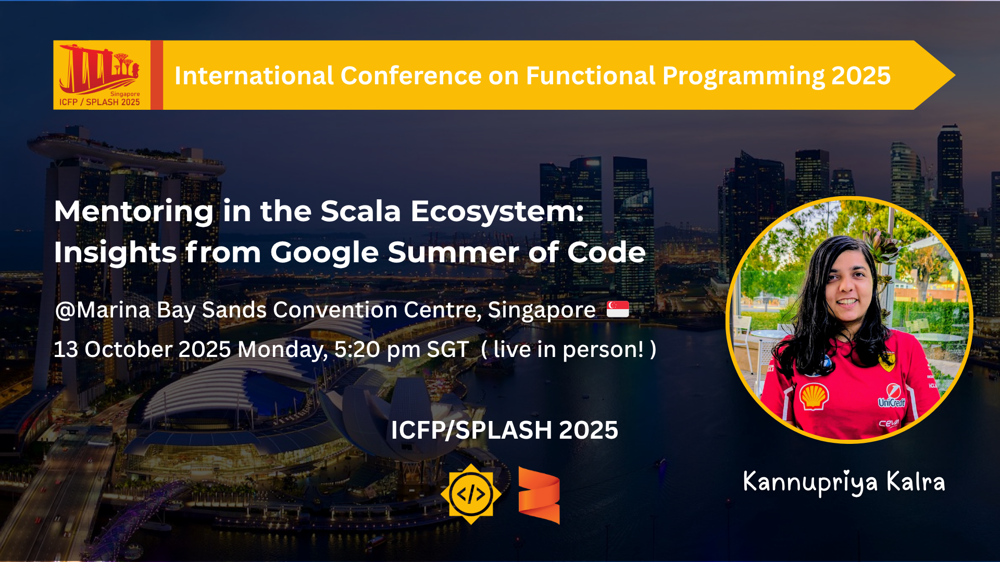

# LLM4S - Large Language Models for Scala

<h4 align="center">
    <a href="https://github.com/llm4s/llm4s/blob/main/LICENSE">
        
    </a>
    <a href="https://discord.gg/4uvTPn6qww">
        
    </a>
    <a href="https://codecov.io/gh/llm4s/llm4s">
        
    </a>
</h4>
<h4 align="center">
    
</h4>

## ⭐ Stars Over Time

[](https://star-history.com/#llm4s/llm4s&Date)


## Project Momentum


[](https://deepwiki.com/llm4s/llm4s)

## Overview

LLM4S provides a simple, robust, and scalable framework for building LLM applications in Scala. While most LLM work is done in Python, we believe that Scala offers a fundamentally better foundation for building reliable, maintainable AI-powered applications.

<p align="center">
  
  <br>
  <em></em>
</p>

<br>

> **Note:** This is a work in progress project and is likely to change significantly over time.

## Why Scala for LLMs?

- **Type Safety**: Catch errors at compile time, not in production.
- **Functional Programming**: Immutable data and pure functions for predictable, maintainable systems.
- **JVM Ecosystem**: Access to mature, production-grade libraries and tooling.
- **Concurrency**: Advanced models for safe, efficient parallelism.
- **Performance**: JVM speed with functional elegance.
- **Ecosystem Interoperability**: Seamless integration with enterprise JVM systems and cloud-native tooling.

## Features

- **Multi-Provider Support**: Connect seamlessly to multiple LLM providers (OpenAI, Anthropic, Google Gemini, Azure, Ollama, DeepSeek).
- **Execution Environments**: Run LLM-driven operations in secure, containerized or non-containerized setups.
- **Error Handling**: Robust mechanisms to catch, log, and recover from failures gracefully.
- **MCP Support**: Integration with Model Context Protocol for richer context management.
- **Agent Framework**: Build single or multi-agent workflows with standardized interfaces.
- **Multimodal Generation**: Support for text, image, voice, and other LLM modalities.
- **RAG (Retrieval-Augmented Generation)**: Built-in tools for search, embedding, retrieval workflows, and RAGAS evaluation with benchmarking harness.
- **Observability**: Detailed trace logging, monitoring, and analytics for debugging and performance insights.

## Architecture

```text
        ┌───────────────────────────┐
        │    LLM4S API Layer        │
        └──────────┬────────────────┘
                   │
          Multi-Provider Connector
        (OpenAI | Anthropic | DeepSeek | ...)
                   │
         ┌─────────┴─────────┐
         │ Execution Manager │
         └─────────┬─────────┘
                   │
        ┌──────────┴──────────┐
        │   Agent Framework   │
        └──────────┬──────────┘
                   │
      ┌────────────┴────────────┐
      │  RAG Engine + Tooling   │
      └────────────┬────────────┘
                   │
     ┌─────────────┴─────────────┐
     │   Observability Layer     │
     └───────────────────────────┘

```

## Project Structure

- **modules/core**: Core LLM4S framework
- **modules/workspace**: Workspace runner/client/shared
- **modules/crossTest**: Cross-version tests
- **modules/samples**: Usage examples
- **docs**: Documentation site and references
- **hooks**: Pre-commit hook installer

## Getting Started

To get started with the LLM4S project, check out this teaser talk presented by **Kannupriya Kalra** at the Bay Area Scala Conference. This recording is essential for understanding where we’re headed:

🎥 **Teaser Talk:** https://www.youtube.com/watch?v=SXybj2P3_DE&ab_channel=SalarRahmanian

<br>

<p align="center">
  
  
  <br>
  <em>LLM4S was officially introduced at the Bay Area Scala Conference in San Francisco on February 25, 2025.</em>
</p>

<br>

### Setting Up Pre-commit Hooks

To ensure code quality, we use a Git pre-commit hook that automatically checks code formatting and runs tests before allowing commits:

```bash
# Install the pre-commit hook
./hooks/install.sh

# The hook will automatically:
# - Check code formatting with scalafmt
# - Compile code for both Scala 2.13 and 3
# - Run tests for both Scala versions

# To skip the hook temporarily (not recommended):
# git commit --no-verify
```

### Prerequisites

- JDK 21+
- SBT
- Docker

#### Verify Java installation

```bash
java -version
```

#### Windows

Set `JAVA_HOME` and update your `PATH`.

#### macOS (Homebrew)

```bash
brew install openjdk@21
echo 'export PATH="/opt/homebrew/opt/openjdk@21/bin:$PATH"' >> ~/.zshrc
```

### Building the Project

```bash
sbt compile

# For all supported Scala versions (2.13 and 3)
sbt +compile

# Build and test all versions
sbt buildAll
```


### Setup your LLM Environment

You will need an API key for either OpenAI (https://platform.openai.com/) or Anthropic (https://console.anthropic.com/)
other LLMS may be supported in the future (see the backlog).

Set the environment variables:

```
LLM_MODEL=openai/gpt-4o
OPENAI_API_KEY=<your_openai_api_key>
```

or Anthropic:

```
LLM_MODEL=anthropic/claude-sonnet-4-5-latest
ANTHROPIC_API_KEY=<your_anthropic_api_key>
```

or OpenRouter:

```
LLM_MODEL=openai/gpt-4o
OPENAI_API_KEY=<your_openai_api_key>
OPENAI_BASE_URL=https://openrouter.ai/api/v1
```

or Z.ai:

```
LLM_MODEL=zai/GLM-4.7
ZAI_API_KEY=<your_zai_api_key>
ZAI_BASE_URL=https://api.z.ai/api/paas/v4
```

or DeepSeek:

```
LLM_MODEL=deepseek/deepseek-chat
DEEPSEEK_API_KEY=<your_deepseek_api_key>
# Optional: DEEPSEEK_BASE_URL defaults to https://api.deepseek.com
```

> **Migration Note:** The `LLMProvider.DeepSeek` case has been added to the sealed `LLMProvider` ADT. If you have exhaustive pattern matches on `LLMProvider`, add a `case LLMProvider.DeepSeek => ...` handler, or use a wildcard `case _ => ...` to gracefully handle future providers.

Or Cohere:

```
LLM_MODEL=cohere/command-r
COHERE_API_KEY=<your_cohere_api_key>
COHERE_BASE_URL=https://api.cohere.com
```

This will allow you to run the non-containerized examples.

### Running the Examples

```bash
# Using Scala 3
sbt "samples/runMain org.llm4s.samples.basic.BasicLLMCallingExample"
```

### Run containerized demo

```bash
sbt docker:publishLocal
sbt "workspaceSamples/runMain org.llm4s.samples.workspace.ContainerisedWorkspaceDemo"

# Using Scala 2.13
sbt ++2.13.16 "samples/runMain org.llm4s.samples.basic.BasicLLMCallingExample"
```

### Cross Compilation

LLM4S supports Scala 2.13 and Scala 3.7.1. The build supports version-specific code through source directories when needed:

- `src/main/scala` - Common code for all versions
- `src/main/scala-2.13` - Scala 2.13 specific code (add when needed)
- `src/main/scala-3` - Scala 3 specific code (add when needed)

When you need to use version-specific features, place the code in the appropriate directory.

We've added convenient aliases for cross-compilation:

```bash
# Compile for all Scala versions
sbt compileAll

# Test all Scala versions
sbt testAll

# Both compile and test
sbt buildAll

# Publish for all versions
sbt publishAll
```

### Cross-Compilation Testing

We use specialized test projects to verify cross-version compatibility against the published artifacts. These tests ensure that the library works correctly across different Scala versions by testing against actual published JARs rather than local target directories.

```bash
# Run tests for both Scala 2 and 3 against published JARs
sbt testCross

# Full clean, publish, and test verification
sbt fullCrossTest
```

> **Note:** For detailed information about our cross-testing strategy and setup, see [modules/crossTest/README.md](modules/crossTest/README.md)

## Roadmap

Our goal is to implement Scala equivalents of popular Python LLM frameworks, with **multi-provider, multimodal, and observability-first design** as core principles.

### 📋 Detailed Roadmap

**For the full roadmap including core framework features and agent phases, see the [LLM4S Roadmap](https://llm4s.org/reference/roadmap)**

The roadmap covers:
- **Core Framework Features**: Multi-provider LLM, image generation, speech, embeddings, tools, MCP
- **Agent Framework Phases**: Conversations, guardrails, handoffs, memory, streaming, built-in tools
- **Production Pillars**: Testing, API Stability, Performance, Security, Documentation, Observability
- **Path to v1.0.0**: Structured path to production release

### High-Level Goals

- [ ] Single API access to multiple LLM providers (like LiteLLM) - **llmconnect** ✅ *Complete*
- [ ] Comprehensive toolchain for building LLM apps (LangChain/LangGraph equivalent)
  - [x] Tool calling ✅ *Complete*
  - [x] RAG search & retrieval ✅ *Complete* (vector memory, embeddings, document Q&A)
  - [x] RAG evaluation & benchmarking ✅ *Complete* (RAGAS metrics, systematic comparison)
  - [x] Logging, tracking, and monitoring ✅ *Complete*
- [ ] Agentic framework (like PydanticAI, CrewAI)
  - [x] Single-agent workflows ✅ *Complete*
  - [x] Multi-agent handoffs ✅ *Complete*
  - [x] Memory system (in-memory, SQLite, vector) ✅ *Complete*
  - [x] Streaming events ✅ *Complete*
  - [x] Built-in tools module ✅ *Complete*
  - [ ] DAG-based orchestration 🚧 *In Progress*
- [ ] Tokenization utilities (Scala port of tiktoken) ✅ *Complete*
- [ ] Examples for all supported modalities and workflows ✅ *Complete*
- [ ] Stable platform with extensive test coverage 🚧 *In Progress*
- [ ] Scala Coding SWE Agent - perform SWE Bench–type tasks on Scala codebases
  - [ ] Code maps, code generation, and library templates

## Tool Calling

Tool calling is a critical integration - designed to work seamlessly with **multi-provider support** and **agent frameworks**.
We use ScalaMeta to auto-generate tool definitions, support dynamic mapping, and run in **secure execution environments**.

Tools can run:

- In **containerized sandboxes** for isolation and safety.
- In **multi-modal pipelines** where LLMs interact with text, images, and voice.
- With **observability hooks** for trace analysis.

### Tool Signature Generation

Using ScalaMeta to automatically generate tool definitions from Scala methods:

```scala
/** My tool does some funky things with a & b...
 * @param a The first thing
 * @param b The second thing
 */
def myTool(a: Int, b: String): ToolResponse = {
  // Implementation
}
```

ScalaMeta extracts method parameters, types, and documentation to generate OpenAI-compatible tool definitions.

### Tool Call Mapping

Mapping LLM tool call requests to actual method invocations through:

- Code generation
- Reflection-based approaches
- ScalaMeta-based parameter mapping

### Secure Execution

Tools run in a protected Docker container environment to prevent accidental system damage or data leakage.

## Comprehensive Tracing & Observability

Tracing isn’t just for debugging - it’s the backbone of understanding model behavior.LLM4S’s observability layer includes:

- Detailed token usage reporting
- Multi-backend trace output (Langfuse, console, none)
- Agent state visualization
- Integration with monitoring dashboards

### Tracing Modes

Configure tracing behavior using the `TRACING_MODE` environment variable:

```bash
# Send traces to Langfuse (default)
TRACING_MODE=langfuse
LANGFUSE_PUBLIC_KEY=pk-lf-your-key
LANGFUSE_SECRET_KEY=sk-lf-your-secret

# Print detailed traces to console with colors and token usage
TRACING_MODE=print

# Disable tracing completely
TRACING_MODE=none
```

### Basic Usage

```scala
import org.llm4s.trace.{ EnhancedTracing, Tracing }

// Create tracer from environment (Result), fallback to console tracer
val tracer: Tracing = EnhancedTracing
  .createFromEnv()
  .fold(_ => Tracing.createFromEnhanced(new org.llm4s.trace.EnhancedConsoleTracing()), Tracing.createFromEnhanced)

// Trace events, completions, and token usage
tracer.traceEvent("Starting LLM operation")
tracer.traceCompletion(completion, completion.model) // prefer the model reported by the API
tracer.traceTokenUsage(tokenUsage, completion.model, "chat-completion")
tracer.traceAgentState(agentState)
```

### Usage using starter kit `llm4s.g8`

#### A carefully crafted starter kit to unlock the power of llm4s

> **Note:** The LLM4S template has moved to its own repository for better maintainability and independent versioning.

The llm4s.g8 starter kit helps you quickly create AI-powered applications using llm4s.
It is a starter kit for building AI-powered applications using [llm4s][llm4s] with improved SDK usability and developer ergonomics. You can now spin up a fully working scala project with a single `sbt` command.
The starter kit comes pre-configured with best practices, prompt execution examples, CI, formatting hooks, unit testing, documentation, and cross-platform support.

**Template Repository:** [github.com/llm4s/llm4s.g8](https://github.com/llm4s/llm4s.g8)

Using `sbt`, do:

```
sbt new llm4s/llm4s.g8 \
--name=<your.project.name> \
--package=<your.organization> \
--version=0.1.0-SNAPSHOT \
--llm4s_version=<llm4s.version> \ # 0.1.1 is the latest version at the time of writing
--scala_version=<scala.version> \ # 2.x.x or Scala 3.x.x
--munit_version=<munit.version> \ # 1.1.1 is the latest version at the time of writing
--directory=<your.project.name> \
--force
```

to create new project.

For more information about the template, including compatibility matrix and documentation, visit the [template repository](https://github.com/llm4s/llm4s.g8).
Use the comprehensive [documentation](docs/llm4s-g8-starter-kit.md) to get started with the project using starter kit.

---

## Configuration: Unified Loaders

llm4s exposes a single configuration flow with sensible precedence:

- Precedence: `-D` system properties > `application.conf` (if your app provides it) > `reference.conf` defaults.
- Environment variables are wired via `${?ENV}` in `reference.conf` (no `.env` reader required).

Preferred typed entry points (PureConfig-backed via `Llm4sConfig`):

- Provider / model:
  - `Llm4sConfig.provider(): Result[ProviderConfig]` – returns the typed provider config (OpenAI/Azure/Anthropic/Ollama).
  - `LLMConnect.getClient(config: ProviderConfig): Result[LLMClient]` – builds a client from a typed config.
- Tracing:
  - `Llm4sConfig.tracing(): Result[TracingSettings]` – returns typed tracing settings.
  - `EnhancedTracing.create(settings: TracingSettings): EnhancedTracing` – builds an enhanced tracer from typed settings.
  - `Tracing.create(settings: TracingSettings): Tracing` – builds a legacy `Tracing` from typed settings.
- Embeddings:
  - `Llm4sConfig.embeddings(): Result[(String, EmbeddingProviderConfig)]` – returns `(provider, config)` with validation.
  - `EmbeddingClient.from(provider: String, cfg: EmbeddingProviderConfig): Result[EmbeddingClient]` – builds an embeddings client from typed config.

Recommended usage patterns:

- Model name for display: `Llm4sConfig.provider().map(_.model)` or prefer `completion.model` from API responses.
- Tracing:
  - For enhanced tracing: `Llm4sConfig.tracing().map(EnhancedTracing.create)`.
  - For legacy `Tracing`: `Llm4sConfig.tracing().map(Tracing.create)`.
- Workspace (samples): `WorkspaceConfigSupport.load()` to get `workspaceDir`, `imageName`, `hostPort`, `traceLogPath`.
- Embeddings sample (samples): `EmbeddingUiSettings.loadFromEnv`, `EmbeddingTargets.loadFromEnv`, `EmbeddingQuery.loadFromEnv` (sample helpers backed by `Llm4sConfig`).

### Config Keys → Typed Settings

Use these loaders to convert flat keys and HOCON paths into typed, validated settings used by the code:

- LLM model selection
  - Keys: `llm4s.llm.model` or `LLM_MODEL`
  - Type: `ProviderConfig` (with provider-specific subtypes)
  - Loader: `Llm4sConfig.provider()` + `LLMConnect.getClient(...)`

- Tracing configuration
  - Keys: `llm4s.tracing.mode` | `TRACING_MODE`, `LANGFUSE_URL`, `LANGFUSE_PUBLIC_KEY`, `LANGFUSE_SECRET_KEY`, `LANGFUSE_ENV`, `LANGFUSE_RELEASE`, `LANGFUSE_VERSION`
  - Type: `TracingSettings`
  - Loader: `Llm4sConfig.tracing()` → then `EnhancedTracing.create` or `Tracing.create`

- Workspace settings (samples)
  - Keys: `llm4s.workspace.dir` | `WORKSPACE_DIR`, `llm4s.workspace.image` | `WORKSPACE_IMAGE`, `llm4s.workspace.port` | `WORKSPACE_PORT`, `llm4s.workspace.traceLogPath` | `WORKSPACE_TRACE_LOG`
  - Type: `WorkspaceSettings`
  - Loader: `WorkspaceConfigSupport.load()`

- Embeddings: inputs and UI (samples)
  - Input paths: `EMBEDDING_INPUT_PATHS` or `EMBEDDING_INPUT_PATH` → `EmbeddingTargets.loadFromEnv()` → `EmbeddingTargets`
  - Query: `EMBEDDING_QUERY` → `EmbeddingQuery.loadFromEnv()` → `EmbeddingQuery`
  - UI knobs: `MAX_ROWS_PER_FILE`, `TOP_DIMS_PER_ROW`, `GLOBAL_TOPK`, `SHOW_GLOBAL_TOP`, `COLOR`, `TABLE_WIDTH` → `EmbeddingUiSettings.loadFromEnv()` → `EmbeddingUiSettings`

- Embeddings: provider configuration
  - Key: `EMBEDDING_PROVIDER` or `llm4s.embeddings.provider` (required)
  - Supported providers: `openai`, `voyage`, `ollama`
  - Type: `(String, EmbeddingProviderConfig)`
  - Loader: `Llm4sConfig.embeddings()`
  - Provider-specific keys:
    - **OpenAI**: `OPENAI_EMBEDDING_BASE_URL`, `OPENAI_EMBEDDING_MODEL`, `OPENAI_API_KEY`
    - **Voyage**: `VOYAGE_EMBEDDING_BASE_URL`, `VOYAGE_EMBEDDING_MODEL`, `VOYAGE_API_KEY`
    - **Ollama** (local): `OLLAMA_EMBEDDING_BASE_URL` (default: `http://localhost:11434`), `OLLAMA_EMBEDDING_MODEL`

- Provider API keys and endpoints
  - Keys: `OPENAI_API_KEY`, `OPENAI_BASE_URL`, `ANTHROPIC_API_KEY`, `ANTHROPIC_BASE_URL`, `AZURE_API_BASE`, `AZURE_API_KEY`, `AZURE_API_VERSION`, `OLLAMA_BASE_URL`, `GEMINI_BASE_URL`, `GOOGLE_API_KEY`, `DEEPSEEK_API_KEY`, `DEEPSEEK_BASE_URL`, `COHERE_BASE_URL`, `COHERE_API_KEY`
  - Type: concrete `ProviderConfig` (e.g., `OpenAIConfig`, `AnthropicConfig`, `AzureConfig`, `OllamaConfig`, `GeminiConfig`, `DeepSeekConfig`, `CohereConfig`)
  - Loader: `Llm4sConfig.provider()` → then provider-specific config constructors

Tracing

- Configure mode via `llm4s.tracing.mode` (default: `console`). Supported: `langfuse`, `console`, `noop`.
- Override with env: `TRACING_MODE=langfuse` (or system property `-Dllm4s.tracing.mode=langfuse`).
- Build tracers:
  - Typed: `Llm4sConfig.tracing().map(EnhancedTracing.create)` → `Result[EnhancedTracing]`
  - Legacy bridge: `Llm4sConfig.tracing().map(Tracing.create)`
  - Low-level: `LangfuseTracing.fromEnv()` → `Result[LangfuseTracing]`

Example (no application.conf required):

```
sbt -Dllm4s.llm.model=openai/gpt-4o -Dllm4s.openai.apiKey=sk-... "samples/runMain org.llm4s.samples.basic.BasicLLMCallingExample"
```

Or with environment variables (picked up via `reference.conf`):

```
export LLM_MODEL=openai/gpt-4o
export OPENAI_API_KEY=sk-...
sbt "samples/runMain org.llm4s.samples.basic.BasicLLMCallingExample"
```


## Continuous Integration (CI)

LLM4S uses GitHub Actions for continuous integration to ensure code quality and compatibility across different platforms and Scala versions.

### CI Workflows

#### Main CI Pipeline (`ci.yml`)

Our unified CI workflow runs on every push and pull request to main/master branches:

- **Quick Checks**: Fast-failing checks for code formatting and compilation
- **Cross-Platform Testing**: Tests run on Ubuntu and Windows with Scala 2.13.16 and 3.7.1
- **Template Validation**: Verifies the g8 template works correctly
- **Caching**: Optimized caching strategy with Coursier for faster builds

#### Claude Code Review (`claude-code-review.yml`)

Automated AI-powered code review for pull requests:

- **Automatic Reviews**: Trusted PRs get automatic Claude reviews
- **Security**: External PRs require manual trigger by maintainers
- **Manual Trigger**: Maintainers can request reviews with `@claude` comment

#### Release Pipeline (`release.yml`)

Automated release process triggered by version tags (format: `v0.1.11`):

- **Tag Format**: Must use `v` prefix (e.g., `v0.1.11`, not `0.1.11`)
- **Pre-release Checks**: Runs full CI suite before publishing
- **GPG Signing**: Artifacts are signed for security
- **Maven Central**: Publishes to Sonatype/Maven Central

See [RELEASE.md](RELEASE.md) for detailed release instructions.

### Running CI Locally

You can run the same checks locally before pushing:

```bash
# Check formatting
sbt scalafmtCheckAll

# Compile all Scala versions
sbt +compile

# Run all tests
sbt +test

# Full build (compile + test)
sbt buildAll
```

## Hands-On Sessions & Live Collaboration

Stay hands-on with **LLM4S**! Join us for interactive **mob programming** sessions, live debugging, and open-source collaboration. These events are great for developers, contributors, and anyone curious about Scala + GenAI.

<br>

<p align="center">
  
  <br>
  <em>🗓️ Weekly live coding and collaboration during LLM4S Dev Hour, join us every Sunday on Discord!</em>
</p>

<br>

| Date                                           | Session Title                                             | Description                                                                                                                                                                                                                                                                                                                                               | Location                            | Hosts                         | Details URL                                                                                                                                                                                                                                                                                                                                                                                                                                                       | Featured In                                                 |
| ---------------------------------------------- | --------------------------------------------------------- | --------------------------------------------------------------------------------------------------------------------------------------------------------------------------------------------------------------------------------------------------------------------------------------------------------------------------------------------------------- | ----------------------------------- | ----------------------------- | ----------------------------------------------------------------------------------------------------------------------------------------------------------------------------------------------------------------------------------------------------------------------------------------------------------------------------------------------------------------------------------------------------------------------------------------------------------------- | ----------------------------------------------------------- |
| **20-Jul-2025 onwards (Weekly Sundays)** | 🗓️ LLM4S Dev Hour - Weekly Live Coding & Collaboration | A weekly **mob programming** session where we code, debug, and learn together - open to all! <br><br> 📌 *Updates are shared by the host in the `#llm4s-dev-hour` Discord channel after each session.  [Weekly changing Luma invite link](https://luma.com/calendar/cal-Zd9BLb5jbZewxLA) (for scheduling in your calender)* | Online, London, UK (9am local time) | Kannupriya Kalra, Rory Graves | [LinkedIn](https://www.linkedin.com/posts/kannupriyakalra_ai-llms-scala-activity-7352669046288384000-av_n) <br><br> [Reddit1](https://www.reddit.com/r/scala/comments/1m4oxf6/llm4s_dev_hour_sundays_9am_london_time) <br><br> [Reddit2](https://www.reddit.com/r/scala/comments/1o6mkol/llm4s_dev_hour_weekly_live_coding_collaboration/?utm_source=share&utm_medium=web3x&utm_name=web3xcss&utm_term=1&utm_content=share_button) <br><br> [Bluesky](https://bsky.app/profile/kannupriyakalra.bsky.social/post/3lufjgszijk2o) <br><br> [Mastodon](https://functional.cafe/@kannupriyakalra/114885664201722837) <br><br> [X/Twitter](https://x.com/KannupriyaKalra/status/1946915693644890537) | [Scala Times – Issue #537](https://scalatimes.com/15edab7583) |

## 📢 Talks & Presentations

See the talks being given by maintainers and open source developers globally and witness the engagement by developers around the world.

Stay updated with talks, workshops, and presentations about **LLM4S** happening globally. These sessions dive into the architecture, features, and future plans of the project.

<p align="center">
  
  
  
  
  
  
  
  
  
  
  
  
  
  
  
  
  

</p>
<p align="center">
<br>
  <em>Snapshots from LLM4S talks held around the world 🌍.</em>
</p>

<br>
<br>

### Upcoming & Past Talks

| Date                | Event/Conference                         | Talk Title                                                      | Location                                                                                    | Speaker Name                  | Details URL                                                                                                                                                                                                                                                                                                                                                                                                                                                                                                                                                                                                                                                             | Recording Link URL                                                                            | Featured In                                                                                                                                                                                                                                                                                                                                                                                                                                                                                                                                                                                                                                                                                                                                                                                                                                                                                                                                                                                                                                                                                                                            |
|---------------------| ---------------------------------------- | --------------------------------------------------------------- | ------------------------------------------------------------------------------------------- | ----------------------------- | ----------------------------------------------------------------------------------------------------------------------------------------------------------------------------------------------------------------------------------------------------------------------------------------------------------------------------------------------------------------------------------------------------------------------------------------------------------------------------------------------------------------------------------------------------------------------------------------------------------------------------------------------------------------------- | --------------------------------------------------------------------------------------------- | -------------------------------------------------------------------------------------------------------------------------------------------------------------------------------------------------------------------------------------------------------------------------------------------------------------------------------------------------------------------------------------------------------------------------------------------------------------------------------------------------------------------------------------------------------------------------------------------------------------------------------------------------------------------------------------------------------------------------------------------------------------------------------------------------------------------------------------------------------------------------------------------------------------------------------------------------------------------------------------------------------------------------------------------------------------------------------------------------------------------------------------- |
| **25-Feb-2025**     | Bay Area Scala                           | Let's Teach LLMs to Write Great Scala! (Original version)       | Tubi office, San Francisco, CA, USA 🇺🇸                                                    | Kannupriya Kalra              | [Event Info](https://lu.ma/5fz2y9or) , [Reddit Discussion](https://www.reddit.com/r/scala/comments/1ipr596/scala_meetup_san_francisco_designing_the_library/?share_id=3IdgjEpmpDcwoIFgNOy1d&utm_content=1&utm_medium=android_app&utm_name=androidcss&utm_source=share&utm_term=3) , [Mastodon Post](https://social.softinio.com/@softinio/statuses/01JM3MD5H0R4ZS5CHXN37S878E) , [Bluesky Post](https://bsky.app/profile/salarrahmanian.bsky.social/post/3li6lh3funk2q) , [X/Twitter Post](https://x.com/SalarRahmanian/status/1890575797947388070) , [Meetup Event](https://www.meetup.com/scala-bay/events/306178503/?eventOrigin=group_past_events) | [Watch Recording](https://www.youtube.com/watch?v=SXybj2P3_DE&t=779s&ab_channel=SalarRahmanian)  | –                                                                                                                                                                                                                                                                                                                                                                                                                                                                                                                                                                                                                                                                                                                                                                                                                                                                                                                                                                                                                                                                                                                                     |
| **20-Apr-2025**     | Scala India                              | Let's Teach LLMs to Write Great Scala! (Updated from Feb 2025)  | India 🇮🇳                                                                                  | Kannupriya Kalra              | [Event Info](https://www.linkedin.com/posts/activity-7318299169914249216-Sec-?utm_source=share&utm_medium=member_desktop&rcm=ACoAAA8qk7UBmvcZ2O7aAJfMpsdEXBvcKSNiHWM) , [Reddit Discussion](https://www.reddit.com/r/scala/comments/1k0r1c7/upcoming_scala_india_talk_on_topic_lets_teach/?share_id=aPCwPdh0wOkxuPfsU7f3j&utm_content=1&utm_medium=android_app&utm_name=androidcss&utm_source=share&utm_term=3) , [X/Twitter Post](https://x.com/themightysid888/status/1912758284509134866)                                                                                                                                                                       | [Watch Recording](https://www.youtube.com/watch?v=PiUaVKuV0dM&ab_channel=ScalaIndia)             | –                                                                                                                                                                                                                                                                                                                                                                                                                                                                                                                                                                                                                                                                                                                                                                                                                                                                                                                                                                                                                                                                                                                                     |
| **28-May-2025**     | Functional World 2025 by Scalac          | Let's Teach LLMs to Write Great Scala! (Updated from Apr 2025)  | Gdansk, Poland 🇵🇱                                                                         | Kannupriya Kalra              | [LinkedIn Post 1](https://www.linkedin.com/posts/scalac_ai-functionalworld-scala-ugcPost-7326538223818563584-U2Ru) , [LinkedIn Post 2](https://www.linkedin.com/posts/scalac_lets-teach-llms-to-write-great-scala-ugcPost-7332752921190625281-K2YD) , [Reddit Discussion](https://www.reddit.com/r/scala/comments/1krvvgv/meetup_lets_teach_llms_to_write_great_scala/) , [Meetup Link](https://www.meetup.com/functionalworld/events/307654612/?eventOrigin=group_upcoming_events) , [X/Twitter Post](https://x.com/FunctionalWorld/status/1920776605015674943)                                                                                           | [Watch Recording](https://www.youtube.com/watch?v=cNAmsIpSsgk&ab_channel=Scalac)                 | [Scalendar (May 2025)](https://www.linkedin.com/pulse/scalendar-may-2025-scalac-qck6e/?trackingId=aSO5CkxeSB2O0U4GPUxJuw%3D%3D) , [Scala Times 1](https://scalatimes.com/ead904f5c2) , [Scala Times 2](https://scalatimes.com/af935bf2d5)                                                                                                                                                                                                                                                                                                                                                                                                                                                                                                                                                                                                                                                                                                                                                                                                                                                                                         |
| **13-Jun-2025**     | Dallas Scala Enthusiasts                 | Let's Teach LLMs to Write Great Scala! (Updated from May 2025)  | Dallas, Texas, USA 🇺🇸                                                                     | Kannupriya Kalra              | [Meetup Event](https://www.meetup.com/dallas-scala-enthusiasts/events/307717420/?eventOrigin=find_page%24all) , [LinkedIn Post](https://www.linkedin.com/posts/kannupriyakalra_scala-ai-llm4s-activity-7338339521807212544-t5gT) , [X/Twitter Post](https://x.com/KannupriyaKalra/status/1932864594025836700) , [Reddit Discussion](https://www.reddit.com/r/scala/comments/1l9iheb/talk_llm4s_talk_in_dallas_scala_meets_ai_june_13/) , [Bluesky Post](https://bsky.app/profile/kannupriyakalra.bsky.social/post/3lrfuplb3oc2n) , [Mastodon Post](https://functional.cafe/@kannupriyakalra/114672918629990024)                                        | [Watch Recording](https://www.youtube.com/watch?v=-PnsSSWTye0&ab_channel=DallasScalaEnthusiasts) | [Scalendar (June 2025)](https://www.linkedin.com/pulse/scalendar-june-2025-scalac-fmiwe/?trackingId=ifE4kllzPvQvBqItbqXL4w%3D%3D)                                                                                                                                                                                                                                                                                                                                                                                                                                                                                                                                                                                                                                                                                                                                                                                                                                                                                                                                                                                                         |
| **13-Aug-2025**     | London Scala Users Group                 | Scala Meets GenAI: Build the Cool Stuff with LLM4S              | [The Trade Desk](https://www.thetradedesk.com/) office, London, UK 🇬🇧                        | Kannupriya Kalra, Rory Graves | [Meetup Event](https://www.meetup.com/london-scala/events/308564399/?utm_medium=email&utm_campaign=rsvp-confirmation-social) , [X/Twitter Post](https://x.com/KannupriyaKalra/status/1949925385992622131) , [Bluesky Post](https://bsky.app/profile/kannupriyakalra.bsky.social/post/3lv2g77b2yk2s) , [LinkedIn Post](https://www.linkedin.com/posts/kannupriyakalra_scala-genai-llms-activity-7357084500595482626-CxBe?utm_source=share&utm_medium=member_desktop&rcm=ACoAAA8qk7UBmvcZ2O7aAJfMpsdEXBvcKSNiHWM)                                                                                                                                                | Recording will be posted once the event is done                                               | [Scalendar (August 2025)](https://www.linkedin.com/pulse/scalendar-august-2025-scalac-cxoje/?trackingId=c5MNCnKeSOeff0LojUz0ug%3D%3D)                                                                                                                                                                                                                                                                                                                                                                                                                                                                                                                                                                                                                                                                                                                                                                                                                                                                                                                                                                                                     |
| **21-Aug-2025**     | Scala Days 2025                          | Scala Meets GenAI: Build the Cool Stuff with LLM4S              | SwissTech Convention Center,[EPFL](https://www.epfl.ch/en/) campus, Lausanne, Switzerland 🇨🇭 | Kannupriya Kalra, Rory Graves | [Talk Info](https://scaladays.org/editions/2025/talks/scala-meets-genai-build-the) , [LinkedIn Post](https://www.linkedin.com/feed/update/urn:li:activity:7348123421945262080/) , [X/Twitter Post](https://x.com/KannupriyaKalra/status/1942369453267947900) , [Reddit Discussion](https://www.reddit.com/r/scala/comments/1lua1ud/talk_llm4s_at_scala_days_2025_scala_meets_genai/) , [Bluesky Post](https://bsky.app/profile/kannupriyakalra.bsky.social/post/3ltfyhmlsi22p) , [Mastodon Post](https://functional.cafe/@kannupriyakalra/114814671581110365)                                                                                          | Recording will be posted once the event is done                                               | [Scala Days 2025: August in Lausanne – Code, Community &amp; Innovation](https://scalac.io/blog/scala-days-2025-august-lausanne-code-community-innovation/) , [Scalendar (August 2025)](https://www.linkedin.com/pulse/scalendar-august-2025-scalac-cxoje/?trackingId=c5MNCnKeSOeff0LojUz0ug%3D%3D) , [Scala Days 2025 LinkedIn Post](https://www.linkedin.com/posts/scalac_scala-scalac-scaladays2025-activity-7359538627879571456-5YKa?utm_source=share&utm_medium=member_desktop&rcm=ACoAAA8qk7UBmvcZ2O7aAJfMpsdEXBvcKSNiHWM) , [Scala Days 2025 Highlights](https://www.linkedin.com/posts/scalac_scala-days-2025-highlights-our-key-takeaways-activity-7370816575886483456-3g6w?utm_source=share&utm_medium=member_desktop&rcm=ACoAAA8qk7UBmvcZ2O7aAJfMpsdEXBvcKSNiHWM) , [Scala Days 2025 Wrap](https://www.linkedin.com/posts/scalac_scala-days-2025-ugcPost-7364632095945547778-8sAk?utm_source=share&utm_medium=member_desktop&rcm=ACoAAA8qk7UBmvcZ2O7aAJfMpsdEXBvcKSNiHWM) , [Scala Days 2025 Recap – A Scala Community Reunion](https://scalac.io/blog/scala-days-2025-recap-a-scala-community-reunion/) , [Xebia Scala days blog](https://xebia.com/blog/scala-days-2025-ai-integration/) |
| **25-Aug-2025**     | Zürich Scala Enthusiasts                | Fork It Till You Make It: Career Building with Scala OSS        | Rivero AG, ABB Historic Building, Elias-Canetti-Strasse 7, Zürich, Switzerland 🇨🇭        | Kannupriya Kalra              | [Meetup Event](https://lnkd.in/emMVS8Mj) , [LinkedIn Post](https://www.linkedin.com/posts/kannupriyakalra_scala-opensource-llm4s-activity-7354152797799342080-O_ik) , [X/Twitter Post](https://x.com/KannupriyaKalra/status/1948388464837226568) , [Bluesky Post](https://bsky.app/profile/kannupriyakalra.bsky.social/post/3lupqmo2z722j) , [Mastodon Post](https://functional.cafe/@kannupriyakalra/114908674646390403) , [Reddit Discussion](https://www.reddit.com/r/scala/comments/1m867vu/zurich_career_growth_through_scala_oss_join_our/)                                                                                                      | Recording will be posted once the event is done                                               | [Scalendar (August 2025)](https://www.linkedin.com/pulse/scalendar-august-2025-scalac-cxoje/?trackingId=c5MNCnKeSOeff0LojUz0ug%3D%3D)                                                                                                                                                                                                                                                                                                                                                                                                                                                                                                                                                                                                                                                                                                                                                                                                                                                                                                                                                                                                     |
| **18-Sept-2025**    | Scala Center Talks                       | Lightning Talks Powered by GSoC 2025 for Scala                  | EPFL campus, Lausanne, Switzerland 🇨🇭                                                     | Kannupriya Kalra              | [Event Invite](https://luma.com/3eda0rsz) , [LinkedIn Post](https://www.linkedin.com/posts/shubham-vish_ai-generativeai-artificialintelligence-activity-7373039711487070208-WlYm?utm_source=share&utm_medium=member_desktop&rcm=ACoAADmu6soBQhs2fe8_CNIw2ChlNe0Oon4E3G0) , [Scala Center's LinkedIn Post](https://www.linkedin.com/posts/davidgilmendez_lightning-talks-powered-by-gsoc-2025-activity-7373294561311391746-9gpG?utm_source=share&utm_medium=member_desktop&rcm=ACoAAA8qk7UBmvcZ2O7aAJfMpsdEXBvcKSNiHWM) , [X/Twitter Post](https://x.com/KannupriyaKalra/status/1968408400330416301) , [Mastodon Post](https://functional.cafe/@kannupriyakalra/115221495411735909) , [Bluesky Post](https://bsky.app/profile/kannupriyakalra.bsky.social/post/3lz2oedo5rs2o) , [Reddit Discussion](https://www.reddit.com/r/scala/comments/1nk2t4b/event_today_scala_center_org_google_summer_of/?utm_source=share&utm_medium=web3x&utm_name=web3xcss&utm_term=1&utm_content=share_button)                                                                                                                                                                                                                                                                                                                                                                                                                                                                                                                                                                                                                     | Recording will be posted once the event is done, View LLM4S Slides  [1](docs/image_assets/gsoc_assets/gsoc_2025/talks/gsoc_lighting_talks_2025/slides/Anshuman_Awasthi_LLM4S_Support_image_voice_and_other_LLM_modalities.pdf), [2](docs/image_assets/gsoc_assets/gsoc_2025/talks/gsoc_lighting_talks_2025/slides/Elvan_Konukseven_LLM4S_Implement_an_agentic_toolkit_for_Large_Language_Models.pdf), [3](docs/image_assets/gsoc_assets/gsoc_2025/talks/gsoc_lighting_talks_2025/slides/Gopi_Trinadh_Maddikunta_LLM4S_RAG_in_a_box.pdf), [4](docs/image_assets/gsoc_assets/gsoc_2025/talks/gsoc_lighting_talks_2025/slides/Shubham_Vishwakarma_LLM4S_Tracing_support.pdf), Download LLM4S Slides  [1](docs/image_assets/gsoc_assets/gsoc_2025/talks/gsoc_lighting_talks_2025/slides/Anshuman_Awasthi_LLM4S_Support_image_voice_and_other_LLM_modalities.pptx), [2](docs/image_assets/gsoc_assets/gsoc_2025/talks/gsoc_lighting_talks_2025/slides/Elvan_Konukseven_LLM4S_Implement_an_agentic_toolkit_for_Large_Language_Models.pptx), [3](docs/image_assets/gsoc_assets/gsoc_2025/talks/gsoc_lighting_talks_2025/slides/Gopi_Trinadh_Maddikunta_LLM4S_RAG_in_a_box.pptx), [4](docs/image_assets/gsoc_assets/gsoc_2025/talks/gsoc_lighting_talks_2025/slides/Shubham_Vishwakarma_LLM4S_Tracing_support.pptx)                                                         | –                                                                                                                                                                                                                                                                                                                                                                                                                                                                                                                                                                                                                                                                                                                                                                                                                                                                                                                                                                                                                                                                                                                                     |
| **12-18-Oct-2025**  | ICFP/SPLASH 2025 (The Scala Workshop 2025) | Mentoring in the Scala Ecosystem: Insights from Google Summer of Code |  Peony West, Marina Bay Sands Convention Center, Singapore 🇸🇬  | Kannupriya Kalra              | [ICFP/SPLASH 2025 Event Website](https://conf.researchr.org/home/icfp-splash-2025) , [The Scala Workshop 2025 Schedule](https://2025.workshop.scala-lang.org/#program) ,  [LinkedIn Post](https://www.linkedin.com/posts/kannupriyakalra_icfp2025-splash2025-functionalprogramming-activity-7379263313022730240-5uOk?utm_source=share&utm_medium=member_desktop&rcm=ACoAAA8qk7UBmvcZ2O7aAJfMpsdEXBvcKSNiHWM) , [X/Twitter Post](https://x.com/KannupriyaKalra/status/1973507011003424968) , [Mastodon Post](https://functional.cafe/@kannupriyakalra/115301118970199281) , [Bluesky Post](https://bsky.app/profile/kannupriyakalra.bsky.social/post/3m25zmx47nc2u) , [Reddit Discussion](https://www.reddit.com/r/scala/comments/1o5g0wn/announcement_paper_presentation_at_icfpsplash/?utm_source=share&utm_medium=web3x&utm_name=web3xcss&utm_term=1&utm_content=share_button)                                                                                                                                                                                                                                                                                                                                                                                                                                                                                                                                                                                                  | [Watch Recording](https://www.youtube.com/live/OtFPJNFJSsA?si=XIg9LM2OaRBuXR2C&t=26236)                                             | –                                                                                                                                                                                                                                                                                                                                                                                                                                                                                                                                                                                                                                                                                                                                                                                                                                                                                                                                                                                                                                                                                                                                     |
| **24-Oct-2025**     | GEN AI London 2025 | Building Reliable AI systems: From Hype to Practical Toolkits |  Queen Elizabeth II Center in the City of Westminster, London, UK 🇬🇧 | Kannupriya Kalra              | [GEN AI London Event Website](https://www.genailondon.uk/speakers) , [GEN AI London 2025 Schedule](https://www.genailondon.uk/programme) , [LinkedIn Post 1](https://www.linkedin.com/posts/genailondon_genailondon-genailondon2025-genailondonspeaker-ugcPost-7385254431333883904-1eZk?utm_source=share&utm_medium=member_desktop&rcm=ACoAADmu6soBQhs2fe8_CNIw2ChlNe0Oon4E3G0) , [LinkedIn Post 2](https://www.linkedin.com/posts/kannupriyakalra_genai-genai-ai-activity-7387419483914522624--NfX?utm_source=share&utm_medium=member_desktop&rcm=ACoAADmu6soBQhs2fe8_CNIw2ChlNe0Oon4E3G0) , [LinkedIn Post 3](https://www.linkedin.com/posts/kannupriyakalra_genailondon2025-genailondon-activity-7387421709043204096-yUJs?utm_source=share&utm_medium=member_desktop&rcm=ACoAADmu6soBQhs2fe8_CNIw2ChlNe0Oon4E3G0) ,  [X/Twitter Post](https://x.com/Kannupriyakalra/status/1981647405071368231) , [Mastodon Post](https://functional.cafe/@kannupriyakalra/115428352731873350) , [Bluesky Post](https://bsky.app/profile/kannupriyakalra.bsky.social/post/3m3wjhmkhfs25) , [Reddit Discussion](https://www.reddit.com/r/scala/comments/1oexkzw/announcement_my_mentor_is_going_to_talk_at_genai/)                                                                                                                                                                                                                                                                                                                                                                                                                                                                                                                                                                                                  | Recording will be posted once the event is done, [View Slides](docs/image_assets/talks/GEN_AI_London_2025/Kannupriya_Kalra_GenAI_London_Building%20Reliable%20AI%20Systems_From_Hype_to_Practical_Toolkits.pdf), [Download Slides](docs/image_assets/talks/GEN_AI_London_2025/Kannupriya_Kalra_GenAI_London_Building%20Reliable%20AI%20Systems_From_Hype_to_Practical_Toolkits.pptx)                                           | –                                                                                                                                                                                                                                                                                                                                                                                                                                                                                                                                                                                                                                                                                                                                                                                                                                                                                                                                                                                                                                                                                                                                     |
| **23-25-Oct-2025** | Google Summer Of Code Mentor Summit 2025 | LLM4S x GSoC 2025: Engineering GenAI Agents in Functional Scala | Google Office, Munich, Erika-Mann-Str. 33 · 80636 München, Germany 🇩🇪 | Kannupriya Kalra | [Event Website](https://sites.google.com/view/2025mentorsummit/home) | Recording will be posted once the event is done. [View Scala Center Slides](docs/image_assets/gsoc_assets/gsoc_2025/talks/gsoc_mentor_summit_2025/LLM4S_x_GSoC_2025_Engineering_GenAI_Agents_in_Functional_Scala/LLM4S_x_GSoC_2025_Engineering_GenAI_Agents_in_Functional_Scala_by_Kannupriya_Kalra.pdf), [Download Scala Center Slides](docs/image_assets/gsoc_assets/gsoc_2025/talks/gsoc_mentor_summit_2025/LLM4S_x_GSoC_2025_Engineering_GenAI_Agents_in_Functional_Scala/LLM4S_x_GSoC_2025_Engineering_GenAI_Agents_in_Functional_Scala_by_Kannupriya_Kalra.pptx), [View GSoC Mentor Summit All Speakers Slides](docs/image_assets/gsoc_assets/gsoc_2025/talks/gsoc_mentor_summit_2025/LLM4S_x_GSoC_2025_Engineering_GenAI_Agents_in_Functional_Scala/GSoC_2025_Lightning_Talk_Mentor_Summit_Slides_Germany.pdf), [Download GSoC Mentor Summit All Speakers Slides](docs/image_assets/gsoc_assets/gsoc_2025/talks/gsoc_mentor_summit_2025/LLM4S_x_GSoC_2025_Engineering_GenAI_Agents_in_Functional_Scala/GSoC_2025_Lightning_Talk_Mentor_Summit_Slides_Germany.pptx) | – |
| **29-30-Nov-2025** | Oaisys Conf 2025: AI Practitioners Conference | LLM4S: Building Reliable AI Systems in the JVM Ecosystem | MCCIA, Pune, India 🇮🇳 | Kannupriya Kalra, Shubham Vishwakarma | [Event Website](https://theoaisys.com/#registration), [LinkedIn Post](https://www.linkedin.com/posts/kannupriyakalra_ai-genai-llm-ugcPost-7400455606865911808-JWd7?utm_source=share), [X/Twitter Post](https://x.com/KannupriyaKalra/status/1994683063054500035?s=20), [Mastodon Post](https://functional.cafe/@kannupriyakalra/115631876757606748), [Bluesky Post](https://bsky.app/profile/kannupriyakalra.bsky.social/post/3m6qx6fkwcs2y), [Reddit Post](https://www.reddit.com/r/scala/comments/1p9ovvk/upcoming_talk_llm4s_reliable_genai_for_the_jvm/) | Recording will be posted once the event recordings are available. [View Slides](docs/image_assets/talks/Oaisys_2025_AI_Practitioners_Conference/LLM4S_Building_Reliable_AI_Systems_in_the_JVM_Ecosystem.pdf), [Download Slides](docs/image_assets/talks/Oaisys_2025_AI_Practitioners_Conference/LLM4S_Building_Reliable_AI_Systems_in_the_JVM_Ecosystem.pptx) | – |
| **10-Dec-2025** |AI Compute & Hardware Conference 2025 | Functional Intelligence: Building Scalable AI Systems for the Hardware Era | Samsung HQ, San Jose, California, USA 🇺🇸 | Kannupriya Kalra | [Event Website](https://luma.com/ql64e6yo?tk=RWbeu7), [Event details on Meetup](https://www.meetup.com/bay-area-computer-vision-and-deep-learning-meet-up/events/312286702/?eventOrigin=group_upcoming_events), [LinkedIn Post](https://www.linkedin.com/posts/kannupriyakalra_scala-genai-llm4s-activity-7403208643388903424-nV1c), [X/Twitter Post](https://x.com/KannupriyaKalra/status/1997431694006333475?s=20), [Mastodon Post](https://functional.cafe/@kannupriyakalra/115674987787442544), [Bluesky Post](https://bsky.app/profile/kannupriyakalra.bsky.social/post/3m7dzzdii222w), [Reddit Post](https://www.reddit.com/r/scala/comments/1pg5fn0/talk_at_samsung_semiconductor_san_jose_functional/?utm_source=share&utm_medium=web3x&utm_name=web3xcss&utm_term=1&utm_content=share_button) | Recording will be posted once the event recordings are available. View Slides (coming soon), Download Slides (coming soon) | – |

> 📝 *Want to invite us for a talk or workshop? Reach out via our respective emails or connect on Discord: [https://discord.gg/4uvTPn6qww](https://discord.gg/4uvTPn6qww)*

### Why You Should Contribute to LLM4S?

- Build AI-powered applications in a statically typed, functional language designed for large systems.
- Help shape the Scala ecosystem’s future in the AI/LLM space.
- Learn modern LLM techniques like zero-shot prompting, tool calling, and agentic workflows.
- Collaborate with experienced Scala engineers and open-source contributors.
- Gain real-world experience working with Dockerized environments and multi-LLM providers.
- Contribute to a project that offers you the opportunity to become a mentor or contributor funded by Google through its [Google Summer of Code (GSoC)](https://summerofcode.withgoogle.com/) program.
- Join a global developer community focused on type-safe, maintainable AI systems.

## Contributing

Interested in contributing? Start here:

 **LLM4S GitHub Issues:** https://lnkd.in/eXrhwgWY

## Join the Community

Want to be part of developing this and interact with other developers? Join our Discord community!

 **LLM4S Discord:** https://lnkd.in/eb4ZFdtG

## Google Summer of Code (GSoC)

<br>

<p align="center">
  
  <br>
  <em>LLM4S was selected for GSoC 2025 under the Scala Center Organisation.</em>
</p>

<br>

This project is also participating in **Google Summer of Code (GSoC) 2025**! If you're interested in contributing to the project as a contributor, check out the details here:

👉 **Scala Center GSoC Ideas:** [https://lnkd.in/enXAepQ3](https://lnkd.in/enXAepQ3)

To know everything about GSoC and how it works, check out this talk:

🎥 **GSoC Process Explained:** [https://lnkd.in/e_dM57bZ](https://lnkd.in/e_dM57bZ)

To learn about the experience of GSoC contributors of LLM4S, check out their blogs in the section below.

📚 **Explore Past GSoC Projects with Scala Center:** [https://www.gsocorganizations.dev/organization/scala-center/](https://www.gsocorganizations.dev/organization/scala-center/)
This page includes detailed information on all GSoC projects with Scala Center from past years - including project descriptions, code repositories, contributor blogs, and mentor details.

### 👥 GSoC Contributor Onboarding Resources

> Hello GSoCers and future GSoC aspirants! Here are some essential onboarding links to help you collaborate and stay organized within the LLM4S community.

- 🔗 **LLM4S GSoC GitHub Team**:You have been invited to join the LLM4S GitHub team for GSoC participants. Accepting this invite will grant you access to internal resources and coordination tools.👉 [https://github.com/orgs/llm4s/teams/gsoc/members](https://github.com/orgs/llm4s/teams/gsoc/members)
- 📌 **Private GSoC Project Tracking Board**:
  Once you're part of the team, you will have access to our private GSoC tracking board. This board helps you track tasks, timelines, and project deliverables throughout the GSoC period.
  👉 [https://github.com/orgs/llm4s/projects/3](https://github.com/orgs/llm4s/projects/3)

## GSoC 2025: Google Open Source Funded Project Ideas from LLM4S

### LLM4S - Implement an agentic toolkit for Large Language Models

- **Contributor:** [Elvan Konukseven](https://github.com/elvankonukseven) | [GSoC Final Report URL](https://elvankonukseven.com/gsoc-links.html)
- **LinkedIn:** [https://www.linkedin.com/in/elvan-konukseven/](https://www.linkedin.com/in/elvan-konukseven/) | **Email:** [elvankonukseven0@gmail.com](mailto:elvankonukseven0@gmail.com) | **Discord:** `elvan_31441`
- **Mentors:** [Kannupriya Kalra](https://www.linkedin.com/in/kannupriyakalra/) (Email: [kannupriyakalra@gmail.com](mailto:kannupriyakalra@gmail.com)), [Rory Graves](https://www.linkedin.com/in/roryjgraves/) (Email: [rory.graves@fieldmark.co.uk](mailto:rory.graves@fieldmark.co.uk))
- **Announcement:** [Official Acceptance Post](https://www.linkedin.com/posts/elvan-konukseven_got-accepted-into-the-google-summer-of-code-activity-7326980179812139008-OoMU?utm_source=share&utm_medium=member_desktop&rcm=ACoAADmu6soBQhs2fe8_CNIw2ChlNe0Oon4E3G0) | [Volunteering at Scala Center 1](https://www.linkedin.com/posts/scala-center_a-huge-thank-you-to-our-incredible-volunteers-ugcPost-7363630531332194305-0bW3?utm_source=share&utm_medium=member_desktop&rcm=ACoAADmu6soBQhs2fe8_CNIw2ChlNe0Oon4E3G0), [2](https://www.linkedin.com/posts/lausanne-capitale-olympique_scaladays2025-scala-epfl-ugcPost-7371447794642997248-aYd5?utm_source=share&utm_medium=member_desktop&rcm=ACoAADmu6soBQhs2fe8_CNIw2ChlNe0Oon4E3G0), [3](https://www.linkedin.com/posts/scaladays_such-a-smooth-and-productive-start-to-the-activity-7363237831990824960-44hS?utm_source=share&utm_medium=member_desktop&rcm=ACoAADmu6soBQhs2fe8_CNIw2ChlNe0Oon4E3G0) | [Python Vs Scala](https://www.linkedin.com/posts/elvan-konukseven_gsoc2025-scalacenter-activity-7371455676214046720-OeEI?utm_source=share&utm_medium=member_desktop&rcm=ACoAADmu6soBQhs2fe8_CNIw2ChlNe0Oon4E3G0)
- **Contributor Blogs:** 📌 [elvankonukseven.com/blog](https://www.elvankonukseven.com/blog)
- **Work log:** 📌 [GitHub Project Board](https://github.com/users/elvankonukseven/projects/4/views/1)

### LLM4S - RAG in a box

- **Contributor:** [Gopi Trinadh Maddikunta](https://github.com/GOPITRINADH3561) | [ GSoC Final Report URL](https://gopitrinadh.site/final-work-submission/)
- **LinkedIn:** [https://www.linkedin.com/in/gopitrinadhmaddikunta/](https://www.linkedin.com/in/gopitrinadhmaddikunta/) | **Email:** [trinadh7341@gmail.com](mailto:trinadh7341@gmail.com) | **Discord:** `g3nadh_58439`
- **Mentors:** [Kannupriya Kalra](https://www.linkedin.com/in/kannupriyakalra/) (Email: [kannupriyakalra@gmail.com](mailto:kannupriyakalra@gmail.com)), [Rory Graves](https://www.linkedin.com/in/roryjgraves/) (Email: [rory.graves@fieldmark.co.uk](mailto:rory.graves@fieldmark.co.uk)), [Dmitry Mamonov](https://www.linkedin.com/in/dmamonov/) (Email: [dmitry.s.mamonov@gmail.com](mailto:dmitry.s.mamonov@gmail.com))
- **Announcement:** [Official Acceptance Post](https://www.linkedin.com/posts/gopitrinadhmaddikunta_gsoc-googlesummerofcode-scalacenter-activity-7328890778594803714-uP8t?utm_source=share&utm_medium=member_desktop&rcm=ACoAADmu6soBQhs2fe8_CNIw2ChlNe0Oon4E3G0) | [Midterm evaluation post](https://www.linkedin.com/posts/gopitrinadhmaddikunta_gsoc-gsoc2025-scalacenter-activity-7352132732191207424-NItx?utm_source=share&utm_medium=member_desktop&rcm=ACoAADFpDrQB56LGBguVZFlinC7-yOKG5O6RI70) | [Lightning talk post](https://www.linkedin.com/posts/gopitrinadhmaddikunta_ai-generativeai-artificialintelligence-activity-7373215190328201217-PSor?utm_source=share&utm_medium=member_desktop&rcm=ACoAADmu6soBQhs2fe8_CNIw2ChlNe0Oon4E3G0)| [GSoC Final Report post](https://www.linkedin.com/posts/gopitrinadhmaddikunta_certification-of-completion-gsoc-2025-activity-7403225921349951490-_988)
- **Contributor Blogs:** 📌 [Main Blog](https://gopitrinadh.site/blog) | 📌 [Scala at Light Speed – Part 1](https://gopitrinadh.site/scala-at-lightspeed-part1/) | 📌 [Scala at Light Speed – Part 2](https://gopitrinadh.site/scala-at-light-speed-gsoc-part2/)
- **Work log:**  📌 [Work Log → GitHub Project](https://github.com/users/GOPITRINADH3561/projects/1/views/1)

### LLM4S - Support image, voice and other LLM modalities

- **Contributor:** [Anshuman Awasthi](https://github.com/AnshumanAI) | [GSoC Final Report URL](https://awesomegsoc.hashnode.dev/gsoc-2025-with-scala-center-the-final-report)
- **LinkedIn:** [https://www.linkedin.com/in/let-me-try-to-fork-your-responsibilities/](https://www.linkedin.com/in/let-me-try-to-fork-your-responsibilities/) | **Email:** [mcs23026@iiitl.ac.in](mailto:mcs23026@iiitl.ac.in) | **Discord:** `anshuman23026`
- **Mentors:** [Kannupriya Kalra](https://www.linkedin.com/in/kannupriyakalra/) (Email: [kannupriyakalra@gmail.com](mailto:kannupriyakalra@gmail.com)), [Rory Graves](https://www.linkedin.com/in/roryjgraves/) (Email: [rory.graves@fieldmark.co.uk](mailto:rory.graves@fieldmark.co.uk))
- **Announcement:** [Official Acceptance Post](https://www.linkedin.com/posts/let-me-try-to-fork-your-responsibilities_big-announcement-im-thrilled-to-activity-7327724651726405635-3Y7V?utm_source=share&utm_medium=member_desktop&rcm=ACoAADmu6soBQhs2fe8_CNIw2ChlNe0Oon4E3G0) | [Midterm evaluation post](https://www.linkedin.com/posts/let-me-try-to-fork-your-responsibilities_gsoc-googlesummerofcode-opensource-activity-7352249524486066176-loNn?utm_source=share&utm_medium=member_desktop&rcm=ACoAADFpDrQB56LGBguVZFlinC7-yOKG5O6RI70) | [Rock the JVM post](https://www.linkedin.com/posts/let-me-try-to-fork-your-responsibilities_scala-catseffect-rockthejvm-activity-7366439188415569922-HHUf?utm_source=share&utm_medium=member_desktop&rcm=ACoAADmu6soBQhs2fe8_CNIw2ChlNe0Oon4E3G0) | [Lightning talk post](https://www.linkedin.com/posts/let-me-try-to-fork-your-responsibilities_ai-generativeai-artificialintelligence-activity-7373069282827517952-Z4sc?utm_source=share&utm_medium=member_desktop&rcm=ACoAADmu6soBQhs2fe8_CNIw2ChlNe0Oon4E3G0) | [GSoC Final Report post](https://www.linkedin.com/posts/let-me-try-to-fork-your-responsibilities_gsoc-scala-opensource-activity-7382077946968166400-pR2N?utm_source=share&utm_medium=member_desktop&rcm=ACoAADmu6soBQhs2fe8_CNIw2ChlNe0Oon4E3G0)
- **Contributor Blogs:** 📌 [Anshuman&#39;s GSoC Journey](https://awesomegsoc.hashnode.dev/)
- **Work Log:** 📌 [GitHub Project Board](https://github.com/users/AnshumanAI/projects/2/views/1)

### LLM4S - Tracing support

- **Contributor:** [Shubham Vishwakarma](https://github.com/Vi-shub) | [ GSoC Final Report URL](https://shubhams-gsoc-journey.hashnode.dev/my-gsoc-2025-final-report-tracing-the-road-to-multi-agent-reliability)
- **LinkedIn:** [https://www.linkedin.com/in/shubham-vish/](https://www.linkedin.com/in/shubham-vish/) | **Email:** [smsharma3121@gmail.com](mailto:smsharma3121@gmail.com) | **Discord:** `oxygen4076`
- **Mentors:** [Kannupriya Kalra](https://www.linkedin.com/in/kannupriyakalra/) (Email: [kannupriyakalra@gmail.com](mailto:kannupriyakalra@gmail.com)), [Rory Graves](https://www.linkedin.com/in/roryjgraves/) (Email: [rory.graves@fieldmark.co.uk](mailto:rory.graves@fieldmark.co.uk)), [Dmitry Mamonov](https://www.linkedin.com/in/dmamonov/) (Email: [dmitry.s.mamonov@gmail.com](mailto:dmitry.s.mamonov@gmail.com))
- **Announcement:** [Official Acceptance Post](https://www.linkedin.com/posts/shubham-vish_gsoc2025-scalacenter-llm4s-activity-7326533865836068864-kQVf?utm_source=share&utm_medium=member_desktop&rcm=ACoAADmu6soBQhs2fe8_CNIw2ChlNe0Oon4E3G0) |  [Midterm evaluation post](https://www.linkedin.com/posts/shubham-vish_gsoc-llm4s-scala-activity-7352409971654848512-Ulyt?utm_source=share&utm_medium=member_desktop&rcm=ACoAADFpDrQB56LGBguVZFlinC7-yOKG5O6RI70) |  [Midway journey post](https://www.linkedin.com/posts/shubham-vish_%F0%9D%90%8C%F0%9D%90%A2%F0%9D%90%9D%F0%9D%90%B0%F0%9D%90%9A%F0%9D%90%B2-%F0%9D%90%AD%F0%9D%90%A1%F0%9D%90%AB%F0%9D%90%A8%F0%9D%90%AE%F0%9D%90%A0%F0%9D%90%A1-%F0%9D%90%A6%F0%9D%90%B2-%F0%9D%90%86%F0%9D%90%92%F0%9D%90%A8-activity-7368485328724144128-1LfG?utm_source=share&utm_medium=member_desktop&rcm=ACoAADmu6soBQhs2fe8_CNIw2ChlNe0Oon4E3G0) | [Lightning talk post](https://www.linkedin.com/posts/shubham-vish_ai-generativeai-artificialintelligence-activity-7373039711487070208-WlYm?utm_source=share&utm_medium=member_desktop&rcm=ACoAADmu6soBQhs2fe8_CNIw2ChlNe0Oon4E3G0) | [Rock the JVM post](https://www.linkedin.com/posts/shubham-vish_gsoc-scala-functionalprogramming-activity-7396026842106974208-lbUJ?utm_source=share&utm_medium=member_desktop&rcm=ACoAADmu6soBQhs2fe8_CNIw2ChlNe0Oon4E3G0)
- **Contributor Blogs:** 📌 [Cracking the Code: My GSoC 2025 Story](https://shubhams-gsoc-journey.hashnode.dev/cracking-the-code-my-gsoc-2025-story)
- **Work log:** 📌 [GitHub Project Board](https://github.com/users/Vi-shub/projects/2/views/1)

Feel free to reach out to the contributors or mentors listed for any guidance or questions related to **GSoC 2026**.

<br>

<p align="center">
 
  <br>
  <em>Contributors selected across the globe for GSoC 2025 program.</em>
</p>

<br>

## 🚧 Behind the Build: Blogs & Series

We’ve got exciting news to share - **Scalac**, one of the leading Scala development companies, has officially partnered with **LLM4S** for a dedicated **AI-focused blog series**!

This collaboration was initiated after our talk at **Functional World 2025**, and it’s now evolving into a full-fledged multi-part series and an upcoming eBook hosted on Scalac’s platform. The series will combine practical Scala code, GenAI architecture, and reflections from the LLM4S team - making it accessible for Scala developers everywhere who want to build with LLMs.

📝 The first post is already drafted and under review by the Scalac editorial team. We’re working together to ensure this content is both technically insightful and visually engaging.

> 🎉 Thanks to Matylda Kamińska, Rafał Kruczek, and the Scalac marketing team for this opportunity and collaboration!

Stay tuned - the series will be published soon on [scalac.io/blog](https://scalac.io/blog/), and we’ll link it here as it goes live.

<br>

<p align="center">
  
  <br>
  <em>LLM4S blogs powered by Scalac.</em>
</p>

<br>

---

### 📖 Community blogs & articles

Technical deep-dives, production stories, and insights from LLM4S contributors. These articles chronicle real-world implementations, architectural decisions, and lessons learned from building type-safe LLM infrastructure in Scala.

| Author                                                     | Title | Topics Covered | Part of Series                                                                                                                             | Link                                                                                                                                                                   |
|------------------------------------------------------------|-------|----------------|--------------------------------------------------------------------------------------------------------------------------------------------|------------------------------------------------------------------------------------------------------------------------------------------------------------------------|
| [Vitthal Mirji](https://www.linkedin.com/in/vitthal10/)    | llm4s: type-safe LLM infrastructure for Scala that stay 1-step ahead of everything | Introduction to llm4s, why type safety matters, runtime → compile-time errors, provider abstraction, agent framework overview | [Building type-safe LLM infrastructure](https://vitthalmirji.com/series/llm4s-building-type-safe-llm-infrastructure-for-scala/) (Part 1/7) | [Read article](https://vitthalmirji.com/2025/10/llm4s-type-safe-llm-infrastructure-for-scala-that-stay-1-step-ahead-of-everything-make-runtime-errors-compile-errors/) |
| [Vitthal Mirji](https://www.linkedin.com/in/vitthal10/) | Developer experience: How we turned 20-minute llm4s setup into 60 seconds | Giter8 template creation, onboarding friction elimination, starter kit design, 95% time savings ([PR #101](https://github.com/llm4s/llm4s/pull/101)) | [Building type-safe LLM infrastructure](https://vitthalmirji.com/series/llm4s-building-type-safe-llm-infrastructure-for-scala/) (Part 2/7) | [Read article](https://vitthalmirji.com/2025/07/developer-experience-how-we-turned-20-minute-llm4s-setup-into-60-seconds/)                                             |
| [Vitthal Mirji](https://www.linkedin.com/in/vitthal10/) | Production error handling: When our LLM pipeline threw 'Unknown error' for everything | Type-safe error hierarchies, ADTs, Either-based error handling, 60% faster debugging ([PR #137](https://github.com/llm4s/llm4s/pull/137)) | [Building type-safe LLM infrastructure](https://vitthalmirji.com/series/llm4s-building-type-safe-llm-infrastructure-for-scala/) (Part 3/7) | [Read article](https://vitthalmirji.com/2025/08/production-error-handling-when-our-llm-pipeline-threw-unknown-error-for-everything/)                                   |
| [Vitthal Mirji](https://www.linkedin.com/in/vitthal10/) | Error hierarchy refinement: Smart constructors and the code we deleted | Smart constructors, trait-based error classification, eliminating boolean flags, -263 lines ([PR #197](https://github.com/llm4s/llm4s/pull/197)) | [Building type-safe LLM infrastructure](https://vitthalmirji.com/series/llm4s-building-type-safe-llm-infrastructure-for-scala/) (Part 4/7) | [Read article](https://vitthalmirji.com/2025/08/error-hierarchy-refinement-smart-constructors-and-the-code-we-deleted/)                                                |
| [Vitthal Mirji](https://www.linkedin.com/in/vitthal10/) | Type system upgrades: The 'asistant' typo that compiled and ran in production | String literals → MessageRole enum, 6 type classes, compile-time typo prevention, 43-file migration ([PR #216](https://github.com/llm4s/llm4s/pull/216)) | [Building type-safe LLM infrastructure](https://vitthalmirji.com/series/llm4s-building-type-safe-llm-infrastructure-for-scala/) (Part 5/7) | [Read article](https://vitthalmirji.com/2025/08/type-system-upgrades-the-asistant-typo-that-compiled-and-ran-in-production/)                                           |
| [Vitthal Mirji](https://www.linkedin.com/in/vitthal10/) | Safety refactor: The P1 streaming bug that showed wrong errors and 47 try-catch blocks | Eliminating 47 try-catch blocks, safety utilities, resource management, streaming bug fix, -260 net lines ([PR #260](https://github.com/llm4s/llm4s/pull/260)) | [Building type-safe LLM infrastructure](https://vitthalmirji.com/series/llm4s-building-type-safe-llm-infrastructure-for-scala/) (Part 6/7) | [Read article](https://vitthalmirji.com/2025/09/safety-refactor-the-p1-streaming-bug-that-showed-wrong-errors-and-47-try-catch-blocks/)                                |
| [Vitthal Mirji](https://www.linkedin.com/in/vitthal10/) | 5 Production patterns from building llm4s: What actually works | Pattern-based design, type-safe foundations, developer experience first, migration playbooks, production lessons learned | [Building type-safe LLM infrastructure](https://vitthalmirji.com/series/llm4s-building-type-safe-llm-infrastructure-for-scala/) (Part 7/7) | [Read article](https://vitthalmirji.com/2025/10/5-production-patterns-from-building-llm4s-what-actually-works/)                                                        |

> 💡 **You can contribute writing blogs** Share your LLM4S experience, architectural insights, or production lessons. Reach out to maintainers on [Discord](https://discord.gg/4uvTPn6qww) or create a PR updating this table.

---

### ✍️ Blogs Powered by GSoC

Our **Google Summer of Code (GSoC) 2025** contributors have actively documented their journeys, sharing insights and implementation deep-dives from their projects. These blog posts offer valuable perspectives on how LLM4S is evolving from a contributor-first lens.

| Contributor                       | Blog(s)                                                                                                                                                                                                                               | Project                   |
| --------------------------------- | ------------------------------------------------------------------------------------------------------------------------------------------------------------------------------------------------------------------------------------- | ------------------------- |
| **Elvan Konukseven**        | [elvankonukseven.com/blog](https://www.elvankonukseven.com/blog)                                                                                                                                                                         | Agentic Toolkit for LLMs  |
| **Gopi Trinadh Maddikunta** | [Main Blog](https://gopitrinadh.site/blog) <br> [Scala at Light Speed – Part 1](https://gopitrinadh.site/scala-at-lightspeed-part1/) <br> [Scala at Light Speed – Part 2](https://gopitrinadh.site/scala-at-light-speed-gsoc-part2/) | RAG in a Box              |
| **Anshuman Awasthi**        | [Anshuman&#39;s GSoC Journey](https://awesomegsoc.hashnode.dev/)                                                                                                                                                                         | Multimodal LLM Support    |
| **Shubham Vishwakarma**     | [Cracking the Code: My GSoC 2025 Story](https://shubhams-gsoc-journey.hashnode.dev/cracking-the-code-my-gsoc-2025-story)                                                                                                                 | Tracing and Observability |

> 💡 These blogs reflect first-hand experience in building real-world AI tools using Scala, and are great resources for future contributors and researchers alike.

### 📚 Where Innovation Speaks: Articles by GSoC's Brightest

#### **Elvan Konukseven**

- 🌐 [Main Blog](https://www.elvankonukseven.com/blog)
- 📝 Articles:
  - [The Application](https://elvankonukseven.com/blog/gsoc-application)
  - [First Task](https://elvankonukseven.com/blog/first-task)
  - [Final GSoC Report URL](https://elvankonukseven.com/gsoc-links.html)

#### **Gopi Trinadh Maddikunta**

- 🌐 [Main Blog](https://gopitrinadh.site/blog)
- 📝 Articles:
  - [Spark of Curiosity](https://gopitrinadh.site/spark-of-curiosity/)
  - [The Hunt Begins](https://gopitrinadh.site/the-hunt-begins/)
  - [Enter Scala Center](https://gopitrinadh.site/enter-scala-center/)
  - [Understanding the Mission](https://gopitrinadh.site/understanding-the-mission/)
  - [Locking the Vision](https://gopitrinadh.site/locking-the-vision/)
  - [The Proposal Sprint](https://gopitrinadh.site/the-proposal-sprint/))
  - [The Acceptance Moment](https://gopitrinadh.site/the-acceptance-moment/)
  - [Stepping In](https://gopitrinadh.site/stepping-in/)
  - [Fiel for the Mission](https://gopitrinadh.site/fuel-for-the-mission/)
  - [Scala at Light Speed – Part 1](https://gopitrinadh.site/scala-at-lightspeed-part1/)
  - [Scala at Light Speed – Part 2](https://gopitrinadh.site/scala-at-light-speed-gsoc-part2/)
  - [From Documents to Embeddings](https://gopitrinadh.site/diving-into-llmclient/)
  - [Universal Extraction + Embedding Client = One step closer to RAG](https://gopitrinadh.site/embedding-anything/)
  - [Midterm Milestone- Modular RAG in Motion](https://gopitrinadh.site/blog/#)
  - [ GSoC Final Report URL](https://gopitrinadh.site/final-work-submission/)


#### **Anshuman Awasthi**

- 🌐 [Main Blog : Anshuman&#39;s GSoC Journey](https://awesomegsoc.hashnode.dev/)
- 📝 Articles:
  - [My Journey to Google Summer of Code 2025](https://awesomegsoc.hashnode.dev/my-journey-to-google-summer-of-code-2025)
  - [Community Bonding Experience at GSoC 2025](https://awesomegsoc.hashnode.dev/community-bonding-experience-at-gsoc-2025)
  - [Milestone 1 : Successfully Added Image Generation Capabilities into the LLM4S Library](https://awesomegsoc.hashnode.dev/milestone-1-successfully-added-image-generation-capabilities-into-the-llm4s-library)
  - [ GSoC Final Report URL](https://awesomegsoc.hashnode.dev/gsoc-2025-with-scala-center-the-final-report)

#### **Shubham Vishwakarma**

- 🌐 [Main Blog : Shubham&#39;s GSoC Journey](https://shubhams-gsoc-journey.hashnode.dev)
- 📝 Articles:
  - [Cracking the Code: My GSoC 2025 Story](https://shubhams-gsoc-journey.hashnode.dev/cracking-the-code-my-gsoc-2025-story)
  - [My Scala Sprint: JVM to Poland Insights](https://shubhams-gsoc-journey.hashnode.dev/my-scala-sprint-jvm-to-poland-insights)
  - [ GSoC Final Report URL](https://shubhams-gsoc-journey.hashnode.dev/my-gsoc-2025-final-report-tracing-the-road-to-multi-agent-reliability)

## Maintainers

Want to connect with maintainers? The LLM4S project is maintained by:

- **Rory Graves** - [https://www.linkedin.com/in/roryjgraves/](https://www.linkedin.com/in/roryjgraves/) | Email: [rory.graves@fieldmark.co.uk](mailto:rory.graves@fieldmark.co.uk) | Discord: `rorybot1`
- **Kannupriya Kalra** - [https://www.linkedin.com/in/kannupriyakalra/](https://www.linkedin.com/in/kannupriyakalra/) | Email: [kannupriyakalra@gmail.com](mailto:kannupriyakalra@gmail.com) | Discord: `kannupriyakalra_46520`

## License

This project is licensed under the MIT License - see the [LICENSE](LICENSE) file for details.

---

[llm4s]: https://github.com/llm4s/llm4s
[Scala 3]: https://dotty.epfl.ch/
[Scala 2]: https://www.scala-lang.org/
