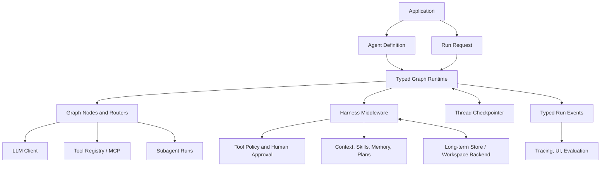

# Typed Agent Runtime: Overall Design and Staged Roadmap

**Status:** Proposed; runtime semantics resolved for review
**Date:** 2026-10-02
**Related:** [Agent Framework Gap Analysis](agent-framework-gap-analysis-deepagents-2026.md), [LLM4S Roadmap](../reference/roadmap.md)

## 1. Goal

Bring LLM4S agent capabilities to the practical level of the Deep Agents harness while preserving LLM4S's Scala-first strengths: typed composition, immutable state, explicit errors, model neutrality, and deploy-anywhere libraries.

“Deep Agents level” here means an integrated agent harness for complex, multi-step work. It should support planning, tool use, context management, reusable skills, long-term memory, delegation, permissions, human review, streaming, and durable resume. Those capabilities should all operate through one execution model, rather than appearing as unrelated utilities.

The foundation is a **typed graph runtime**. Agent loops, handoffs, and developer-authored workflows become graph patterns. Harness capabilities are composable components that run around graph nodes, model calls, and tool calls.

## 2. Design decisions

### 2.1 Keep the simple path simple

`Agent.run(query, tools)` remains the low-friction entry point for a normal conversational tool loop. It is implemented directly by invoking the graph runtime with a prebuilt agent graph, so simple users do not need to learn graph APIs; this is a convenience API, not a compatibility facade for a separate legacy engine.

### 2.2 Make graphs the shared execution model

The runtime executes nodes against explicit state in **supersteps**. At the start of a superstep, all ready nodes read the same committed state snapshot. Their state updates are applied to committed values in deterministic task and update order. The resulting state and next frontier are committed together. Nodes in the same frontier may run concurrently; a node scheduled by an update runs in a later superstep. This makes fan-in, conflict behavior, and the checkpoint boundary explicit.

Graph nodes can be ordinary Scala functions, model calls, tool loops, human-review gates, or nested graphs. The graph supports conditional routing, loops, static and dynamic fan-out/fan-in, and subgraphs. Existing static DAG workflows remain a useful, narrower subset; the current `Plan` API is not fully type-safe because its plan inputs/results use `Map[String, Any]` and its edge type labels are placeholders.

The agent loop is model → tool proposals → policy/tool execution → model routing. Each proposed tool call becomes an independent task. Handoffs become `Command` route changes to registered `AgentRef`/node targets; no live `Agent` object is stored in graph state.

### 2.3 Separate definition, run, state, context, and memory

- **Agent definition:** reusable prompt, model policy, tools, graph, policies, and configured capabilities.
- **Run:** one execution attempt, with a run ID, budgets, cancellation, and outcome.
- **Thread state:** serializable working state for a conversation/workflow, including graph cursor and pending work. It contains no tool registry, Agent, callback, client, or closure.
- **Run context:** the identity and limits of one invocation - run, tenant and principal identity, budgets, metadata, the task's position - plus its cancellation signal and event channels. Provider clients, tool/backend registries, clocks and other services are not in it: node closures capture them when the graph is built, and per-tenant or per-thread resources come from captured resolvers keyed by the run's identity (§4.6).
- **Long-term store:** cross-thread knowledge or preferences scoped to a user, tenant, or agent.

Replace `AgentState` with the data-only graph/thread state used by the runtime. It currently contains a live `ToolRegistry`, and `AgentStatus.HandoffRequested` contains a live `Handoff`/`Agent` reference; neither belongs in persisted state. The replacement stores stable agent/handoff IDs, while tool functions, provider clients, and other executable values are rebound after restore: the caller supplies a freshly built graph whose node closures capture them, and per-tenant or per-thread resources come from resolvers keyed by run identity (`RunContext.position`, `config.tenantId`). Provide one migration note for users moving existing conversation/session data; imported conversation history does not imply resumable execution.

### 2.4 Persist execution, not only conversation history

Session JSON is valuable for saving a conversation. Durable runtime checkpoints must additionally capture graph version and cursor, state version, pending tool or child tasks, interrupt state, event sequence, and idempotency metadata. Keep session files and runtime checkpoints as distinct storage concepts, with an import path between them.

### 2.5 Make tool side effects governable

Every tool call passes through runtime policy before execution. A new agent-level `AgentTool` contract receives validated arguments, `RunContext` and the thread state, and returns content with typed updates to the state keys it declares, an approval request, a typed question, or a tool-level or fatal failure; it does not route (§4.7). Completion occurs when no further graph work is scheduled. `AgentToolSpec` holds the model-facing schema; runtime policy metadata (side-effect class, permissions, timeout, retry/idempotency behavior, and sensitivity) is added with the middleware that reads it ([#1279](https://github.com/llm4s/llm4s/issues/1279)). Existing core `ToolFunction` remains the simple stateless synchronous tool contract; an adapter makes it available to the agent runtime. Agent-specific state, suspension, and cancellation stay out of `llm4s-core`.

Approval is represented as an interrupt that persists the proposed action for review and resumes with an explicit approve, edit, or reject decision.

### 2.6 Keep powerful capabilities explicit

Filesystem, shell, memory writes, remote tools, and subagent delegation are capabilities granted by the application. The harness may make them easy to configure, but does not silently grant them.

### 2.7 Use Scala 3 and structured concurrency directly

The target is Scala 3 only, JDK 21, and Scala 3 idioms (`enum`, opaque IDs, context parameters, and derives) without a Scala 2.13 or Java-source-compatibility constraint. Use SoftwareMill Ox as the initial internal execution substrate for direct-style structured concurrency over blocking provider/tool APIs. Scope child work to a run/superstep, interrupt and join sibling virtual threads on failure or cancellation, and expose `Future`/Cats Effect/ZIO bridges only as optional adapters rather than making `ExecutionContext` the runtime's control plane. Interruption is the cancellation contract: providers must preserve interruption and surface it as a cancellation/error result. §4.4 settles that contract (`CancelledError`, interrupt flag kept), brings core and every chat client under it, and adds a provider-testkit check.

Ox is an implementation choice to validate in the first runtime prototype, not a new public runtime type in the API. Its current project describes Scala 3/JDK 21 support and structured concurrency ([Ox](https://github.com/softwaremill/ox)).

## 3. Conceptual architecture



The runtime owns scheduling, state transitions, checkpoints, interrupts, and run events. Middleware assembles context and enforces policies at defined execution boundaries. Stores and tool backends are ports with interchangeable implementations.

### 3.1 Module placement and API baseline

`llm4s-core` is designated as the stable spine for 1.0, but no module has an active MiMa baseline yet. Keep agent-specific runtime and harness APIs in `llm4s-agent`; any proposed change to core must be demonstrably core-neutral, finalized before enabling MiMa, and must not pull graph/runtime concepts into the spine. Put the graph kernel in the existing `llm4s-agent` module under `org.llm4s.agent.graph`; it is agent-specific today, so a separate graph artifact adds maintenance and release work without a demonstrated independent consumer. This adds Ox as an implementation dependency for `llm4s-agent` consumers; keep Ox types out of public signatures and document the dependency in the 1.0 migration note. Keep `llm4s-agent-tools` independent and core-only for reusable simple tools. Define `SandboxBackend` in `llm4s-agent`; implement its first workspace adapter in `workspaceClient`, which already depends on `agent`, so dependency direction stays acyclic. Keep SQLite and PostgreSQL checkpoint adapters in separate `llm4s-agent-checkpoint-sqlite` and `llm4s-agent-checkpoint-postgres` modules so JDBC dependencies do not leak through common settings. Each new published adapter module must declare a coverage floor or explicit disabled policy, Codecov flag, docs-project entry, migration note, integration suite tier in `modules/it`, and project registration in `hooks/pre-commit`.

## 4. State, update, routing, and run model

This is a design contract to prototype in Scala 3. Names may change, but the semantics below are requirements.

```scala
trait GraphNode[I] {
  def run(input: I, state: ThreadStateView, context: RunContext): NodeResult
}

opaque type NodeRef[I] = NodeId
opaque type ThreadId = String
opaque type RunId = String
opaque type CheckpointId = String
opaque type InterruptId = String
opaque type TaskId = String
opaque type NodeId = String
opaque type MiddlewareId = String
opaque type ToolCallId = String
opaque type MessageId = String
opaque type FencingToken = Long
opaque type JoinId = String

final case class RunPosition(
  threadId: ThreadId,
  checkpointId: CheckpointId,
  taskId: TaskId,
  nodeId: NodeId,
  fencingToken: FencingToken
)

enum Route:
  case Goto(target: NodeRef[Unit])
  case Send[I](target: NodeRef[I], payload: I, join: Option[JoinId] = None)
  case ExitToParent[O](port: ParentPortRef[O], output: O)

enum JoinExpectation:
  case Static(sourceNodes: Set[NodeId])
  case Dynamic(fanOutTask: TaskId)

final case class JoinBarrier(
  id: JoinId,
  target: NodeRef[Unit],
  expected: JoinExpectation
)

final case class ToolCallPosition(
  toolCallId: ToolCallId,
  joinId: JoinId
)

final case class Command(update: StateUpdate, routes: List[Route])

enum NodeResult:
  case Continue(command: Command)
  case Suspend[Q, A](
    update: StateUpdate,
    interrupt: TypedInterrupt[Q, A],
    resumeAt: NodeRef[Resumed[Q, A]]
  )
  case Fail(error: AgentError)

/** Identities, limits and event channels only; services are captured by node closures (§2.3, §4.6). */
final class RunContext(val config: RunConfig, val position: RunPosition) {
  def emit(name: String, version: Int, payload: ujson.Value): Unit
  def progress(payload: ujson.Value): Unit
  /** View of the current task thread's interrupt bit; this does not clear it. */
  def isCancelled: Boolean
}

final case class RunConfig(
  runId: RunId,
  tenantId: Option[TenantId],
  principal: Option[Principal],
  budgets: RunBudgets,
  metadata: Map[String, String]
)

final case class TypedInterrupt[Question, Answer](
  id: InterruptId,
  payload: Question,
  payloadCodec: ReadWriter[Question],
  answerCodec: ReadWriter[Answer]
)

final case class Resumed[Question, Answer](question: Question, answer: Answer)

/** Checkpoint DTO only; codecs and typed node definitions are rebound from the compiled graph. */
final case class PendingContinuation(
  interruptId: InterruptId,
  question: ujson.Value,
  questionCodecId: CodecId,
  answerCodecId: CodecId,
  resumeNodeId: NodeId,
  taskId: TaskId,
  toolCallPosition: Option[ToolCallPosition]
)

enum RunResult[+O]:
  case Completed(state: ThreadState, output: O)
  case Suspended(state: ThreadState, pending: Map[InterruptId, TypedInterrupt[?, ?]])
  case Failed(state: Option[ThreadState], error: AgentError)

sealed trait AgentError extends LLMError

trait RunHandle[O] {
  def threadId: ThreadId
  def runId: RunId
  def status: RunStatus
  def await(): Result[RunResult[O]]
  def cancel(): Unit
  def subscribe(capacity: Int = 1024)(listener: StreamEvent => Unit): Result[Subscription]
}

opaque type CompiledGraph[I, O] = CompiledGraphHandle[I, O]

final class StateKey[A, U] private (
  val id: StateKeyId,
  val stateCodec: ReadWriter[A],
  val updateCodec: ReadWriter[U],
  val initial: A,
  val applyUpdate: (A, U) => Result[A]
)

trait StateUpdate {
  def update[A, U](key: StateKey[A, U], value: U): StateUpdate
  def remove[A, U](key: StateKey[A, U]): StateUpdate
  def combine(next: StateUpdate): StateUpdate
}

object StateUpdate {
  val empty: StateUpdate
}

final case class StoredMessage(id: MessageId, message: Message)

enum MessageUpdate:
  case Append(message: StoredMessage)
  case Replace(id: MessageId, message: StoredMessage)
  case RemoveThrough(id: MessageId)

val messagesKey: StateKey[Vector[StoredMessage], MessageUpdate]

enum HookResult[+A]:
  case Continue[A](value: A, update: StateUpdate) extends HookResult[A]
  case ApplyCommand(command: Command) extends HookResult[Nothing]
  case Suspend[Q, Ans](
    update: StateUpdate,
    interrupt: TypedInterrupt[Q, Ans],
    resumeAt: NodeRef[Resumed[Q, Ans]]
  ) extends HookResult[Nothing]
  case Fail(error: AgentError) extends HookResult[Nothing]

/** Settled in §4.7. Policy metadata (side-effect class, permissions, timeout, idempotency) arrives with `AgentMiddleware` (#1279). */
final case class AgentToolSpec[A] private (
  name: String,
  description: String,
  schema: SchemaDefinition[A],
  validateDecoded: A => Result[Unit],
  question: Option[ToolQuestion[?, ?]]
)(using val codec: ReadWriter[A]) {
  def withValidation(check: A => Result[Unit]): AgentToolSpec[A]
  def argumentSchema: ujson.Value // schema.toJsonSchema(strict = false): what arguments are validated against
  def toolDefinition: ujson.Value // strict OpenAI-format definition, for callers that send definitions themselves
}

trait ToolArgumentValidator {
  def unsupported(schema: ujson.Value): Vector[String]
  def validate(schema: ujson.Value, arguments: ujson.Value): Vector[String]
}

final case class ToolContext(run: RunContext, toolCallId: String, state: ThreadState, approved: Boolean)

/** No routes: routing belongs to the loop. A question is `Ask`, answered through `resume`. */
enum ToolOutcome:
  case Success(content: ujson.Value, update: StateUpdate = StateUpdate.empty)
  case Error(message: String)
  case NeedsApproval(reason: String)
  case Ask[Q](question: Q)
  case Fatal(error: LLMError)

trait AgentTool[A] {
  def spec: AgentToolSpec[A]
  def writes: Set[StateKey[?, ?]] = Set.empty
  def execute(arguments: A, context: ToolContext): ToolOutcome
}

/** A tool that asks typed questions; only it can declare one. */
abstract class Asking[A, Q: ReadWriter, Ans: ReadWriter](base: AgentToolSpec[A]) extends AgentTool[A] {
  def resume(arguments: A, question: Q, answer: Ans, context: ToolContext): ToolOutcome
}

trait SandboxBackend {
  def execute(request: SandboxRequest, context: RunContext): Result[SandboxResult]
}

trait AgentMiddleware {
  def id: MiddlewareId
  def stateKeys: Set[StateKey[?, ?]] = Set.empty
  def tools: Vector[AgentTool[?]] = Vector.empty
  def before: Set[MiddlewareId] = Set.empty
  def after: Set[MiddlewareId] = Set.empty

  def beforeAgent(
    context: RunContext,
    state: ThreadStateView,
    input: AgentInput
  ): HookResult[AgentInput] = HookResult.Continue(input, StateUpdate.empty)
  def beforeModel(
    context: RunContext,
    state: ThreadStateView,
    request: ModelRequest
  ): HookResult[ModelRequest] = HookResult.Continue(request, StateUpdate.empty)
  def wrapModelCall(
    context: RunContext,
    request: ModelRequest,
    next: ModelRequest => HookResult[ModelResponse]
  ): HookResult[ModelResponse] = next(request)
  def afterModel(
    context: RunContext,
    state: ThreadStateView,
    response: ModelResponse
  ): HookResult[ModelResponse] = HookResult.Continue(response, StateUpdate.empty)
  def wrapToolCall(
    context: RunContext,
    call: AgentToolCall,
    next: () => ToolOutcome
  ): ToolOutcome = next()
  def afterToolCall(
    context: RunContext,
    state: ThreadStateView,
    call: AgentToolCall,
    result: ToolOutcome
  ): HookResult[ToolOutcome] = HookResult.Continue(result, StateUpdate.empty)
  def afterAgent[O](
    context: RunContext,
    state: ThreadStateView,
    output: O
  ): HookResult[O] = HookResult.Continue(output, StateUpdate.empty)
}

final case class ResumeInput(answers: Map[InterruptId, ujson.Value])

trait AgentRuntime {
  def start[I, O](
    threadId: ThreadId,
    graph: CompiledGraph[I, O],
    input: I,
    config: RunConfig
  ): Result[RunHandle[O]]

  def resume[I, O](
    threadId: ThreadId,
    graph: CompiledGraph[I, O],
    answers: ResumeInput,
    config: RunConfig
  ): Result[RunHandle[O]]

  def recover[I, O](
    threadId: ThreadId,
    graph: CompiledGraph[I, O],
    config: RunConfig
  ): Result[RunHandle[O]]
}
```

`start` creates a new thread when no checkpoint exists. If the thread has a completed checkpoint and no pending interrupts, it applies the new input to the latest committed state (normally through the message-key update) and starts a new run. If the thread has an incomplete execution checkpoint, `start` rejects with `IncompleteRun`; callers use `recover` to continue that execution without adding a new input. If the thread has pending interrupts, `start` and `recover` reject; callers use `resume`. `resume` accepts a non-empty subset of pending interrupt answers, rejects unknown IDs, and leaves unanswered continuations pending. `recover` acquires the thread claim and continues runnable work from the latest durable checkpoint, reusing successful pending writes so completed siblings do not run again; it retries failed or unstarted tasks according to their node policies. It uses a new run ID and caller-supplied budgets. If an interrupt remains pending, recovery rejects and requires `resume`; a still-active thread claim returns retryable `ThreadBusy`. Concurrent active runs or stale versions for the same thread are rejected by the thread claim/version check. A concurrent resume receives a retryable `ThreadBusy` result identifying the active run; its answers are not accepted or discarded, and the caller retries after that run suspends or completes.

The runtime owns thread interruption: `RunHandle.cancel` interrupts the run's thread, whose structured-concurrency scope interrupts every task, and `RunContext.isCancelled` observes the current task's thread status without clearing it. A `Left` from `start`, `resume` or `recover` means no run exists and the thread is unchanged. Delete the separate orchestration `CancellationToken` as the graph runtime replaces orchestration; do not retain a second cancellation contract. Cancellation surfaces as a typed run outcome/error.

`beforeModel` and `afterModel` use `HookResult` to return a transformed request/response and state update, route with a `Command`, suspend with a typed continuation, or fail. A non-`Continue` result prevents the wrapped model call or ends the current model phase, respectively.

`CompiledGraph` is intentionally opaque to callers; the builder/compile API owns its internals. `RunConfig` carries a new `runId`, tenant and principal identity, budgets, and metadata. `threadId` is supplied once as the address to `start` or `resume`, avoiding duplicate thread identity. `RunContext.position` identifies the active thread, checkpoint, task, node, and fencing token for idempotency, tracing, event attribution, and scoped storage. The public resume payload is JSON because it can contain answers for different existential `Answer` types; the runtime resolves saved codec and node IDs against the compiled graph, decodes each answer, then schedules that interrupt's typed `resumeAt` node with `Resumed(question, answer)`. The continuation is data, never a serialized closure or codec instance.

Expected properties:

- **Typed state updates:** capabilities declare `StateKey[A, U]` with state/update codecs, an initial state, and an update function. The function belongs to the compiled definition, never the checkpoint. Every update is applied to the committed value, including single-writer updates; replacement is the special case `U = A` and `applyUpdate(_, next) = Right(next)`. `ThreadState` is a typed key/value store with checked access; existential erasure stays private to the serialization/runtime boundary. Scala 3 tuple/intersection state composition is not the default because capabilities must be attachable dynamically and checkpointable by key; statically composed node inputs/outputs remain ordinary Scala types.
- **Deterministic update order:** updates from concurrent tasks are applied in stable task order, then in emission order within each task. Dynamic `Send` children are ordered by `(emittingTaskOrdinal, routeIndex, itemIndex)`. This permits operation-valued updates and makes message order deterministic without requiring updates to form an associative `Semigroup`.
- **Typed routes:** every `GraphNode[I]` declares an input type and `NodeRef[I]` consumes that input. The graph builder creates opaque node handles. `Send` checks its payload against the destination input; `Goto` is limited to `NodeRef[Unit]`. The compiled graph owns existentially typed refs internally and validates membership/port compatibility at build and restore time. Nodes return `Command` updates plus routes, never route strings. Parent/child graph exits use explicit typed boundary refs.
- **Declared writes:** each node and middleware declares its set of `StateKey`s it may update/remove. The builder validates that declared updates are accepted by the key; runtime checks remain as defense for dynamic sends and restored graphs.
- **Joins and barriers:** `JoinBarrier` is an explicit typed scheduler construct with a builder-issued `JoinId` and a `NodeRef[Unit]` target; it is not an implicit property of routes. A static barrier declares its complete set of predecessor nodes for an activation and releases its target only after every expected arrival has committed. A dynamic barrier is attached to a fan-out task and records the expected child task IDs as its `Send`s expand; it releases only after every expected child has completed, ordered by emitting task ordinal, route index, then item index. An empty dynamic fan-out resolves immediately. Branch state effects are committed through the normal ordered update path before the target runs. The agent tool loop places a dynamic barrier between a batch of model tool calls and the next model call; each call task must contribute exactly one runtime-created result before that barrier releases.
- **Approval continuation identity:** when a tool task suspends, its continuation inherits that task's logical join slot and `ToolCallId`. Resume may execute at a newly scheduled `resumeAt` task, but its result fills the original logical arrival; the barrier must not wait for the continuation's new scheduler identity. Policy middleware approvals and tool-raised approvals converge on the built-in `ApprovalResumeNode`, which receives the typed decision, updates the original assistant tool-call message for edits, then executes or rejects the operation and lets the runtime create the result associated with the inherited `ToolCallId`.
- **Update composition:** `update`, `remove`, and `combine` are supported. `combine` is ordered composition for sequential updates (later operation wins for a key); parallel task updates remain distinct and are applied in the deterministic task order above. Message history uses `StateKey[Vector[StoredMessage], MessageUpdate]` with stable graph-owned IDs and `Append`, `Replace(id)`, and `RemoveThrough(id)` operations; do not add runtime IDs or update semantics to core `Message`.
- **Removal semantics:** `StateUpdate.remove(key)` removes that key's stored entry; subsequent reads observe the key's declared initial value. It does not mean “remove one item” from a collection. Collection-specific removals are ordinary typed update operations, such as `MessageUpdate.RemoveThrough`.
- Generic thread state is checkpointable only when every registered key has explicit state and update `ReadWriter`s plus migration chains and stable codec IDs. Checkpoints store codec IDs and versioned JSON (`ujson.Value` at storage/migration boundaries), not the key's update function; data is readable for inspection and compressible by stores.
- A run returns completed, suspended, or failed outcomes; interruption is not disguised as an exception. A `Continue` command may have zero routes; an empty ready frontier with no pending interrupts ends the graph and projects its output. A suspension pauses the whole run at the end of the current superstep: sibling tasks finish, their successful updates commit, and no next superstep starts until resume. Multiple interrupts are keyed by stable `InterruptId`; resume may answer any non-empty subset, schedules only those continuations with `Resumed(question, answer)`, and leaves unanswered continuations pending. **Quiescence** is a superstep boundary with no runnable tasks. If quiescence leaves parked continuations, the run reports `Suspended` again; joins remain closed while expected arrivals are parked, and no downstream/model node runs early. If a required join input has neither a runnable task nor a pending continuation capable of producing it, the runtime fails with `UnsatisfiedJoin`. Unknown IDs are rejected; missing IDs are allowed. The run remains suspended while any interrupt is still pending.
- Each durable run event includes stable `threadId`, `runId`, checkpoint, task, and node IDs, a monotonically increasing per-thread replay sequence, and timestamp. Live-only token deltas do not consume or advance the durable replay sequence.
- The thread checkpointer owns the durable run-event log as well as checkpoint snapshots. A checkpoint/task commit atomically appends its durable events with the associated state and pending writes; the SPI provides `eventsAfter(threadId, fromSeq, limit)` and `compactEvents(threadId, beforeSeq)`. Persist lifecycle, node/task/tool, checkpoint, state-update, interrupt/resume, and custom events. Allocate their per-thread sequence numbers in the commit and deliver them to subscribers only after that commit succeeds, in every durability mode, including `Async`; a crash must never expose an uncommitted durable sequence. Token deltas and other high-volume transient progress are live-only and are not replayed. Retain events while their corresponding checkpoints are retained, subject to configurable age/size limits; compaction advances a per-thread earliest available sequence, and replay before that floor returns `ReplayUnavailable(earliestSeq)`.
- `RunHandle` exposes `await`, typed event stream, `cancel`, current status, and the eventual `RunResult`; resume begins a new run ID and may use new budgets while retaining the thread/checkpoint identity. `subscribe(fromSeq)` supports replay from a persisted, serializable event sequence.
- Run events are serializable to versioned JSON; custom events provide a stable type name/version and `ujson.Value` payload (typed helpers encode through `ReadWriter`). Events are delivered in ascending per-thread sequence on a per-subscriber ordered dispatcher, never on a model/tool worker thread. A bounded subscriber queue disconnects a lagging subscriber with its last-delivered sequence; it can reconnect with `subscribe(fromSeq)` to replay persisted events. Nested child-run events carry parent and child IDs.
- Replace `AgentEvent` with the unified run-event model before 1.0; do not retain a compatibility adapter as a permanent second event vocabulary.

### 4.1 Superstep and checkpoint semantics

At a superstep boundary the scheduler resolves the ready frontier, snapshots the committed state, starts all eligible node tasks in a bounded Ox scope, collects branch outcomes, and applies state updates in deterministic task/update order. Each tool call is its own scheduled task, with its own task ID, write set, idempotency key, pending write record, and possible interrupt. Dynamic `Send` children are ordered by emitting task's stable frontier ordinal, route index, then item index, preserving model tool-call order in corresponding tool results; declared static edges are additive to routes returned in `Command`, ordered by edge declaration before command route order. Duplicate destinations remain distinct scheduled tasks. The scheduler records **pending writes per completed task** before the full superstep commit. If one sibling fails, successful sibling pending writes are retained and are not re-executed on resume; only failed/unstarted tasks are eligible to rerun. If any task suspends, all other tasks in that superstep finish and commit, then the entire run pauses before another superstep. Effects outside the checkpoint store still have at-least-once semantics and need idempotency. A suspended task stores its typed continuation and completed update, then resumes at the declared node with `Resumed(question, answer)`.

Checkpoint durability is configurable:

- `Sync`: commit each task result and superstep before advancing. Required for strong resume guarantees and human interrupts; default for durable graphs.
- `Async`: write checkpoints asynchronously; improves latency but permits bounded replay after process failure. The bound is the work after the last durable checkpoint.
- `OnExit`: persist at successful/failed run exit, but **always synchronously persist a suspension/interrupt before returning it**. Ordinary work has no crash recovery between exits; a reported suspension remains resumable. Intended for short runs where only final state matters.

Regardless of durability mode, returning a suspended result means its state, pending continuations, completed sibling writes, and event cursor have been synchronously persisted. `Async` and `OnExit` trade away durability for ordinary in-flight work only.

The run completes when no nodes are scheduled and no interrupt is pending; there is no node-level `Complete` outcome that bypasses superstep scheduling. A typed output projection reads the final committed state. Child graphs use explicit `ExitToParent` ports; an empty top-level frontier terminates the run.

The runtime supports per-node retry/cache policy, a recursion/superstep limit, input/output codecs, and graph visualization export (Mermaid). Thread checkpoint writes use optimistic version checks; one writer advances a thread version at a time. Concurrent same-thread runs must choose an explicit policy (reject by default; optional enqueue later), and stale workers cannot overwrite a newer checkpoint.

Static `interruptBefore`/`interruptAfter` breakpoints complement dynamic typed interrupts. `updateState` creates a versioned state update before resume; `stateHistory` inspects checkpoints; `fork` starts a new thread from a selected checkpoint. Subgraphs use hierarchical checkpoint namespaces and emit events with parent and child run IDs.

### 4.2 Stage 0 prototype: typed state, routing, and joins ([#1267](https://github.com/llm4s/llm4s/issues/1267))

`org.llm4s.agent.graph` in `llm4s-agent` prototypes the kernel contracts of §4 and §4.1 that do not depend on suspension, checkpoints, or Ox: `StateKey[A, U]`, `StateUpdate`, `ThreadState`, `GraphBuilder` with `NodeRef[I]`, `StaticJoin`, and `DynamicJoin` handles, `Command`/`Route`/`NodeResult`, a superstep scheduler in `CompiledGraph[I, O]`, and `GraphSnapshot` restore. Its specs (`ThreadStateSpec`, `GraphBuilderSpec`, `SuperstepSpec`, `JoinSpec`, `RestoreSpec`) are the executable form of the decisions below.

Decisions, including where the prototype refines the §4 sketch:

- **Handles are builder-owned classes, not opaque IDs.** An opaque `NodeRef[I] = NodeId` cannot distinguish a handle from another builder that reuses an ID, so `NodeRef[I]`, `StaticJoin`, and `DynamicJoin` carry their builder's identity. `compile` rejects foreign handles in edges, joins, and the entry; the scheduler rejects them in returned routes. IDs (`NodeId`, `TaskId`, `JoinId`, `StateKeyId`) stay opaque strings. Cycles use `declare[I]` followed by `implement`; `node[I]` does both.
- **Fan-out is its own route.** `Route.FanOut(join, target, payloads)` replaces `Send(..., join = Some(id))`. An empty fan-out must still open an activation, which releases immediately, and the item index in the `(emittingTaskOrdinal, routeIndex, itemIndex)` order comes from the payload vector. `Send` is one untracked item. A task may fan out to a given join at most once per command.
- **Static join arrival is completion.** A source arrives when one of its tasks completes; it does not route to the join. Each source counts once per activation however many of its tasks complete, and the join re-arms after release. A dynamic child arrives when its task completes; routes it emits do not delay the release.
- **Next-frontier order.** For each completed task in frontier order: its static edges in declaration order, then its command routes in route order, with fan-out payloads in item order. Then the targets of joins released by this commit: static joins in declaration order, then dynamic activations in the order they opened. Task IDs are `"<superstep>.<ordinal>"`.
- **`combine` is sequential composition.** `a.combine(b)` applies `a`'s operations and then `b`'s. "Later wins" holds only for replacement keys; for an operation-valued key, both operations apply.
- **`ThreadState` is an immutable snapshot**, so there is no separate `ThreadStateView`. `get` returns `Result[A]`. A key the graph did not register, or a different key instance that shares a registered ID, is `UnknownStateKey`. A registered key without an entry reads as its initial value. The graph registers every key in a node's write set, plus read-only keys passed to `stateKey`. Two distinct keys with one ID fail compilation.
- **A superstep commits atomically.** If any task fails, writes an undeclared key, returns an invalid route, or has an update rejected by its key, nothing from that superstep commits. The run fails with the first error in frontier order, and `RunResult.Failed` carries the last committed state. Under `GraphRuntime`, each completed task's result is also recorded as a pending write before the superstep commits, so `recover` keeps completed siblings (§4.3).
- **`UnsatisfiedJoin` is detected at quiescence.** Routes are values computed at run time, so the scheduler cannot prove early that a source is unreachable. A join that is still open when the frontier empties fails the run. With suspension ([#1269](https://github.com/llm4s/llm4s/issues/1269)), the same check must also treat parked continuations as possible arrivals.
- **Restore validates against the compiled graph and reports every problem.** It checks the graph ID and the caller-supplied `version`, which names behaviour. It also checks a SHA-256 structural fingerprint over nodes, entry, edges, joins, and key IDs. It then checks that every state value and pending input decodes with this graph's codec, that each join exists with the right kind, that static arrivals come from sources, that every open join is partial (an empty or fully arrived activation would already have released), and that every arrival a dynamic activation still expects is pending in that fan-out. An in-memory `Execution` is bound to the `CompiledGraph` instance that created or restored it (`ForeignExecution`). Another instance of the same definition, including one in another process, goes through `snapshot`/`restore`.
- **Concurrency is behind a private seam.** `TaskExecutor` runs a frontier and returns results in task order. The default was sequential; since §4.4 it is a bounded Ox scope. The specs run every ordering scenario with tasks executed last-first and concurrently with random delays, and commit order does not change.

Limits that later Stage 0 issues resolve: `NodeResult` has no `Suspend` yet ([#1269](https://github.com/llm4s/llm4s/issues/1269)). Versioned checkpoints and codec migrations followed in §4.3 ([#1268](https://github.com/llm4s/llm4s/issues/1268)). `NodeContext` (task, node, superstep) and `compile(maxSupersteps)` stood in for `RunContext` and `RunBudgets`, which replaced them in §4.6. The fingerprint does not cover node input types; a changed input type is caught when a pending input fails to decode. The message key, retries/cache policy, and Mermaid export are Stage 1 work.

### 4.3 Stage 0 prototype: checkpoints and commit-gated event replay ([#1268](https://github.com/llm4s/llm4s/issues/1268))

`GraphRuntime` runs a `CompiledGraph` on a durable thread over a `Checkpointer`. It adds `start`, `recover`, and `subscribe`, and the `Sync`, `Async`, and `OnExit` durability modes. `InMemoryCheckpointer` is the reference store. Its specs are `CheckpointFormatSpec`, `InMemoryCheckpointerSpec`, and `GraphRuntimeSpec`.

Decisions:

- **Checkpoints are versioned data.** `Checkpoint` carries `formatVersion`, `id`, `parent`, thread and run IDs, `status` (`Running` or `Completed`), `createdAt`, and the `GraphSnapshot`. `Checkpoint.fromJson` migrates older formats through a `SchemaVersion` chain and refuses newer ones (`UnsupportedCheckpointFormat`). The reference store keeps checkpoints and pending writes as JSON, so nothing executable survives a round trip.
- **Three codecs per graph are versioned.** A key's state codec, a key's update codec, and a node's input codec each have a `SchemaVersion`: a current version plus migration steps `n -> n + 1`. Every encoded value is a `VersionedJson(version, value)`, so a codec's stable ID is its key or node ID with that version. Restore migrates and then decodes. The migration functions belong to the compiled graph and are never persisted.
- **Pending writes are commands as data.** A completed task's `Command` is encoded as a `PendingWrite` of `EncodedOperation`s and `EncodedRoute`s, keyed to the checkpoint whose frontier the task ran in. Recovery decodes the command and rebinds it to the graph's keys, nodes, and joins instead of running the task again.
- **One atomic write.** `Checkpointer.commit` takes a `Commit`: an optional new checkpoint, pending writes, and event drafts. The store applies all of it or none of it. A new checkpoint is accepted only if its `parent` is the thread's latest (`CheckpointConflict`); this optimistic thread version is the precursor of Stage 2's run-claim fencing. Pending writes must name the resulting latest checkpoint. A new checkpoint drops the previous one's pending writes.
- **The store numbers events.** Per-thread sequence numbers are allocated inside the commit, contiguously, and are never reused. A refused commit consumes none. `eventsAfter(afterSeq, limit)` pages the log. `compactEvents(beforeSeq)` raises a floor that never moves back, and replay from before it fails with `ReplayUnavailable(earliestSeq)`.
- **Delivery follows commit in every mode.** The runtime commits and delivers under one lock, so subscribers receive durable events in commit order, only after the commit succeeds, and at most once each. `subscribe(afterSeq)` replays the log and then continues live, without gaps or duplicates, even when it joins mid-run. Live-only `NodeContext.progress` bypasses the log and is delivered immediately. `NodeContext.emit` custom events are committed with the task's pending write and discarded if the task fails.
- **Durable events.** The durable events are `RunStarted`, `RunRecovered`, `TaskCompleted`, `TaskFailed`, `CheckpointCommitted`, `RunCompleted`, `RunFailed`, and `Custom(name, version, payload)`. Each record carries the thread, run, checkpoint, task, and node IDs, a timestamp, and its sequence number.
- **Durability modes.** In `Sync`, every pending write and checkpoint is committed before the run proceeds. In `Async`, commits go through a single ordered writer while the run continues. The first failed commit stops the queue, so nothing lands on top of a lost write; the run drains the queue before returning and reports `CheckpointWriteFailed`. In `OnExit`, the run buffers everything after its claim (§4.5) and commits once at exit: the last checkpoint, re-parented to the claim, plus its pending writes and every event. A failed `OnExit` run therefore still keeps its completed siblings. If the commit that records a run's failure fails too, in any mode, the result is `CheckpointWriteFailed`, with the run's own error kept as `runError`, so the caller knows the failure was not made durable. All three modes share the delivery rule above, so the crash spec shows that an Async subscriber's events are a prefix of what a later process replays.
- **`start` and `recover`.** `start` creates a thread, or applies its input to a `Completed` thread's state. It refuses a `Running` thread with `IncompleteRun`. A failed run leaves its latest checkpoint `Running` with its pending writes. `recover` restores it with no new input, reuses every pending write, and runs only failed or unstarted tasks. Each call is a new run ID, and the superstep limit counts per run.

Limits:

- **Suspension:** suspension was not modelled in this step. [#1269](https://github.com/llm4s/llm4s/issues/1269) implemented it (§4.5), including persisting every suspension before it is returned.
- **Retry:** `recover` retries a failed task once; per-node retry policy is Stage 1.
- **Retention:** the store keeps only the latest checkpoint and compacts events only when asked. Checkpoint history, fork, retention by age or size, and claim fencing are Stage 2.
- **Delivery threads and queues:** events are delivered on the committing thread. Subscribers have unbounded queues and are registered per runtime instance. §4.6 replaced this with an ordered dispatcher and a bounded queue per subscription.
- **Run API:** runs return `Result[RunResult]` synchronously. §4.6 added the dispatcher, bounded queues, `RunHandle`, and `RunConfig`.

### 4.4 Stage 0 prototype: Ox cancellation and provider interruption ([#1270](https://github.com/llm4s/llm4s/issues/1270))

Interrupting a thread is how a run is cancelled. This step defines what an interrupted provider or tool call returns, makes core and every chat client follow that rule, and runs each superstep in a bounded Ox scope so that a cancelled run leaves no task running. The specs are `CancellationSpec` (graph and runtime), the core error and retry-layer specs, and the two interruption checks in each chat provider's module spec.

Contract decisions:

- **An interrupted call returns `Left(CancelledError)` with the interrupt flag still set.** `org.llm4s.error.CancelledError(context)` is a `NonRecoverableError`, so no retry layer retries it. The call does not throw `InterruptedException`, which keeps `Result[A]` as the only failure channel, and it does not clear the flag, so the caller can still see that it was interrupted.
- **One rule decides what counts as a cancellation.** A failure is a cancellation if the current thread's interrupt flag is set when the failure is mapped, or if the failure is caused by `InterruptedException` or `ClosedByInterruptException`. A bare `InterruptedIOException` is not enough on its own: OkHttp reports its call timeout as `InterruptedIOException("timeout")`, which openai-java and the Anthropic SDK wrap, and `SocketTimeoutException` is one by inheritance. Both stay timeouts unless the flag is set or an `InterruptedException` lies beneath them. The flag test is what makes the rule work: on a JDK 21 virtual thread, an interrupt during a blocking socket read closes the socket, so the client sees an ordinary `SocketException`. `CancelledError` exposes the rule as a public helper, because external provider authors must follow the same contract and the testkit checks it.
- **Mapping classifies; it never sets the flag.** `DefaultErrorMapper`, `CancelledError.fromThrowable` and `HttpFailures.toLLMError` only decide what an exception is. The flag belongs to the thread that was interrupted, and mapping can run elsewhere: `Safety.future.fromFuture` and `Future#toResult` map in a `recover` on a pool thread, where a set flag would cancel the next, unrelated callback. Only code that itself caught an `InterruptedException` on the current thread restores the flag: `CancelledError.attempt` and other `catchInterrupt` callers, `HttpFailures.attempt`, and the catch sites in `ReliableClient`, `LLMClientRetry` and `ToolRegistry`. An interrupt that closes a socket on a virtual thread, or that the JDK's response body stream reports, leaves the flag set by itself. `ToolRegistry.executeAsync` clears the flag on its pool thread after a cancelled call, since the `Future` carries the outcome.
- **Core follows the rule throughout.** `Llm4sHttpClient` returns `CancelledError` for an interrupt before the response or during a stream read, where it used to return a recoverable `ExecutionError` or `NetworkError`. `ReliableClient`, `LLMClientRetry` and `ErrorRecovery` return it, including for an interrupt during a backoff sleep, and never retry it. That includes `ReliableClient`'s wait for a local rate-limit token, which used to return the local `RateLimitError`; the circuit still counts it as it would that throttle, so only a provider failure earlier in the call counts. A provider call made with the flag already set returns `CancelledError` without running, because an SDK that ignores the flag would still send the billed request. `DefaultErrorMapper` applies the rule, so code that maps exceptions with `Try(...).toResult` inherits it. When the thread waiting on `ToolRegistry`'s timeout join is interrupted, that is a cancellation, not a timeout: the registry interrupts the worker and returns a cancelled tool error.
- **Every chat client follows the rule.**
  - **OpenAI and Anthropic** apply the rule in their error mapping. They also catch the `InterruptedException` that the SDK's retry sleep throws once its own retry of the interrupted request fails.
  - **Anthropic** closes its stream on every path.
  - **Gemini, Vertex AI, Ollama and the OpenAI-compatible clients** inherit `Llm4sHttpClient`'s behaviour. An interrupt during an error-body read is still reported as `CancelledError` by the client wrapper, whatever the read returned (Gemini, Vertex AI and Ollama still read a failed body as empty).
- **Interrupts are prompt on virtual threads.** JDK 21 makes blocking socket I/O interruptible on a virtual thread, and the runtime runs every task on one. On a platform thread, OkHttp's socket read cannot be interrupted, so an SDK client still returns `CancelledError` but only once its read completes or times out.

Runtime decisions:

- **A superstep is a bounded Ox scope.** The private `TaskExecutor` seam stays, so specs can still impose orderings. Its default is now Ox `parLimit` on virtual threads, with a private default limit of 16; it used to run a superstep's tasks one after another. Every task is forked, a lone one included: run inline on the calling thread, a task that caught the interrupt and returned normally would clear the caller's flag and the run would carry on. `CompiledGraph.run` and `GraphRuntime` both use it. Because tasks now run concurrently, node code must be thread-safe, a task does not inherit the caller's `ThreadLocal` or MDC context, and `Sync`-mode durable events and live progress are delivered on task threads. Ox is an implementation dependency of `llm4s-agent`, and no Ox type appears in a public signature.
- **A run is cancelled by interrupting its calling thread.** That is the thread that called `start`, `recover`, `resume` or `CompiledGraph.run`. (§4.6 moves the run to a thread the runtime owns, cancelled through `RunHandle.cancel`.) Ox interrupts every task in the superstep and joins them before the interrupt reaches the run loop, so no task outlives the call. A task that ignores its interrupt therefore delays the cancellation, and in a durable run its completed result is kept (an in-memory run keeps nothing from the cancelled superstep).
- **An interrupted task records nothing.** If a task's thread is interrupted when it finishes, the task is cancelled whatever its node returned. It submits no pending write and no task event, so a cancelled tool call never records a result, and `recover` runs the task again. Siblings that finished before the interrupt keep their pending writes in `Sync` and `Async`, as a failed sibling's do.
- **A cancelled run ends cleanly and reports it.** Once the scope has unwound, the run loop clears the interrupt flag so that its final commits can complete. It then commits a `RunCancelled` event, leaves the checkpoint `Running`, closes the committer, and releases the thread claim. Finally it sets the flag again and returns `RunResult.Failed(state, GraphError.Cancelled(threadId: Option[String], lastCheckpoint: Option[String]))` (both `None` for an in-memory `CompiledGraph.run`). The interrupt is caught with the private `CancelledError.catchInterrupt`, which llm4s uses in place of `scala.util.control.Exception.catching`, because `catching` rethrows `InterruptedException`. The thread claim is now always released, so an interrupted run no longer leaves its thread `ThreadBusy`. Closing an `Async` queue after an interrupt still waits for it to drain, so the claim never fences a run whose commits are still landing. If the closing commit fails, the result is `CheckpointWriteFailed`, keeping the cancellation as its `runError`.
- **A timeout is an interrupt from outside.** Until `RunBudgets` (§4.6), a deadline is applied by wrapping the call, for example with Ox `timeout`. The specs check that every sibling has stopped by the time the timeout returns, and that `recover` then completes the run without re-running finished work.

Testkit decisions:

- **`LocalProviderTestServer` can hold a request open.** It runs handlers on their own executor, and gives a test a way to release a held handler, so a request held open by a test cannot block the server's shutdown.
- **`ProviderModuleChecks.assertCancelsWhenInterrupted` and `assertCancelsStreamWhenInterrupted`** run on a virtual thread against two servers: one that never answers, and one that streams a single chunk and then stalls. For `complete` and `streamComplete` it interrupts the call and asserts that the call returns promptly with `Left(CancelledError)` and the interrupt flag set. For the stream it also asserts that the first chunk was delivered. Every chat provider's module spec calls them: OpenAI, Anthropic, Gemini, Vertex AI, Ollama and OpenAI-compatible. Vertex AI's runs against a stalled mock HTTP client, because its base URL derives from `location`.

Limits (owners in §4.9):

- Embedding, reranker, MCP, image and speech clients are not yet brought under the cancellation contract. Some of them flatten every error into their own type.
- On a platform thread, cancelling an SDK client call is not prompt.
- Cancellation, the concurrency limit and deadlines have no public API until `RunHandle`, `RunConfig` and `RunBudgets`, which §4.6 added.
- `CancellationToken` remains for `PlanRunner` until it is rebuilt.

### 4.5 Stage 0 prototype: resumable approval and tool-call barriers ([#1269](https://github.com/llm4s/llm4s/issues/1269))

The kernel gains typed suspension, and `org.llm4s.agent.graph.toolloop` proves the model/tool loop on top of it. The specs are `SuspendSpec` (kernel) and `ToolLoopSpec` (loop, in memory and durable).

Kernel decisions:

- **Suspension is a node result.** `NodeResult.Suspend(update, question: Q, resumeAt: ResumeRef[Q, A])` replaces the sketch's `TypedInterrupt`. `GraphBuilder.declareResume[Q, A]` issues a `ResumeRef` whose node consumes `Resumed[Q, A]` and carries the question and answer codecs. A checkpoint therefore stores the question as `VersionedJson`, and a resume supplies the answer as JSON; both are decoded by the compiled graph. The interrupt ID is the suspended task's ID: one suspension per task, stable across processes and re-runs.
- **A continuation stands in for its task.** The parked continuation inherits the suspended task's dynamic join slot, and its *origin* (task and node). When it completes, it fills that task's dynamic arrival under the original task ID and makes the static arrival as the original node. The barrier never waits on the continuation's own scheduler ID. A continuation that suspends again keeps the original origin. The suspended task makes no arrival and fires none of its node's static edges.
- **The whole run pauses after the superstep.** Siblings finish and their updates commit, along with the suspending task's own update. `Execution.paused` stops the next superstep. `CompiledGraph.resume(execution, answers)` accepts any non-empty subset. It rejects unknown IDs and undecodable answers without changing anything (`InvalidResume`), and appends each answered continuation to the frontier in parking order. Unanswered ones stay parked. At quiescence, a join that is waiting only for parked continuations reports `Suspended`. A join waiting for an arrival that nothing can make fails with `UnsatisfiedJoin`, even while unrelated continuations are parked.
- **Snapshots carry parked continuations.** `GraphSnapshot` gains `parked`, `paused`, and task origins, and restore validates them. A dynamic join's expected arrival may be satisfied by a pending task or by a parked continuation in its slot. The checkpoint format moves to 2, with a real 1 -> 2 migration. `PendingWrite.suspension` defaults to `None`, so writes recorded against a format-1 checkpoint still read.

Runtime decisions:

- **Checkpoint status.** `Suspended` joins `Running` and `Completed`. `start` and `recover` refuse a suspended thread with `PendingInterrupts`. `resume` requires one, and returns `NotSuspended` otherwise. `recover` still accepts a `Running` thread that has parked continuations, such as a resumed run that crashed: it runs what is runnable and suspends again.
- **Every run claims its thread.** Before running anything, `start`, `recover`, and `resume` synchronously commit a checkpoint whose parent is the latest checkpoint they read; `recover` also carries the pending writes over to it. If another run claimed the thread first, the call returns `ThreadBusy` and its input or answers are neither accepted nor discarded. This also makes "persist every suspension before returning it" hold in every mode, because each mode drains its commits before a run returns. A runtime also refuses any call on a thread whose run it is still executing with `ThreadBusy`, before reading the thread: an executing run's latest checkpoint is `Running`, which `recover` would otherwise take for an abandoned run and execute again, repeating its side effects. Across processes a live run is not yet distinguishable from a dead one; claim leases and fencing against a stale worker are Stage 2.
- **Suspension events.** `TaskSuspended(interruptId)` is committed with the suspended task's pending write, so recovery does not re-run a task that suspended. `RunSuspended(interrupts)` and `RunResumed(answered)` mark the run boundaries.

Tool-loop decisions (`ToolLoop`):

- **One task per call.** `model` appends the assistant message and fans its calls out to `call-tool`, one task each, behind a dynamic join named `tool-batch`. `collect` runs only when that barrier releases. It requires exactly one result per call, appends the `ToolMessage`s in call order, clears the results key, and routes back to `model`. The model therefore never sees a partial batch, and `model` re-checks `Message.validateConversation` before every call.
- **The loop writes every result.** A tool returns `ToolOutcome.Completed`, `Failed`, or `NeedsApproval`, never a message. The loop records the single `ToolResult` per call for success, failure, a thrown tool, policy denial, rejection, an unknown tool, and a tool that asks again after approval. The results key refuses a second result for the same call.
- **Approvals converge on one node.** A policy `RequireApproval` and a tool's `NeedsApproval` both suspend with an `ApprovalRequest` (call, reason, source) and resume at the one `approval` node. `Approve` runs the call with `approved = true`. `Reject` records an error result. `Edit(arguments)` first applies `MessageUpdate.EditToolCall` to the source assistant message, then runs the edited call. The policy can still deny edited arguments; it is not asked to approve them again.
- **Edits are an operation.** `MessageUpdate.EditToolCall` changes one call's arguments in place, so two approvals that edit calls of the same message in one superstep both apply. Under the sketch's whole-message `Replace`, the second edit would overwrite the first.
- **Message IDs.** Each `StoredMessage` ID is derived from the task that wrote it, so a re-run writes the same IDs. Core `Message` stays ID-free, as §4 requires.

Limits (owners in §4.9):

- `LoopTool`, `ToolCallPolicy`, and `ModelStep` are prototype contracts. §4.7 replaced `LoopTool` with `AgentTool` and gave `ModelStep` the tool set.
- Tool-argument schema validation is not implemented. §4.7 added it.
- A thrown tool is always a tool-level failure. It still is; §4.7 added `ToolOutcome.Fatal` for a failure that must fail the run.

### 4.6 Stage 0 prototype: run API and event dispatch ([#1277](https://github.com/llm4s/llm4s/issues/1277))

`start`, `recover` and `resume` now admit a run on the caller's thread and return a `RunHandle` as soon as the thread is claimed; the run executes on a thread the runtime owns. `RunConfig` carries the run's identity and its `RunBudgets`, `RunContext` replaces `NodeContext`, each subscription has its own ordered dispatcher with a bounded queue, and `TracingSubscriber` bridges durable run events to core's `Tracing`. `GraphRuntime.inMemory()` replaces `CompiledGraph.run`. The specs are `RunHandleSpec`, `RunBudgetsSpec`, `RunConfigSpec`, `TenantSpec`, `RebindSpec`, `EventDispatchSpec` and `TracingSubscriberSpec`, with the earlier graph and tool-loop specs ported to the new signatures.

Contract decisions:

- **A run is a handle, and admission never throws.** `start(threadId, graph, input, config, durability)`, `recover(threadId, graph, config, durability)` and `resume(threadId, graph, answers, config, durability)` - thread first, then graph, in all three - return `Result[RunHandle[O]]`. Admission runs on the caller's thread, in order: in-process exclusivity (`ThreadBusy`), the tenant check against the latest checkpoint if there is one (`TenantMismatch`), that checkpoint's status (`IncompleteRun`, `PendingInterrupts`, `NothingToRecover`, `NotSuspended`), restoring the graph and decoding answers or reused pending writes, and the claim commit (`ThreadBusy` if another run claimed the thread first; if re-reading the thread then fails, still `ThreadBusy`, naming the conflict's checkpoint). The tenant check comes before anything that describes the thread, so a caller from another tenant learns nothing about it: where `ThreadBusy` would name the latest checkpoint of another tenant's thread - a live run, or a lost claim - the call gets `TenantMismatch` instead. A `Left` means no run exists and the thread is free again. A non-fatal throwable during admission - from the store, the clock or restoring the graph - is `Left(GraphError.RunCrashed)`, and an interrupt is `Left(CancelledError)` with the flag set again. A checkpointer whose `commit` throws rather than returning `Left` is reported as `CheckpointWriteFailed`, at the claim and in every durability mode. `RunHandle` has `threadId`, `runId`, `status`, `await`, `cancel` and `subscribe(capacity)`. `CompiledGraph.step(threadId, execution, config)` stays as the low-level stepping API; it runs at most `maxConcurrency` tasks at a time, checks no superstep limit, and outside a runtime `emit` and `progress` are no-ops and `checkpointId` is `""`.
- **Budgets and deadlines are per run.** `RunBudgets(maxSupersteps, timeout, maxConcurrency)` is part of `RunConfig`; there are no graph-level defaults, and `compile` no longer takes a superstep limit. `RunBudgets.apply` and the `with*` setters reject a non-positive value with `IllegalArgumentException`, as a programming error; `RunBudgets.of` returns `Left(ValidationError)` for untrusted input. The superstep limit counts the supersteps of this run. A timeout is measured from the claim commit. When it passes, the run stops exactly as a cancelled run does, commits `RunEvent.RunTimedOut` instead of `RunCancelled`, and ends with `GraphError.DeadlineExceeded`. A deadline that has already passed when the run thread starts ends the run that way before any superstep. `cancel()` and expiry each record a stop cause with a compare-and-set, and the first one wins, so a run reports exactly one. `DeadlineExceeded` is the only `GraphError` that is a `RecoverableError` (the trait now extends `LLMError`, and every other case is a `NonRecoverableError`): `recover` with a new budget continues the run without re-running finished work.
- **The tenant is part of a thread's identity.** `RunConfig` carries `tenantId: Option[TenantId]` and `principal: Option[Principal]`. Every checkpoint records the run's tenant (checkpoint format 3; earlier checkpoints read as `tenantId = None`). Admission compares the run's tenant with the latest checkpoint's and refuses a difference with `TenantMismatch(threadId, requested)`, which names only the caller's tenant and never the owner's; `None` and `Some` differ, and a thread with no checkpoint accepts any tenant. `RunStarted`, `RunRecovered` and `RunResumed` record both `tenantId` and `principal`. The principal is recorded, never checked: authorisation belongs to the caller. Events written before this change, including the old `RunStarted` encoding, still read.
- **Dependencies are captured, not carried.** `RunContext` is `(config, position)` with `emit`, `progress` and `isCancelled`; `RunPosition` is the thread, run, checkpoint, task, node and superstep. Clients, tools and other services are captured by node closures when the graph is built. A per-tenant or per-thread resource comes from a captured resolver keyed by `config.tenantId` or `position`. A restored run rebinds because checkpoints are data and the caller supplies a freshly built graph, so a thread suspended under one client resumes under another (`RebindSpec`). See §9 for why there is no dependency bag or context type parameter.

Runtime decisions:

- **A run has its own thread.** After the claim, the run loop runs on a virtual thread named `llm4s-run-<threadId>`. The thread stays in the runtime's active set from the start of admission until that run thread exits, so `recover` cannot mistake a live run's `Running` checkpoint for an abandoned one. The run thread releases the thread before it sets the result, on every exit, so a caller that has seen the result can start the next run at once. An unexpected throwable escaping the run loop ends it with `RunCrashed`; no terminal event is committed and the checkpoint stays `Running`. #1270's cancellation semantics apply unchanged to this thread.
- **`cancel` interrupts the run thread; `await` interrupts nothing.** `cancel()` returns at once, is idempotent, and is a no-op once the run has ended. `await()` blocks until the run ends, and the result is retained, so every call returns the same value. If the awaiting thread is interrupted, `await` returns `Left(CancelledError)` with the flag still set, and the run continues. `status` never blocks: `Running` until the result is set, then the result's case. An interrupt from inside the run, such as one a node raises, cancels it too and records `Cancelled` as its cause, so a deadline that passes later sends no interrupt into the run's closing commits.
- **A late stop cannot break a commit.** On a virtual thread a database-backed `Checkpointer` sees an interrupt, so a stop's interrupt must not land on a commit the run depends on. Before committing its outcome - its completed or suspended checkpoint, or a failed run's `RunFailed` (under `OnExit`, the exit commit that carries it) - the run records a third stop cause, `Finishing`, with the same compare-and-set: a later `cancel()` or expiry then records nothing and sends no interrupt, and the run ends with its outcome. If a cancel or expiry was recorded first, the run is stopped instead and does not commit its outcome. A cancel or expiry can still interrupt a superstep's `Sync` commit. A store that throws `InterruptedException` takes the cancellation path as before; one that returns `Left` leaves a failed commit with `Cancelled` or `Expired` recorded, and the run takes the cancellation path for that too - `Cancelled` or `DeadlineExceeded`, not `CheckpointWriteFailed`, naming the last durable checkpoint, so a deadline stays recoverable. The interrupted failure is forgotten so that `RunCancelled` or `RunTimedOut` is committed with the flag cleared; if that commit fails as well, the run reports `CheckpointWriteFailed`.
- **One dispatcher per subscription.** Each subscription has a queue of `capacity` entries drained in order by its own virtual thread, the only thread its listener is called on - never a task, run, writer or committing thread. Commit and hand-off happen under one lock, and the commit path offers events to each queue without blocking, so a slow listener never holds up a run and each queue receives events in commit order. Durable events keep #1268's guarantees: ascending `seq`, no gaps or duplicates, delivery only after the commit that numbered them, in every durability mode. `handle.subscribe` subscribes from just before the run's claim event, so it replays the run from its start whenever it is called. A subscription belongs to the thread, not the run: `handle.subscribe` keeps delivering later runs on the same thread, and every subscription holds its dispatcher (a parked virtual thread while idle) until it is cancelled or disconnected.
- **Overflow policies differ by event kind.** A durable event that does not fit marks the subscriber lagging: what is already queued is delivered, then a `LiveGap(n)` for any live events dropped since the last marker (so the count is never lost), then `Disconnected(lastSeq, Lagging)`, where `lastSeq` is the last durable `seq` delivered, and resubscribing with `afterSeq = lastSeq` continues with no gap. A live event is accepted only while two slots are free, so the gap marker always fits; otherwise it is dropped and counted, and the next accepted event is preceded by `LiveGap(n)`. `subscribe` therefore requires `capacity >= 2` and returns `Left(ValidationError)` below that.
- **Replay, then switch.** `subscribe` returns at once and replay runs on the dispatcher thread, reading pages of 500 until one is empty. Then, under the hub lock, it reads pages until one is not full, queues them, and joins the live set. Commits hand events over under the same lock, so none lands between the last read and joining, and de-duplication by `seq` delivers a commit that landed during the switch exactly once. A failed read ends the subscription with `Disconnected(lastSeq, ReplayFailed(error))`.
- **A throwing listener is disconnected.** It ends its subscription with `Disconnected(lastSeq, ListenerFailed(cause))`, where `lastSeq` excludes the event that threw; #1268 swallowed the exception. `Subscription.cancel()` stops the dispatcher and nothing is delivered after it returns, not even `Disconnected`. Called from another thread, it interrupts a listener call in progress and waits for it to end, so it blocks while a listener ignores its interrupt, and two listeners that cancel each other's subscriptions can deadlock. Called from inside the listener, it neither interrupts nor waits: it returns at once, and the dispatcher stops when the call returns.
- **Tracing is a subscriber.** `TracingSubscriber.attach(runtime, threadId, tracing, afterSeq)` projects each durable event onto `TraceEvent.CustomEvent("graph.<event>", data, timestamp)`, where `<event>` is the `RunEvent` case in snake case (`graph.run_started`, `graph.run_timed_out`) and `data` holds the thread, run, sequence, checkpoint, task and node IDs and the event's own fields. Failures are custom events too, because `ErrorOccurred` needs a `Throwable` that the event log does not keep. Live events are not traced, a `Disconnected` is logged at WARN, and a `Left` from the backend is logged at WARN without ending the subscription. A `Disconnected(lastSeq, Lagging)` ends tracing: nothing re-attaches by itself, so the caller attaches again with `afterSeq = lastSeq`. `RunEvent` stays in `llm4s-agent` and core gains no `TraceEvent` case until Stage 1 shows a need.
- **No lock pins a carrier.** Every lock a task or run thread can take - the commit lock, the active set, the event hub, the subscription dispatchers, `OnExitCommitter`, the task sink and `InMemoryCheckpointer` - is a `ReentrantLock` rather than `synchronized`, which pins a virtual thread's carrier on JDK 21. A source check in `TracingSubscriberSpec` keeps `synchronized` out of `org.llm4s.agent.graph`: it fails if it cannot find the sources, and matches the word only in code, not in comments.

Source breaks, with no shims (the CHANGELOG lists the same):

- `NodeContext` becomes `RunContext`; `context.taskId`, `context.nodeId` and `context.superstep` become `context.position.taskId`, `.nodeId` and `.superstep`.
- `compile(entry, maxSupersteps)` becomes `compile(entry)`, and `ToolLoop.build` drops `maxSupersteps`; limits are `RunBudgets` in `RunConfig`.
- `CompiledGraph.run(input)` becomes `GraphRuntime.inMemory().start(threadId, graph, input).flatMap(_.await())`.
- `step(execution)` becomes `step(threadId, execution, config)`.
- `GraphRuntime.start`/`recover`/`resume(..., runId, durability)` become `(..., config, durability)` and return `Result[RunHandle[O]]`; a run is cancelled with `handle.cancel()`, not by interrupting the caller.
- `recover(graph, threadId, ...)` becomes `recover(threadId, graph, ...)`, and `resume(graph, threadId, answers, ...)` becomes `resume(threadId, graph, answers, ...)`, matching `start`.
- A call from another tenant is refused with `TenantMismatch` before any status error, and instead of `ThreadBusy` when the thread is another tenant's.
- `subscribe` gains `capacity` (at least 2); listeners run on a dispatcher thread; a throwing listener is disconnected; `StreamEvent` gains `LiveGap` and `Disconnected`.
- `GraphError` no longer extends `NonRecoverableError`: it extends `LLMError`, and each case is a `NonRecoverableError` except `DeadlineExceeded`, which is a `RecoverableError`; `GraphError.RunCrashed`, `TenantMismatch` and `DeadlineExceeded`, and `RunEvent.RunTimedOut`, are new cases, and `RunStarted`, `RunRecovered` and `RunResumed` gain `tenantId` and `principal`.

Limits (owners in §4.9):

- Cancelling a run does not reach child runs it started; nested runs and their cancellation are Stage 3.
- `RunContext` has no dependency accessor, by decision (§9).
- `RunPosition` has no fencing token; fencing is Stage 2, with run-claim leases.
- A `Subscription` dropped without `cancel()` keeps its dispatcher's virtual thread parked for the life of the runtime.
- A subscription is fed live only by commits made through its own `GraphRuntime`. Commits by another runtime or process sharing the `Checkpointer` are seen only by subscribing again, which replays the log.
- `Subscription.cancel()` blocks while a listener ignores its interrupt, and two listeners that cancel each other's subscriptions deadlock.
- The hub lock is runtime-wide, so a long catch-up during a replay-to-live switch briefly delays commits on other threads.
- If the caller is interrupted after a slow store has saved the claim, admission returns `Left(CancelledError)` and the thread is left with a `Running` claim, which `recover` continues.

### 4.7 Stage 0 prototype: agent tool contract ([#1278](https://github.com/llm4s/llm4s/issues/1278))

`org.llm4s.agent.graph.tool` replaces the prototype `LoopTool` with the tool contract that Stage 1's `Agent` and [#1279](https://github.com/llm4s/llm4s/issues/1279)'s middleware build on: `AgentTool[A]` and `AgentToolSpec[A]` with typed, schema-validated arguments, `ToolSet`, a pluggable `ToolArgumentValidator`, and an adapter for core's `ToolFunction`. `ToolLoop` runs them. The same issue gives legacy handoffs explicit, stable IDs and adds the stop handshake left by #1277. Nothing in `llm4s-core` changes. The specs are `ToolArgumentValidatorSpec`, `ToolSetSpec`, `AgentToolContractSpec`, `ToolLoopSpec`, `HandoffSpec`, `HandoffExecutorSpec` and `RunHandleSpec`.

Contract decisions:

- **A tool returns data and does not route.** `AgentTool[A]` has `spec`, `writes: Set[StateKey[?, ?]]` and `execute(args: A, context: ToolContext): ToolOutcome`. `ToolContext(run, toolCallId, state, approved)` gives it the run, its call, the thread state to read and whether the call was approved. `ToolOutcome` is `Success(content: ujson.Value, update)`, `Error(message)`, `NeedsApproval(reason)`, `Ask(question)` or `Fatal(error: LLMError)`. A `Success` update may touch only the keys in `writes`. The sketch's `routes` are gone: routing belongs to the loop. So is its `Suspend(update, interrupt, resumeAt)`, because a tool cannot hold a builder-issued `ResumeRef`. `AgentTool(spec, writes)((args, context) => ...)` builds a tool from a function.
- **Arguments are checked against the non-strict schema.** `AgentToolSpec(name, description, schema: SchemaDefinition[A])` takes a `ReadWriter[A]`; `withValidation(A => Result[Unit])` adds a check on the decoded value. `argumentSchema` is `schema.toJsonSchema(strict = false)`, rendered once, and is what the validator checks: only the required fields are required. Core's clients render each tool's schema themselves from `ToolFunction.schema` and do not agree on strictness - Anthropic, Gemini and Vertex AI send the non-strict schema, OpenAI and the OpenAI-compatible clients the strict one. A strict call carries every field, which the non-strict schema also accepts; validating the strict schema instead would refuse every Anthropic or Gemini call that omits an optional field. There is no `strict` option on the spec. `toolDefinition` is the strict OpenAI-format definition (`ToolFunction.toOpenAITool(true)`'s shape), for callers that send definitions themselves; core's clients never see it. Its parameters are a fresh copy on each call, a cheap defence so that editing one definition changes no other. A name must match `[a-zA-Z0-9_-]{1,64}`: `apply` throws `IllegalArgumentException` for an invalid one, as a programming error, and `ToolSet.of` checks again. The spec's constructor and `copy` are private.
- **Unsupported constraints are refused when the tool set is built.** `ToolArgumentValidator` has `unsupported(schema)`, the JSON paths of keywords it cannot check, and `validate(schema, arguments)`, every violation prefixed with its JSON path (`$.limit: 500 is above maximum 100`). The default is in-house and supports exactly the subset core's `SchemaDefinition` emits: `type` (a string, or an array such as `["string", "null"]`), `description` (ignored), `properties`, `required`, `additionalProperties` (boolean), `enum`, `minLength`/`maxLength` (in code points), `minimum`, `maximum`, `exclusiveMinimum`, `exclusiveMaximum`, `multipleOf` (exact in decimal, no tolerance), `items`, `minItems`, `maxItems` and `uniqueItems`. A supported keyword with a malformed value - a bound that is not a finite number, a `multipleOf` that is not a positive finite number, a length or count that is not a non-negative whole number, a non-boolean `uniqueItems`, a `required` that is not an array of strings, a non-array `enum`, a non-object `properties` - is unsupported too, at its path. `ToolSet.of(tools*)` and `ToolSet.of(validator, tools*)` report invalid names, duplicate names, an argument schema whose root is not `type: object` (core's clients assume an object) and every unsupported keyword in one `ValidationError`, so no call is checked against a schema whose constraints the validator would skip. `ToolArgumentValidatorSpec` generates a case for each `SchemaDefinition` constructor to prove that every keyword core emits is supported.
- **Tools reach the provider through core.** Core's clients take tools only as `ToolFunction`s in `CompletionOptions.tools`. `ToolSet.toolFunctions` supplies them in order: a tool made by `AgentTool.fromToolFunction` is its original function; any other is a stand-in with the spec's name, description and schema whose handler refuses to run. `ModelStep.next(messages, tools: ToolSet)` receives the set, and `ModelStep.fromClient` sends `options.withTools(tools.toolFunctions)`.
- **Questions are typed and declared.** Approval stays built in (`NeedsApproval`, `ToolContext.approved`, the loop's approval node). Any other question needs a tool that extends `AgentTool.Asking[A, Q, Ans](spec)`: it declares the question and answer codecs on its spec, asks with `ask(question: Q)`, and continues in `resume(args, question: Q, answer: Ans, context)`. Only `Asking` can declare a question, so tool authors never see `Any`.
- **Two failure channels.** `Error` is a tool-level failure: the model sees it and the run continues. `Fatal` is an infrastructure failure: the run fails with `GraphError.ToolFailed(tool, toolCallId, cause)`, reported as `NodeFailed(call-tool, task, ToolFailed(...))` because the graph wraps every node failure. The checkpoint stays `Running`, and `recover` re-runs only that call. A tool that returns `Fatal` after a side effect must be idempotent; `(position.threadId, position.checkpointId, toolCallId)` is the key. A thrown non-fatal exception is an error result (`Tool 'x' failed: ...`), never a run failure.
- **Core tools adapt.** `AgentTool.fromToolFunction(tool)` takes the function's name, description and schema, so its arguments are validated like any other tool's, and maps `Right(json)` to `Success(json)` and `Left(error)` to `Error(error.getFormattedMessage)`. It writes no state and never asks.

Loop decisions (`ToolLoop`):

- **Checks before policy, policy before side effects.** Each `call-tool` task looks its tool up, validates the raw arguments against `argumentSchema` (`null` arguments are first read as `{}` for a tool that requires nothing, as core's `ToolFunction.execute` does), decodes them, and runs `validateDecoded`. Any failure is one error result (`Invalid arguments for 'x': <violation>; <violation>`), and neither the policy nor the tool runs; so is a validator or `validateDecoded` that throws, unless the throw is a cancellation, which cancels the task as a cancelled tool's does. Then `ToolCallPolicy` decides, then the tool runs. A `Success` whose content is a JSON string records the string itself, not a quoted string, unless it is blank (a `ToolMessage` refuses blank content), which is recorded quoted. A handoff whose tool name (`handoff_to_<id>`) is already a registered tool is refused with the other handoff-id errors, before any model call.
- **A question suspends at a node of the asking tool's own.** `Ask(q)` encodes `q` with the declared codec and suspends with `ToolQuestionRequest(assistantMessageId, call, question, approved)` at `ask/<tool name>`, one resume node per asking tool. `ToolLoop.questions` reads the pending questions, `ToolLoop.question[Q](request): Result[Q]` decodes one's question as the tool's type, and `ToolLoop.answer(id, answer)` encodes an answer of the tool's type, to merge with `answers` into one resume map. The resume node decodes the answer, decodes the stored arguments again without re-validating them, and calls `resume` with the `approved` the call asked with, so an approved call is not asked for approval again. Its outcome is handled as `execute`'s is, so a tool may ask again. An answer that does not decode is that call's error result rather than a refused resume, because the graph-level answer type is JSON. `NeedsApproval` from `resume` is an error result too: approving runs `execute` again and would lose the answer.
- **A tool bug fails the run, not the call.** An update to a key outside the tool's `writes`, an `Ask` from a tool that declares no question, and an `Ask` whose question does not encode with the declared codec each fail the run with `ToolFailed`, whose cause is a `ValidationError` naming the problem. The `call-tool`, approval and `ask/<name>` nodes declare the union of the tools' `writes`, and each call is checked against its own tool's. `ToolLoop.build` refuses a tool that declares `ToolLoop.results` or `Messages.key`: the loop alone writes those, which is how every call gets exactly one result.
- **Edited arguments are checked again.** `ApprovalDecision.Edit(arguments)` amends the assistant message as in §4.5, then the edited arguments are validated, decoded and checked by `validateDecoded` again, and the policy decides once more. Only `Deny` refuses an edit: `RequireApproval` counts as satisfied, because the reviewer has just approved these arguments. `Approve` repeats the argument checks but not the policy.
- **Cancellation follows §4.4.** An `InterruptedException` is not caught. A thrown exception that `CancelledError.fromThrowable` classifies as a cancellation (an interrupt wrapped in another exception, or any throw while the flag is set) and `Fatal(CancelledError)` restore the interrupt flag, so the task is cancelled: it records nothing, and the run ends `Cancelled` rather than failing with `ToolFailed`.

Handoffs and the stop handshake:

- **Handoff IDs are explicit and stable.** `Handoff(id, targetAgent, transferReason, preserveContext, transferSystemMessage)`; `Handoff.to(id, agent)` and `Handoff.to(id, agent, reason)` throw `IllegalArgumentException` for an invalid id, and `Handoff.of(id, agent, reason): Result[Handoff]` returns `Left(ValidationError)`. An id matches `[a-zA-Z0-9_-]{1,52}`, so the tool name `handoff_to_<id>` fits the 64-character limit. It replaces `handoff_to_agent_<hash code>`, which differed between processes, so a stored conversation could not be matched to its handoff after a restart. `HandoffExecutor.createHandoffTools` refuses invalid and duplicate ids, so an agent run given either fails before any model call, and `detectHandoff` matches a tool call only by the exact `handoffId` of an available handoff.
- **No stop's interrupt lands on a closing commit.** #1277's `DefaultRunHandle.stop` recorded its cause and then interrupted, in two steps. A run that saw the cause in between could clear its interrupt flag to close and then take the interrupt on its `RunCancelled` or exit commit, misreporting the outcome. The handle and the run now share a `StopSignal`: the cause, a lock and an `acknowledged` flag. `stop` records the cause by compare-and-set, then interrupts, holding the lock, only if the run has not acknowledged. The run acknowledges, holding the lock, before it clears its flag. `RunHandleSpec` forces the interleaving with a hook between the two steps of `stop`.

Source breaks, with no shims (the CHANGELOG lists the same):

- `toolloop.LoopTool` is removed: use `tool.AgentTool[A]` (`AgentTool(spec)((args, context) => ...)`), and `AgentTool.fromToolFunction` for `LoopTool.fromToolFunction`.
- `toolloop.ToolOutcome` (`Completed`, `Failed`, `NeedsApproval`) is replaced by `tool.ToolOutcome` (`Success`, `Error`, `NeedsApproval`, `Ask`, `Fatal`).
- `ToolLoop.build(..., tools: Seq[LoopTool], ...)` becomes `ToolLoop.build(..., tools: ToolSet, ...)`.
- `ModelStep.next(messages)` becomes `next(messages, tools)`, and `ModelStep.fromClient` replaces `options.tools` with `tools.toolFunctions`.
- `Handoff(agent, ...)` and `Handoff.to(agent, ...)` become `Handoff(id, agent, ...)` and `Handoff.to(id, agent, ...)`; `handoffId` is `handoff_to_<id>`.

Limits (owners in §4.9):

- `AgentToolSpec` has no policy metadata (side-effect class, permissions, timeout, idempotency). #1279 adds it with the middleware that reads it; until then `ToolCallPolicy` is the stand-in, and a policy that throws fails the run. #1279 added `ToolHints` (§4.8).
- Tools reach the provider as core `ToolFunction`s, stand-ins for any tool not adapted from one, because core's clients take no other form.
- `ToolContext` and `GraphError.ToolFailed` are plain case classes with `String` IDs, not yet in the pattern for growth-prone types (private constructor, `with*` setters).
- The legacy `Agent` does not run `AgentTool`s; Stage 1 moves it onto `ToolLoop`.
- The `Handoff` case-class constructor does not check its id; `Handoff.to`, `Handoff.of` and `createHandoffTools` do.

### 4.8 Stage 0 prototype: agent middleware ([#1279](https://github.com/llm4s/llm4s/issues/1279))

`org.llm4s.agent.graph.middleware` adds `AgentMiddleware`: one ordered, composable extension point for model and tool cross-cutting concerns - approval, guardrails, logging, retry, rate limits - that Stage 1's `Agent.run` builds on. It replaces `ToolCallPolicy`, makes approval a middleware that suspends with #1269's semantics, and runs the existing input/output and LLM-as-judge guardrails at the run boundary with their current behaviour. `AgentToolSpec` gains the policy metadata the middleware reads. Nothing in `llm4s-core` changes. The specs are `MiddlewareStackSpec`, `ToolLoopSpec`, `ApprovalMiddlewareSpec` and `GuardrailMiddlewareSpec`.

```scala
trait AgentMiddleware:
  def id: MiddlewareId                                  // [a-zA-Z0-9_-]{1,64}
  def runsBefore: Set[MiddlewareId] = Set.empty
  def runsAfter: Set[MiddlewareId]  = Set.empty
  def writes: Set[StateKey[?, ?]]   = Set.empty         // keys its wrapToolCall may add to a Success update
  def tools: Vector[AgentTool[?]]   = Vector.empty      // merged into the loop's ToolSet

  def beforeAgent(input: String, context: RunContext): Result[String] = Right(input)
  def afterAgent(answer: String, context: RunContext): Result[String] = Right(answer)
  def wrapModelCall(request: ModelRequest, context: RunContext)(
    next: ModelRequest => Result[AssistantMessage]
  ): Result[AssistantMessage] = next(request)
  def wrapToolCall(request: ToolCallRequest, context: ToolContext)(next: () => ToolOutcome): ToolOutcome = next()
```

Contract decisions:

- **Four hooks, all pass-through by default.** `beforeAgent` sees the run's input, `afterAgent` its final answer, `wrapModelCall` each model call and `wrapToolCall` each tool call. §5.6's `beforeModel`, `afterModel` and `afterToolCall` are not separate hooks: each is a wrapper that does its work before or after `next`, so there is one way to write each concern and less API to freeze.
- **A tool wrapper returns a `ToolOutcome`.** No new result type: a wrapper denies with `Error("Denied: ...")`, asks for approval with `NeedsApproval(reason)`, fails the run with `Fatal`, and short-circuits by not calling `next`. It may call `next` more than once (retry), and may transform the outcome `next` returns. `ToolCallRequest(spec, call)` is read-only: a wrapper cannot change a call's arguments, so none can get round argument validation; only an approval `Edit` changes arguments, and those are validated again.
- **A model wrapper rewrites the request and cannot suspend.** `ModelRequest(messages, tools: ToolSet)`; a wrapper may change either (inject a system note, filter tools), call `next` again (retry, fallback), or return `Left`, which fails the run. Filtering `ModelRequest.tools` shapes what the model is offered and is not a permission control: a tool the model calls anyway still runs through `wrapToolCall`, where denial belongs. Model wrappers do not suspend: the only middleware suspension is approval of a tool call (below). This narrows §5.6 and the §9 entry "model wrappers can suspend"; typed middleware questions are carried forward (§4.9).
- **Run-boundary hooks transform or fail.** `beforeAgent` and `afterAgent` return the input or answer, possibly changed, or `Left`, which fails the run with that error.
- **Middleware contributes tools and keys.** A middleware's `tools` join the loop's `ToolSet` and are validated like any other tool's; a name that clashes with another tool is refused. Its `writes` are the keys its `wrapToolCall` may add to a `Success` update. `ToolLoop.build` still refuses a declaration of `ToolLoop.results` or `Messages.key`, from a tool or a middleware.
- **Tools carry MCP-style hints.** `AgentToolSpec.withHints(ToolHints(readOnly, destructive, idempotent, openWorld))`, with the meanings of MCP tool annotations and their conservative defaults: not read-only, destructive, not idempotent, open-world. `AgentTool.fromToolFunction` gets the defaults. Permissions and timeout are not added: nothing in this slice reads them (§4.9).

Ordering decisions:

- **A stack is built once and checked whole.** `MiddlewareStack.of(middleware*): Result[MiddlewareStack]` orders registrations topologically by `runsBefore`/`runsAfter`, breaking ties by registration order. One `ValidationError` reports every invalid id, duplicate id, constraint naming an id that is not registered, cycle, and contributed tool whose name clashes. An unknown id fails closed rather than being ignored, so a typo cannot silently reorder approval after a side-effecting wrapper.
- **Wrappers nest; boundary hooks mirror them.** The first middleware in stack order is the outermost wrapper and the first `beforeAgent`; unwinding runs in reverse, and so does `afterAgent`. A failure propagates out through every enclosing wrapper, each of which sees it as `next`'s result.

Loop decisions (`ToolLoop`):

- **`build(id, version, model, tools, middleware: Seq[AgentMiddleware] = Nil)`.** `policy` is removed. The `input` node runs `beforeAgent`; the `model` node runs `wrapModelCall` around `ModelStep.next`; a final answer routes to a new `finish` node, which runs `afterAgent` and replaces the answer's content when a hook changes it.
- **Validation first, then the chain, then the tool.** Each `call-tool` task looks its tool up, validates, decodes and runs `validateDecoded` exactly as §4.7, then runs the `wrapToolCall` chain, whose innermost `next` is `execute`. Middleware cannot be placed before validation. A tool's `resume` after an answered question runs inside the same chain, with the `approved` the call asked with, so a wrapper sees every invocation of a tool. A `Success` update may touch the tool's `writes` and the `writes` of the middleware in the stack; any other key fails the run with `ToolFailed`, as an undeclared tool write does.
- **Approval resumes through the whole chain.** Every `NeedsApproval`, from a tool or a wrapper, suspends with an `ApprovalRequest` at the loop's one `approval` node; `ApprovalSource` becomes `Tool | Middleware(id)`. `Approve` repeats the argument checks and runs the whole chain again from the outermost wrapper with `ToolContext.approved = true`. `Edit(arguments)` amends the assistant message (§4.5), validates the new arguments and runs the whole chain with `approved = true`, so a deny rule still refuses edited arguments. `Reject` records an error result. Nothing about the chain's position is checkpointed, so a graph rebuilt with a different stack resumes cleanly (§4.6 rebinding); the cost is that wrappers outside the approval run again, which is already required of them because `recover` re-runs a task.
- **Approval is asked once.** A `NeedsApproval` while `approved = true`, from a tool or a wrapper, is an error result (`asked for approval again`), as a tool's is today. `ApprovalMiddleware(requires: ToolCallRequest => Option[String])` asks when `requires` returns a reason and passes when the call is approved; `ApprovalMiddleware.unlessReadOnly` asks for every tool whose hints are not `readOnly`.
- **A throwing hook fails the run.** A hook that throws a non-fatal exception fails the run with `GraphError.MiddlewareFailed(id, cause)`; the checkpoint stays `Running`, and `recover` re-runs only that task. A thrown cancellation cancels the task (§4.4). A cancelled tool is never run again by a wrapper that retries: the cancellation - a bare `InterruptedException` too, from the tool or a hook - restores the interrupt flag at once, and the chain's innermost call returns the same cancellation to every later `next`, and refuses to start while the thread is interrupted, so a tool that reports its cancellation as an `Error` is not run again either. The model call does the same: it is not called while the thread is interrupted, so a retrying model wrapper gets `Left(CancelledError)`. `wrapToolCall` runs concurrently for the calls of one batch, on task threads, so a middleware's own state must be thread-safe; a wrapper should pass `Fatal(CancelledError)` through rather than retry it. A wrapper that wants a tool's failure to be an error result catches it around `next` itself.

Guardrail decisions:

- **Guardrails are a middleware.** `GuardrailMiddleware(input: Seq[InputGuardrail], output: Seq[OutputGuardrail])` runs the input guardrails in `beforeAgent` and the output guardrails in `afterAgent`. Each list runs in order, each guardrail on the value the previous one returned; failures are collected and reported as `CompositeGuardrail.all` reports them. `Block` fails the run with that error (reported, as every node failure is, inside `NodeFailed`), before any model call for input; `Fix` transforms; `Warn` logs and passes. One deliberate difference: `CompositeGuardrail.all` validates every guardrail against the original value and returns it, so the legacy `Agent` never applied a guardrail's transformation, on input or output (`PIIMasker` never masked anything); the middleware applies them. The LLM-as-judge guardrails are `OutputGuardrail`s and run unchanged. A guardrail does not suspend; an application that wants human review of an answer, or guardrail outcomes that branch, uses explicit graph nodes.

Source breaks, with no shims (the CHANGELOG lists the same):

- `ToolCallPolicy` and `PolicyDecision` are removed, and `ToolLoop.build` loses `policy`. A policy becomes an `AgentMiddleware` overriding `wrapToolCall`: `Allow` is `next()`, `Deny(reason)` is `ToolOutcome.Error(s"Denied: $reason")`, `RequireApproval(reason)` is `if context.approved then next() else ToolOutcome.NeedsApproval(reason)`, or use `ApprovalMiddleware`.
- `ApprovalSource.Policy` becomes `ApprovalSource.Middleware(id)`.
- `Approve` now runs the middleware chain again, where it skipped the policy; a deny rule that depends only on the call refuses the same calls as before.

Limits (owners in §4.9):

- Only tool-call approval suspends; model wrappers and guardrails cannot ask typed questions.
- `ToolHints` are not yet read from MCP tool annotations by `llm4s-mcp`.
- The legacy `Agent` still runs guardrails through `GuardrailApplicator`; Stage 1 moves it onto `ToolLoop` and `GuardrailMiddleware`.
- A guardrail `Block` - any `beforeAgent`/`afterAgent` `Left` - fails the run and leaves the checkpoint `Running`. `start` on the thread then returns `IncompleteRun`, and `recover` replays the same input or answer through the same guardrail, which refuses it again, so the thread cannot continue. An output `Block` also leaves the unguarded assistant answer committed, in thread state and in `RunResult.Failed`'s state.

### 4.9 Stage 0 carry-forward

Work the Stage 0 prototypes deliberately left out, and where each item is owned:

| Item | Left by | Owner |
|---|---|---|
| Typed middleware questions (a middleware declaring `Q`/`Ans` like `AgentTool.Asking`), suspension from model wrappers and guardrails (today: tool-call approval only) | #1279 | Stage 1, if the agent loop needs it |
| `ToolHints` read from MCP tool annotations in `llm4s-mcp` | #1279 | Stage 1 |
| A guardrail Block (any run-boundary `Left`) leaves the thread `Running` with no way forward, and an output Block leaves the blocked answer in state; decide a terminal outcome (refusal, or guarding before commit) before `Agent.run` builds on it | #1279 | Stage 1 |
| Tool permissions and timeouts on `AgentToolSpec`, with the ordered deny-if-unmatched permission rules of §5.6 | #1279 | Stage 3 |
| `ToolContext`, `GraphError.ToolFailed`, `ModelRequest` and `ToolCallRequest` in the growth-prone type pattern (private constructor, `with*` setters), with typed IDs | #1278 | Stage 1 |
| `Agent.run`/`continueConversation`/`runMultiTurn` on the runtime via `ToolLoop` and `AgentTool`; `ModelStep` streaming through live progress; `PlanRunner` rebuilt or removed; `AgentEvent` replaced | #1269 | Stage 1 |
| Per-node retry and cache policy (recovery currently retries a failed task once) | #1268 | Stage 1 |
| Delete `CancellationToken` with the `PlanRunner` rebuild | #1270 | Stage 1 |
| Embedding, reranker, MCP, image and speech clients under the `CancelledError` contract (today: chat clients and core only) | #1270 | Stage 1 |
| Prompt cancellation of SDK client calls on platform threads (today: prompt on virtual threads, where the runtime runs tasks) | #1270 | - |
| Mermaid export | #1267 | Stage 1 |
| Durable checkpointer backends (SQLite first) and a provider contract suite proving one result per call in OpenAI and Anthropic formats (today: `Message.validateConversation`) | #1268, #1269 | Stage 2 |
| Run-claim leases, so `recover` in another process refuses a live run, and fencing tokens on every commit and in `RunPosition` (today: the optimistic parent check, and `ThreadBusy` for a run still executing in the same runtime) | #1268, #1269, #1277 | Stage 2 |
| Cancelling a run cancels the child runs it started | #1277 | Stage 3 |
| Store-level change notification (or polling), so a subscription sees live commits made by another `GraphRuntime` or process sharing the checkpointer (today: live delivery only for commits through the subscribing runtime; others by resubscribing and replaying) | #1277 | Stage 2 |
| Checkpoint history, fork, `updateState`, retention by age or size (today: latest checkpoint only, explicit event compaction) | #1268 | Stage 2 |
| Static `interruptBefore`/`interruptAfter` breakpoints | #1269 | Stage 2 |
| Known limits, not planned: a `Subscription` dropped without `cancel()` keeps a parked virtual thread; `cancel()` blocks while a listener ignores its interrupt; the hub lock is runtime-wide; `RunContext` has no dependency accessor (by decision) | #1277 | - |
| Known limit, not planned: tools reach the provider as core `ToolFunction`s (`ToolSet.toolFunctions`), stand-ins for agent tools, because core's clients take no other form | #1278 | - |
| Known limit, not planned: the structural fingerprint does not cover node input types; a changed input type is caught when a pending input fails to decode | #1267 | - |

Closed by [#1277](https://github.com/llm4s/llm4s/issues/1277) (§4.6): public cancellation (`RunHandle.cancel`), a configurable superstep concurrency limit and deadlines in `RunBudgets` (left by #1270); `RunContext`/`RunConfig`/`RunBudgets` replacing `NodeContext` and `compile(maxSupersteps)`, and `RunHandle` with `await`/`status`/`cancel` (left by #1267 and #1268); the ordered per-subscriber dispatcher with bounded queues and lagging-subscriber disconnect (left by #1268); and the `synchronized` locks that pinned a virtual thread's carrier on JDK 21 (left by #1270).

Closed by [#1278](https://github.com/llm4s/llm4s/issues/1278) (§4.7): `AgentTool[A]` and `AgentToolSpec[A]` replacing `LoopTool`, `ToolArgumentValidator` checking arguments before policy or side effects, and the split between tool-level and infrastructure failure (left by #1269); and the stop handshake, so a stop's interrupt cannot land on a run's closing commit (left by #1277).

Closed by [#1279](https://github.com/llm4s/llm4s/issues/1279) (§4.8): `AgentMiddleware` with ordered wrap hooks replacing `ToolCallPolicy`, approval as middleware, guardrails as middleware (left by #1269 and #1278); and policy metadata on `AgentToolSpec` as MCP-style `ToolHints` (left by #1278).

### 4.10 Durable workflow API

Explore a Scala `Workflow[A]`/`Durable[A]` for-comprehension as a peer frontend to the graph DSL. It should compile to the same runtime/checkpoint kernel, not create a second durable engine. Durable boundaries must be explicit named steps with serializable inputs/outputs; arbitrary Scala closures are not replayable. The workflow API can express sequence, parallel composition, retry, timeout, and typed suspension in direct Scala style. Prototype after the superstep kernel exists, and adopt only if it substantially improves ordinary Scala ergonomics.

## 5. Harness capabilities

### 5.1 Core runtime

- Typed graph builder with builder-issued opaque node references; no stringly typed routes.
- Per-key typed state update functions `StateKey[A, U]`, conditional routing, cycles, static and dynamic `Send`, fan-in, and nested subgraphs.
- Pregel-style supersteps with a committed input snapshot, bounded structured concurrency, deterministic update application, pending writes, and a checkpoint boundary.
- Ox direct-style execution as the initial runtime engine. Existing Future APIs are adapters; provider calls must honor thread interruption and report cancellation.
- Add optional Cats Effect and ZIO interop modules after the runtime kernel stabilizes; neither effect type becomes a required dependency of `llm4s-agent`'s public API.
- Run budgets for wall time, model tokens/cost, supersteps/recursion, tool calls, and delegated work.
- In-memory checkpoint and event-log implementations of the shared SPI, static and dynamic join barriers, static breakpoints, state edit/history/fork, retries/cache policy, input/output projections, and Mermaid graph export.
- Explicit `recover(threadId, graph, config)` entry point for continuing an incomplete execution checkpoint without applying a new turn input.

### 5.2 Agent tool contract

The current core `ToolFunction` is stateless and synchronous. Keep that simple tool contract in core because agent state, routing, suspension, and run context should not become core concepts. The agent runtime introduces `AgentTool[A]` plus `AgentToolSpec[A]`: a core `SchemaDefinition[A]` supplies the advertised JSON schema and a `ReadWriter[A]` decodes the same typed argument, with no independent raw `ujson` schema field; and an execution function that receives `RunContext`, the thread state and whether the call is approved, and returns content with updates to the keys the tool declares, an approval request, a typed question, or a failure - never a route (§4.7). Effect and permission metadata come with `AgentMiddleware` ([#1279](https://github.com/llm4s/llm4s/issues/1279)). Before decoding, policy, or execution, the runtime validates the raw JSON arguments against the tool's argument schema - the non-strict rendering, which accepts calls from both strict and non-strict providers - using an agent-local `ToolArgumentValidator`; it then decodes with the typed `ReadWriter` and applies optional decoded-value validation. Unsupported schema constraints fail closed: `ToolSet.of` refuses a keyword the validator cannot check, when the set is built rather than at call time. This catches constraints such as numeric bounds, enum membership, required properties, and string length even when decoding to `A` would succeed. Built-in runtime tools such as `write_todos`, virtual filesystem operations, and `task` are agent tools; reusable no-state tools in `llm4s-agent-tools` continue implementing `ToolFunction` and are adapted into the agent registry. Keep the existing core tool/schema/tracing contracts as the planned stable 1.0 spine; this runtime design does not require agent-specific additions to core.

This keeps the stable tool API small while allowing a tool to access caller identity, scoped backends, cancellation, idempotency keys, and the graph's typed key registry. Do not put `AgentState`, graph commands, interrupt concepts, or the agent-local argument validator into `llm4s-core`.

Tool implementations return content and state effects, never `ToolMessage`s. For each model-issued call, the runtime writes exactly one provider-valid result message linked to its `ToolCallId`, then contributes that result to the batch barrier before the next model node can run. A successful outcome writes the returned content; a tool-level failure (`Error`, or a thrown exception) writes a structured error result, while an infrastructure failure (`Fatal`) fails the run with `GraphError.ToolFailed`, leaving it recoverable. A suspended call contributes no result until its continuation resolves. Approval executes the call, rejection/denial and unknown tools produce runtime-generated error results, and an edited approval first replaces the source assistant message containing the call (including its arguments) before execution. The runtime enforces uniqueness by source assistant message and call ID, so this invariant is not delegated to tool authors.

### 5.3 Durability and human review

- Checkpointer interface with thread-scoped snapshots and checkpoint history.
- SQLite adapter for the first durable backend; PostgreSQL adapter in production-readiness stage.
- Resume using a stable thread ID and typed continuation payload. A new `start` on an existing completed thread applies its input to the latest checkpoint; `start` is rejected while interrupts are pending.
- Recover an incomplete execution checkpoint without accepting new input; replay committed pending writes, retry only failed/unstarted tasks per node policy, and reject recovery while an interrupt is pending.
- Interrupts for tool approval, output review/edit, missing information, and external wait conditions.
- Concurrent pending interrupts are keyed by `InterruptId`; resume accepts a non-empty subset of answers, rejects unknown IDs, and leaves unanswered continuations pending for later reviewers/resume calls.
- If another resume currently owns the thread claim, return retryable `ThreadBusy` with the active run identity. Do not queue or acknowledge the second answer; its caller retries after the active run suspends or completes.
- Static `interruptBefore`/`interruptAfter` breakpoints and dynamic interrupts share the persisted pause/resume path.
- The model/tool graph uses the explicit dynamic join barrier in §4: the next model node cannot run until each requested tool call has contributed exactly one result. The runtime, not each tool implementation, creates and correlates result messages. Rejected, denied, and unknown calls receive provider-valid synthetic error results; suspended calls wait for their continuation, and an edited approval updates the source assistant message before execution. This preserves the one-result-per-call invariant for Anthropic and other provider protocols.
- Support `Sync`, `Async`, and `OnExit` checkpoint durability modes with the replay guarantees in §4.1.
- Side-effect safety through prepare/approve/execute stages, idempotency keys, and documented at-least-once boundaries.
- Derive tool idempotency keys from `(RunContext.position.threadId, RunContext.position.checkpointId, toolCallId)`; do not rely on provider tool-call IDs alone when a model request can be regenerated.
- Fence checkpoint and per-task pending-write commits with the active run-claim token and expected thread version. A stale worker must be unable to append a pending write after another worker takes over. Introduce this fencing in Stage 2 with durable execution, not later with deployment adapters.
- Checkpoint retention and state schema migration support.

### 5.4 Context harness

- Reuse existing token counting, context compression, tool-output compression, and memory modules.
- Add a long-term store SPI for cross-thread instruction/memory data and a pluggable virtual filesystem backend. The default is thread-state-backed, so files persist with the checkpoint and do not touch the host filesystem. A composite backend routes prefixes (for example `/memories/` to a long-term store and other paths to thread state); local and object-store backends are opt-in. `llm4s-agent` defines a `SandboxBackend` SPI; the `workspaceClient` module implements the first adapter. The dependency remains one-way because workspaceClient already depends on agent.
- Allow large tool outputs and working notes to be offloaded with references injected into context.
- Provide the Deep Agents-style optional tool suite: `ls`, `read_file`, `write_file`, `edit_file`, `delete`, `glob`, `grep`; expose `execute` only through a sandbox backend; expose `write_todos` for plans and `task` when subagents are configured. An opinionated harness profile supplies a default system prompt teaching plan/act/verify, context management, tool safety, and delegation; allow tool inclusion/exclusion and prompt replacement/suffix configuration.
- Add an agent-updatable todo plan. It guides work but does not override graph routing or tool policy.
- Adopt the [Agent Skills standard](https://agentskills.io/) (`SKILL.md` with frontmatter and referenced resources/scripts) with metadata discovery and on-demand loading. Do not create a competing skill format.
- Standardize pre-run recall, post-run memory recording, and optional memory consolidation hooks.
- Distinguish **instruction memory** (scoped editable/read-only `AGENTS.md` files loaded at startup or on demand through the backend) from **semantic memory** (`llm4s-memory` facts, entities, and embeddings retrieved/recorded through hooks). Offer both; they solve different problems.
- Include provider-supported structured output/response format and multimodal content blocks in the graph context and tool-result model. Prompt caching of static system, memory, and skill sections is an optional provider capability, not a universal runtime promise.
- Resolve model selection through the existing named provider sections. Put harness defaults and tool-profile defaults in the agent module's `reference.conf`; application-specific credentials and overrides remain at the app edge.

### 5.5 Delegation

- A parent graph can start specialized child runs with bounded input and explicit output schema.
- A child has its own thread/checkpoint namespace and context window; parent/child data exchange occurs through the typed task request/result, not shared mutable conversation state.
- Child definitions use the existing `TypedAgent[I, O]` idea as a genuine strength: task input and final report are typed, while the child receives a fresh conversation and returns its final typed result rather than copying its full trace into the parent prompt.
- Tool, permission, model, memory, time, token, and concurrency inheritance are explicit and inspectable.
- The opinionated harness profile includes a configurable general-purpose subagent by default; applications may disable it and provide only named specialists.
- Support parallel `task` calls with bounded child concurrency. Background child tasks with poll/cancel/join semantics follow only after checkpointing and run supervision are reliable.

### 5.6 Middleware, permissions, and operations

- Middleware is ordered and composable, not only a linear event observer. `AgentMiddleware` declares an ID, contributed state keys, contributed tools, and explicit before/after constraints; hooks have pass-through defaults so an implementation overrides only the phases it needs. It may also contribute prompt/context content and model/tool policy. Order registrations topologically by explicit constraints, using registration order to break ties; reject cycles. Hooks run in that order, and a `Command`, suspension, or failure short-circuits the current phase. `wrap*` middleware nests in that same order (first registered is outermost), and unwinds in reverse order; each wrapper controls whether and how often it calls `next`, with failures propagated through the wrapper stack. Lifecycle hooks include `beforeAgent`, `beforeModel`, `afterModel`, `afterToolCall`, and `afterAgent`; value-producing hooks return `HookResult[A]` with a transformed value/state update, `Command`, typed suspension, or failure. Both `wrapModelCall` and `wrapToolCall` can suspend or fail as well as continue, enabling retry, fallback, cache, dynamic model/tool selection, and HITL. Tool wrapping occurs after policy and before execution.
- Preserve guardrails as first-class middleware behavior. Input guardrails run in `beforeAgent` and at tool-argument validation; output guardrails run in `afterModel`, `afterToolCall`, and `afterAgent` for the corresponding content. Deterministic validators may reject or transform; LLM-as-judge guardrails use model hooks. A guardrail may return a typed failure or interrupt/suspension where configured. Keep explicit graph nodes available for applications that need guardrail outcomes to branch in workflow state.
- Permission rules are ordered `(operation, path/resource, decision)` rules; first match wins. LLM4S deliberately diverges from Deep Agents' allow-if-unmatched behavior: unmatched file/tool operations are denied unless explicitly allowed. Sandbox `execute` is separately constrained by the sandbox provider and must not be treated as secured by virtual-filesystem path rules alone. Human approval maps to typed `approve`/`edit`/`reject` interrupt answers.
- Use one agent execution event model that is also projected through the existing core tracing SPI. Start with runtime-owned typed events; add narrowly scoped generic events to core `TraceEvent` only when the runtime demonstrates a reusable tracing need, before MiMa is enabled. Stream consumers receive typed projections of the same events, including nested subagent handles and custom `ctx.emit` events. Align trace/span names with OpenTelemetry GenAI conventions such as `invoke_agent` and `execute_tool`.
- Preserve existing tracing/metrics and enrich them with run/node/tool/checkpoint identities.
- Support token, cost, latency, retry, approval, tool-failure, and child-task metrics.
- Add run history, state inspection, event replay, and checkpoint fork APIs where supported by the backend.
- Run-history APIs include optimistic `updateState`, checkpoint history, and fork-from-checkpoint; define retention and access-control behavior.
- Provide an evaluation interface for fixed cases, trace review, and before/after comparisons. Keep evaluator/model choices optional.

## 6. Staged roadmap and exit criteria

| Stage | Scope | Exit criteria |
|---|---|---|
| **0. Finalise contracts and prove risky semantics** | Settle typed state/update keys and declared writes, node input/route handles, static/dynamic join barriers, typed continuation resume and inherited tool-call/join identity, built-in `ApprovalResumeNode`, pause/partial-resume and incomplete-run recovery behavior, multi-turn thread semantics, runtime-owned tool results, schema argument validation, middleware/guardrail control flow, interruption cancellation, checkpoint/event DTOs and versioning, durable-event delivery after commit in every mode, and `llm4s-agent` API shape. | Prototypes prove update application/order, route and join checks, exactly one runtime-created result per tool call, approval continuation filling the original barrier slot with its `ToolCallId`, middleware- and tool-raised approval through `ApprovalResumeNode`, typed resume without re-execution, recovery from incomplete checkpoints without replaying successful sibling writes, rejection of invalid schema-constrained tool arguments before policy/side effects, run-wide pause and partial resume, Ox interruption propagation, persistence of continuation data without closures, and that Async-mode subscribers never see durable events before commit or sequence reuse after recovery. Finalise designs before enabling MiMa; this is not a release blocker. |
| **1. Runtime kernel, agent loop first** | Implement the graph kernel in `llm4s-agent` under `org.llm4s.agent.graph`: typed state/update keys, node input types, static/dynamic join barriers, command and additive static routing, dynamic `Send`, superstep scheduler, per-task pending writes, Ox structured concurrency, budgets, retries/cache, and in-memory checkpoints with durable event-log SPI. Implement `Agent.run`, `continueConversation`, `runMultiTurn`, and `recover` directly on this runtime with `AgentTool`, middleware, and guardrails. Rebuild `PlanRunner` with typed graph contracts or remove it. Replace AgentEvent usages in `modules/samples/streaming/*` and update guardrail/tracing samples. | The sole agent loop and parallel update sample demonstrate deterministic application order, barrier release, and step boundaries. Validation covers failed sibling/recover without re-running completed siblings, typed suspension/partial resume, multi-turn input, guardrail behavior, cancellation, cycles/recursion limits, route safety, and error propagation. `Future` APIs remain adapters. |
| **2. Durable execution and HITL** | Add checkpointer SPI plus SQLite backend, atomic checkpoint/event commits and event retention/compaction, Sync/Async/OnExit modes with synchronous persistence of every suspension, optimistic thread versions and run-claim fencing for snapshots and pending writes, typed concurrent interrupts/partial resume, static breakpoints, update/history/fork, policy checks, approval/edit/reject, idempotency keys, and provider-valid tool-result generation for every call including rejection/failure/interruption. | Restart/resume preserves checkpointed work and event replay within retention, rejects stale versions/claims, supports incremental approval, and does not replay completed pending writes. Provider contract suites verify exactly one tool result per call for OpenAI and Anthropic message formats. |
| **3. Deep Agents harness profile** | Add state-backed virtual files and composite backend, full filesystem tool suite, workspace-backed sandbox execute, todos, context offload/summarization, Agent Skills-compatible loader, editable instruction memory, long-term store SPI and distinct semantic-memory hooks, prompt/default profile and tool allow/exclusion. Add response-format/multimodal support and typed/custom streams. | Port a deep-research example and a coding/workspace example. Each demonstrates tool policy, context management, streaming, checkpoint/resume, and persisted artifacts. |
| **4. Subagents and isolation** | Add `task`/typed `TypedAgent[I,O]` delegation, configurable general-purpose subagent, isolated child checkpoint namespaces, parallel bounded children, nested stream handles and inherited policies/budgets. | Port deep research with parallel specialists; child returns typed final report and parent resumes/composes after failure or approval. |
| **5. Production adapters and parity** | PostgreSQL checkpoint/store modules, migrations/retention, distributed worker claims, full trace/evaluation integrations, profile configuration, deployment examples. | Reference workflows meet documented functional parity matrix. Every extra module has build, `hooks/pre-commit`, docs, coverage, Codecov, migration, and IT-tier wiring. |

These are capability stages, not calendar promises. Stage 1 implements the agent loop on the graph kernel from the outset; acceptance tests compare observable behavior against documented contracts rather than running two production loops side by side. Stage 0 prototypes are the gate for finalising contracts and enabling MiMa, not a release blocker. The runtime and harness must be implemented in `llm4s-agent` before 1.0. The core API remains the planned stable spine; any necessary core-neutral change must be reviewed and finalized before MiMa is enabled, while graph- and harness-specific APIs stay in `llm4s-agent`.

## 7. Migration strategy: replace before 1.0

No module has an active MiMa baseline yet; `llm4s-core` is designated as the stable 1.0 spine. Before 1.0, make the graph runtime the implementation and public model for agent execution, then enable MiMa after the API and implementation designs are finalised. Keep `Agent.run(query, tools)` as a convenient user API because it is a good simple entry point, not as a compatibility facade over a second engine.

Make one migration note covering state, event, tracing, guardrail, orchestration, cancellation, sample, dependency, and session changes. Replace `AgentState` with data-only graph/thread state; replace `AgentEvent` with the unified run-event model and update `modules/samples/streaming/*`; replace `TraceEvent.AgentStateUpdated`/`AgentState#toTraceEvent` usage with graph state/update events and update consumers such as `TraceCollector`, Langfuse tracing, and tracing samples. Preserve existing input/output and LLM-as-judge guardrails as middleware at the corresponding agent/model/tool lifecycle points. Delete the orchestration `CancellationToken` and use thread interruption throughout the replacement runtime. Rebuild `PlanRunner` on typed graph APIs or remove it if its contracts cannot be expressed without `Map[String, Any]`; migrate `continueConversation`, `runMultiTurn`, and incomplete-execution recovery to the graph runtime's explicit start/resume/recover semantics. Implement the agent tool loop directly on the runtime: each call becomes a task, arguments are schema-validated centrally, results are generated centrally, and a join barrier prevents early model advancement. Replace the event stream with the checkpointer-backed replay contract. Use acceptance tests to validate behavior; do not run old and new loops side by side or defer cutover until parity. Conversation session files may be imported as conversation history, but cannot restore graph cursors, tool tasks, or interrupts. Document Ox as a new implementation dependency for `llm4s-agent` consumers.

The migration note should give direct replacements for existing state/event/PlanRunner use, explain any intentional source breaks before 1.0, and show how simple `Agent.run` usage and new durable graph usage differ.

## 8. Non-goals

- Reimplement LangGraph, LangSmith, or every Deep Agents integration feature.
- Make filesystem/shell access default for every agent.
- Serialize provider clients, callbacks, or tool closures into state.
- Turn agent-authored todo lists into authoritative workflow control flow.
- Claim exactly-once external side effects without support from the external system; document idempotency and replay guarantees precisely.
- Replace the existing memory subsystem with a single imposed storage technology.
- Force all users to adopt Ox, Cats Effect, or ZIO types in public signatures.
- Treat a public `TypedAgent[I, O]` composition API as fully typed when it crosses `Map[String, Any]` boundaries.

## 9. Decision log

| Review point | Decision |
|---|---|
| Scala 2.13/Java interop constraint | **Accepted.** Scala 3 only and Scala 3 idioms are explicit. Optional integrations may be added separately; they do not constrain the core runtime API. |
| `AgentState`/handoff contain live references | **Accepted.** Replace `AgentState` with data-only graph/thread state and stable handoff IDs; do not preserve it as an adapted runtime model. Supply one migration note before 1.0. |
| Existing `Plan` only partly type-safe | **Accepted.** Describe its current `Any` boundaries accurately; rebuild it on typed graph APIs or remove it rather than preserve those boundaries for compatibility. |
| Concurrency must be selected | **Accepted with a prototype gate.** Use Ox/JDK 21 virtual-thread structured concurrency internally; add optional effect-system adapters later. Interruption is the cancellation contract; check and fix provider implementations that fail to preserve/report interruption. |
| Existing `ToolFunction` cannot see run state or suspend | **Accepted; adjusted boundary.** Keep the core simple-tool SPI as the stateless adapter. Add contextual `AgentTool` + separate `AgentToolSpec` in agent runtime; built-in stateful harness tools use that contract. This keeps graph-specific concepts out of core. |
| MiMa and module freeze | **Clarified.** No module has an active MiMa baseline yet; `llm4s-core` is the designated stable spine for 1.0. Keep agent-specific API changes in `llm4s-agent`, finalize any necessary core-neutral changes before enabling MiMa, and implement the runtime before 1.0. There is no release blocker tied to an intermediate baseline. |
| Module placement | **Accepted.** Put the graph kernel and harness, including `AgentTool`-based harness tools, in `llm4s-agent` (graph package `org.llm4s.agent.graph`). Keep simple reusable `ToolFunction`s in independent `llm4s-agent-tools`; keep SQLite/Postgres checkpoint adapters separate because JDBC should not leak through common settings. |
| Runtime semantics: update functions/supersteps/pending writes/dynamic Send/Command | **Accepted.** `StateKey[A,U]` applies each update to current state in deterministic task/update order. Commands combine updates with typed routes; each tool call is a separately checkpointable task. |
| Typed continuation resume and suspension scope | **Accepted.** A suspension records a typed question/answer interrupt and `resumeAt: NodeRef[Resumed[Q,A]]`. It pauses the whole run at the superstep boundary; resume may answer a subset, and unanswered continuations stay pending. |
| Typed graph sketch and write validation | **Accepted.** Nodes declare input types and write sets; `Goto` targets `NodeRef[Unit]`, `Send` carries the destination's input type, and compile-time checks are reinforced at runtime for dynamic/restored graphs. |
| Tool loop and PlanRunner migration | **Accepted.** Implement the loop directly on the new runtime. Rebuild PlanRunner using typed graph APIs or remove it; no compatibility compilation of `Map[String, Any]` into the new runtime and no side-by-side engines. |
| Workflow/comprehension API | **Accepted as an exploration, not a second engine.** A named-step `Workflow[A]` may compile to the same kernel after runtime semantics are proven; arbitrary closures cannot be replayed safely. |
| Deep Agents default tool suite and middleware | **Accepted.** Tool suite/default prompt, allow/exclude profile, state-contributing and `wrap*` middleware semantics are specified. |
| Typed state key map vs tuples/intersections | **Choose typed keys with operation-valued updates.** `StateKey[A,U]` carries codecs and an `(A,U) => Result[A]` application function. Scala 3 tuple/intersection composition remains appropriate for statically composed application input/output types, not the mutable capability registry. |
| Default backend and path routing | **Accepted.** Thread-state-backed virtual files by default, optional composite routing, and host/sandbox backends only when granted. |
| Skills and memory distinction | **Accepted.** Adopt Agent Skills `SKILL.md`; separately define editable instruction memory (`AGENTS.md`) and semantic/vector memory (`llm4s-memory`). |
| Permission default | **Deliberate divergence.** Use deny-if-unmatched for agent tool/filesystem operations, rather than Deep Agents' allow-if-unmatched behavior. Apply sandbox execution controls at the sandbox boundary as well as tool policy. |
| Dangling tool calls, subagent return, multimodal, prompt caching, nested streams | **Accepted.** Provider-valid tool results after rejection/errors are Stage 2; typed child report and nested stream handles, response formats/multimodal content, and optional provider prompt caching are in harness stages. |
| Event model and transport names | **Accepted.** Replace `AgentEvent` with the unified runtime event model. Add generic core `TraceEvent` cases only when proven useful, before MiMa is enabled. Use Pekko terminology if a stream adapter is added; do not cite Akka. |
| Long-term store, sandbox, custom events, and provider defaults | **Accepted.** Define a long-term store SPI, use `modules/workspace` as the first sandbox backend, expose `RunContext.emit`, select models through named provider sections, and put harness defaults in `reference.conf`. |
| Workspace dependency direction | **Adjusted.** Define `SandboxBackend` in `llm4s-agent`; implement it in `workspaceClient`, which already depends on agent. Do not add an agent-to-workspace dependency. |
| Thread position, multi-turn, and partial approvals | **Accepted.** Put thread/checkpoint/task/node IDs in `RunContext`; apply new input to an existing completed thread's latest checkpoint; reject `start` with pending interrupts; permit incremental resume answers. |
| Guardrails and state-update tracing | **Accepted.** Preserve guardrails as lifecycle middleware and migrate `TraceEvent.AgentStateUpdated` consumers to graph state/update events in the single migration note. |
| Checkpoint fencing and stream delivery | **Accepted.** Fence task writes as well as snapshots with the run claim; serialize/version events and deliver them in sequence on an ordered dispatcher. |
| Explicit joins and partial resume | **Accepted.** Static joins wait for declared arrivals; dynamic joins record expected fan-out task IDs. The tool-call batch feeds a barrier, so an approved branch cannot advance the model while other calls are unresolved. Quiescence with parked continuations reports `Suspended`; an impossible join fails explicitly. |
| Tool-result ownership | **Accepted.** `AgentTool` returns content/effects/outcomes. The runtime creates the correlated provider-valid result message for success, failure, rejection, denial, and unknown tools, and the join enforces one result per call. Edited approvals replace the originating assistant message before execution. |
| Durable event storage | **Accepted.** The thread checkpointer owns an atomic event log alongside snapshots and pending writes. Lifecycle and state/tool events are durable; token deltas are live-only. Replay has configurable retention/compaction and reports the earliest available sequence. |
| Middleware and schema contract | **Accepted.** Middleware declares IDs, state keys, tools, and ordering constraints with pass-through hook defaults. Stage 0 has four hooks - `beforeAgent`, `afterAgent`, `wrapModelCall`, `wrapToolCall` - and only tool-call approval suspends; model wrappers rewrite, retry or fail (§4.8). Agent tool specs use core `SchemaDefinition[A]` plus a decoder for the same `A`, with no raw schema field. |
| Concurrent resume and state removal | **Accepted.** A resume against an actively claimed thread returns retryable `ThreadBusy` without consuming its answer. Removing a typed state key clears its stored entry, so reads return its initial value; collection element deletion remains a typed update operation. |
| Recovery after task failure or process restart | **Accepted.** Add `recover(threadId, graph, config)` for incomplete execution checkpoints. It continues from durable pending writes without accepting a new turn input, retries only failed/unstarted tasks per policy, and rejects threads with pending interrupts (use `resume`). |
| Tool argument validation | **Accepted.** Validate raw arguments against the exact provider-facing JSON Schema generated from core `SchemaDefinition` before decoding, policy, or side effects. Use an agent-local validator SPI that fails closed for unsupported constraints, then decode and run optional semantic validation; do not change core for this runtime requirement. |
| Stable core boundary and module wiring | **Clarified.** `llm4s-core` is the designated stable spine for 1.0, though MiMa is not active yet. Keep graph/harness APIs in `llm4s-agent`; register future checkpoint adapter projects in `hooks/pre-commit` alongside build, docs, coverage, Codecov, and IT-tier wiring. |
| Objective parity measure | **Accepted.** Port a Deep Agents-style research workflow and coding/workspace workflow as acceptance suites, and score the same capabilities across both. |
| Run dependencies | **Accepted.** Node closures capture dependencies when the graph is built; per-tenant or per-thread resources come from captured resolvers keyed by `RunContext` identity (`position`, `config.tenantId`). No `RunDependencies` bag: it is a service locator, and a missing key is found only at run time. No context type parameter: it would spread through every graph, node and tool type. Rebinding after restore follows from data-only checkpoints and a freshly built graph (§4.6). |
| Tenant identity | **Accepted.** The tenant is part of a thread's identity: recorded on every checkpoint, and a mismatch is refused at admission (`TenantMismatch`). The principal is recorded on run events, not checked (§4.6). |
| Tool questions and routing | **Accepted.** A tool does not route. Approval stays built in (`NeedsApproval`, `ToolContext.approved`); any other question is declared by extending `AgentTool.Asking[A, Q, Ans]`, returned as `Ask(q)` and answered through `resume`, because a tool cannot hold a builder-issued `ResumeRef`. Tool-level failure (`Error`) and infrastructure failure (`Fatal`) are separate outcomes (§4.7). |
| Handoff identity | **Accepted.** Handoff IDs are explicit, caller-chosen and validated (`Handoff.to(id, agent)`, tool `handoff_to_<id>`), so a stored conversation matches its handoff in another process (§4.7). |

## 10. Main risks and remaining prototypes

| Risk/question | Mitigation or decision point |
|---|---|
| Generic Scala state is not automatically serializable. | Require state/update `ReadWriter`s, stable codec IDs, and migration chains for registered keys; reject durable compilation when either codec is missing. |
| Heterogeneous typed keys need runtime identity checks at their erased storage boundary. | Use stable key IDs plus internal state/update type tokens, validate duplicate IDs during graph compilation, and expose only typed reads and updates. |
| Update functions can be order-sensitive. | Define a stable total task/update order for all writes and test sequential, parallel, and replayed update application against that order. |
| Compile-time typed routes meet dynamically loaded graphs. | Builder-issued opaque refs constrain normal authoring; checkpoint restore validates graph version and route IDs before resuming. |
| Ox cancellation cannot stop every blocking vendor SDK call. | Treat thread interruption as the contract, check it in provider-testkit, and fix OpenAI/Anthropic SDK paths that do not preserve/report interruption. Do not add a separate cancellable client type. |
| A node may perform an external side effect then crash before checkpoint. | Document at-least-once execution; expose idempotency keys and tool-specific execution policies; checkpoint around side effects. |
| Graph/checkpoint schema evolves after deployment. | Version definitions and state; add explicit migration chain and reject unknown/incompatible versions clearly. |
| A stale worker writes a task result after another worker claims the thread. | Require the current fencing token and expected thread version on every checkpoint and pending-write commit; reject stale claims atomically. |
| Runtime scope risks coupling unrelated graph consumers to agent dependencies. | Keep it in `llm4s-agent` while agent is its demonstrated consumer; split only if a real non-agent user and dependency boundary emerge. |
| Workspaces and memory can cross tenant/security boundaries. | Include tenant/principal scope in run config and storage keys; deny by default where capabilities are not granted; make subagent inheritance explicit. |
| Roadmap becomes a broad rewrite. | Deliver stage gates independently; stage 1 must prove value and ergonomic fit before later stages are committed. |

## 11. Relationship to the comparison report

This document is the proposed implementation direction. The [gap analysis](agent-framework-gap-analysis-deepagents-2026.md) describes current LLM4S capabilities and compares the conceptual division between LangGraph's runtime and Deep Agents' harness. Upstream reference documentation:

- [Deep Agents overview](https://docs.langchain.com/oss/python/deepagents/overview)
- [LangGraph persistence](https://docs.langchain.com/oss/python/langgraph/persistence)
- [LangGraph interrupts](https://docs.langchain.com/oss/python/langgraph/interrupts)
- [Deep Agents backends](https://docs.langchain.com/oss/python/deepagents/backends)
- [Deep Agents subagents](https://docs.langchain.com/oss/python/deepagents/subagents)
- [Deep Agents skills](https://docs.langchain.com/oss/python/deepagents/skills)
- [Ox structured concurrency for Scala](https://github.com/softwaremill/ox)
- [Agent Skills standard](https://agentskills.io/)
