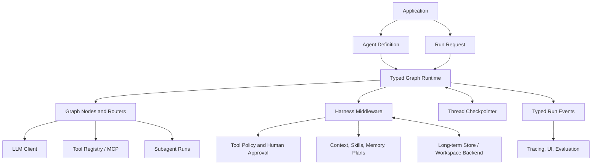

# Typed Agent Runtime: Overall Design and Staged Roadmap

**Status:** Proposed; runtime semantics resolved for review
**Date:** 2026-10-02
**Related:** [Agent Framework Gap Analysis](agent-framework-gap-analysis-deepagents-2026.md), [LLM4S Roadmap](../reference/roadmap.md)

## 1. Goal

Bring LLM4S agent capabilities to the practical level of the Deep Agents harness while preserving LLM4S's Scala-first strengths: typed composition, immutable state, explicit errors, model neutrality, and deploy-anywhere libraries.

“Deep Agents level” here means an integrated agent harness for complex, multi-step work. It should support planning, tool use, context management, reusable skills, long-term memory, delegation, permissions, human review, streaming, and durable resume. Those capabilities should all operate through one execution model, rather than appearing as unrelated utilities.

The foundation is a **typed graph runtime**. Agent loops, handoffs, and developer-authored workflows become graph patterns. Harness capabilities are composable components that run around graph nodes, model calls, and tool calls.

## 2. Design decisions

### 2.1 Keep the simple path simple

`Agent.run(query, tools)` remains the low-friction entry point for a normal conversational tool loop. It is implemented directly by invoking the graph runtime with a prebuilt agent graph, so simple users do not need to learn graph APIs; this is a convenience API, not a compatibility facade for a separate legacy engine.

### 2.2 Make graphs the shared execution model

The runtime executes nodes against explicit state in **supersteps**. At the start of a superstep, all ready nodes read the same committed state snapshot. Their state updates are applied to committed values in deterministic task and update order. The resulting state and next frontier are committed together. Nodes in the same frontier may run concurrently; a node scheduled by an update runs in a later superstep. This makes fan-in, conflict behavior, and the checkpoint boundary explicit.

Graph nodes can be ordinary Scala functions, model calls, tool loops, human-review gates, or nested graphs. The graph supports conditional routing, loops, static and dynamic fan-out/fan-in, and subgraphs. Existing static DAG workflows remain a useful, narrower subset; the current `Plan` API is not fully type-safe because its plan inputs/results use `Map[String, Any]` and its edge type labels are placeholders.

The agent loop is model → tool proposals → policy/tool execution → model routing. Each proposed tool call becomes an independent task. Handoffs become `Command` route changes to registered `AgentRef`/node targets; no live `Agent` object is stored in graph state.

### 2.3 Separate definition, run, state, context, and memory

- **Agent definition:** reusable prompt, model policy, tools, graph, policies, and configured capabilities.
- **Run:** one execution attempt, with a run ID, budgets, cancellation, and outcome.
- **Thread state:** serializable working state for a conversation/workflow, including graph cursor and pending work. It contains no tool registry, Agent, callback, client, or closure.
- **Run context:** non-serialized services bound for one invocation, such as caller identity, provider clients, tool/backend registries, clock, cancellation signal, and request-scoped dependencies.
- **Long-term store:** cross-thread knowledge or preferences scoped to a user, tenant, or agent.

Replace `AgentState` with the data-only graph/thread state used by the runtime. It currently contains a live `ToolRegistry`, and `AgentStatus.HandoffRequested` contains a live `Handoff`/`Agent` reference; neither belongs in persisted state. The replacement stores stable agent/handoff IDs, while tool functions, provider clients, and other executable values are rebound from `RunContext` after restore. Provide one migration note for users moving existing conversation/session data; imported conversation history does not imply resumable execution.

### 2.4 Persist execution, not only conversation history

Session JSON is valuable for saving a conversation. Durable runtime checkpoints must additionally capture graph version and cursor, state version, pending tool or child tasks, interrupt state, event sequence, and idempotency metadata. Keep session files and runtime checkpoints as distinct storage concepts, with an import path between them.

### 2.5 Make tool side effects governable

Every tool call passes through runtime policy before execution. A new agent-level `AgentTool` contract receives validated arguments and `RunContext`, and returns typed state updates and routing, failure, or suspension. Completion occurs when no further graph work is scheduled. `AgentToolSpec` holds model-facing schema and runtime policy metadata (side-effect class, permissions, timeout, retry/idempotency behavior, and sensitivity). Existing core `ToolFunction` remains the simple stateless synchronous tool contract; an adapter makes it available to the agent runtime. Agent-specific state, suspension, and cancellation stay out of `llm4s-core`.

Approval is represented as an interrupt that persists the proposed action for review and resumes with an explicit approve, edit, or reject decision.

### 2.6 Keep powerful capabilities explicit

Filesystem, shell, memory writes, remote tools, and subagent delegation are capabilities granted by the application. The harness may make them easy to configure, but does not silently grant them.

### 2.7 Use Scala 3 and structured concurrency directly

The target is Scala 3 only, JDK 21, and Scala 3 idioms (`enum`, opaque IDs, context parameters, and derives) without a Scala 2.13 or Java-source-compatibility constraint. Use SoftwareMill Ox as the initial internal execution substrate for direct-style structured concurrency over blocking provider/tool APIs. Scope child work to a run/superstep, interrupt and join sibling virtual threads on failure or cancellation, and expose `Future`/Cats Effect/ZIO bridges only as optional adapters rather than making `ExecutionContext` the runtime's control plane. Interruption is the cancellation contract: providers must preserve interruption and surface it as a cancellation/error result. `Llm4sHttpClient` already does this; audit the OpenAI and Anthropic SDK clients, then add provider-testkit checks and fix clients that do not honor it.

Ox is an implementation choice to validate in the first runtime prototype, not a new public runtime type in the API. Its current project describes Scala 3/JDK 21 support and structured concurrency ([Ox](https://github.com/softwaremill/ox)).

## 3. Conceptual architecture



The runtime owns scheduling, state transitions, checkpoints, interrupts, and run events. Middleware assembles context and enforces policies at defined execution boundaries. Stores and tool backends are ports with interchangeable implementations.

### 3.1 Module placement and API baseline

`llm4s-core` is designated as the stable spine for 1.0, but no module has an active MiMa baseline yet. Keep agent-specific runtime and harness APIs in `llm4s-agent`; any proposed change to core must be demonstrably core-neutral, finalized before enabling MiMa, and must not pull graph/runtime concepts into the spine. Put the graph kernel in the existing `llm4s-agent` module under `org.llm4s.agent.graph`; it is agent-specific today, so a separate graph artifact adds maintenance and release work without a demonstrated independent consumer. This adds Ox as an implementation dependency for `llm4s-agent` consumers; keep Ox types out of public signatures and document the dependency in the 1.0 migration note. Keep `llm4s-agent-tools` independent and core-only for reusable simple tools. Define `SandboxBackend` in `llm4s-agent`; implement its first workspace adapter in `workspaceClient`, which already depends on `agent`, so dependency direction stays acyclic. Keep SQLite and PostgreSQL checkpoint adapters in separate `llm4s-agent-checkpoint-sqlite` and `llm4s-agent-checkpoint-postgres` modules so JDBC dependencies do not leak through common settings. Each new published adapter module must declare a coverage floor or explicit disabled policy, Codecov flag, docs-project entry, migration note, integration suite tier in `modules/it`, and project registration in `hooks/pre-commit`.

## 4. State, update, routing, and run model

This is a design contract to prototype in Scala 3. Names may change, but the semantics below are requirements.

```scala
trait GraphNode[I] {
  def run(input: I, state: ThreadStateView, context: RunContext): NodeResult
}

opaque type NodeRef[I] = NodeId
opaque type ThreadId = String
opaque type RunId = String
opaque type CheckpointId = String
opaque type InterruptId = String
opaque type TaskId = String
opaque type NodeId = String
opaque type MiddlewareId = String
opaque type ToolCallId = String
opaque type MessageId = String
opaque type FencingToken = Long
opaque type JoinId = String

final case class RunPosition(
  threadId: ThreadId,
  checkpointId: CheckpointId,
  taskId: TaskId,
  nodeId: NodeId,
  fencingToken: FencingToken
)

enum Route:
  case Goto(target: NodeRef[Unit])
  case Send[I](target: NodeRef[I], payload: I, join: Option[JoinId] = None)
  case ExitToParent[O](port: ParentPortRef[O], output: O)

enum JoinExpectation:
  case Static(sourceNodes: Set[NodeId])
  case Dynamic(fanOutTask: TaskId)

final case class JoinBarrier(
  id: JoinId,
  target: NodeRef[Unit],
  expected: JoinExpectation
)

final case class ToolCallPosition(
  toolCallId: ToolCallId,
  joinId: JoinId
)

final case class Command(update: StateUpdate, routes: List[Route])

enum NodeResult:
  case Continue(command: Command)
  case Suspend[Q, A](
    update: StateUpdate,
    interrupt: TypedInterrupt[Q, A],
    resumeAt: NodeRef[Resumed[Q, A]]
  )
  case Fail(error: AgentError)

final case class RunContext(
  config: RunConfig,
  dependencies: RunDependencies,
  position: RunPosition,
  cancellation: ThreadInterruption,
  emit: CustomRunEvent => Unit
)

trait ThreadInterruption {
  /** View of the current worker thread's interrupt bit; this does not clear it. */
  def isInterrupted: Boolean
}

final case class RunConfig(
  runId: RunId,
  tenantId: Option[TenantId],
  principal: Option[Principal],
  budgets: RunBudgets,
  metadata: Map[String, String]
)

final case class TypedInterrupt[Question, Answer](
  id: InterruptId,
  payload: Question,
  payloadCodec: ReadWriter[Question],
  answerCodec: ReadWriter[Answer]
)

final case class Resumed[Question, Answer](question: Question, answer: Answer)

/** Checkpoint DTO only; codecs and typed node definitions are rebound from the compiled graph. */
final case class PendingContinuation(
  interruptId: InterruptId,
  question: ujson.Value,
  questionCodecId: CodecId,
  answerCodecId: CodecId,
  resumeNodeId: NodeId,
  taskId: TaskId,
  toolCallPosition: Option[ToolCallPosition]
)

enum RunResult[+O]:
  case Completed(state: ThreadState, output: O)
  case Suspended(state: ThreadState, pending: Map[InterruptId, TypedInterrupt[?, ?]])
  case Failed(state: Option[ThreadState], error: AgentError)

sealed trait AgentError extends LLMError

trait RunHandle[O] {
  def await(): RunResult[O]
  def events: RunEventStream
  def status: RunStatus
  def cancel(reason: String): Unit
}

trait RunEventStream {
  def subscribe(fromSeq: Long)(onEvent: RunEvent => Unit): Subscription
}

opaque type CompiledGraph[I, O] = CompiledGraphHandle[I, O]

final class StateKey[A, U] private (
  val id: StateKeyId,
  val stateCodec: ReadWriter[A],
  val updateCodec: ReadWriter[U],
  val initial: A,
  val applyUpdate: (A, U) => Result[A]
)

trait StateUpdate {
  def update[A, U](key: StateKey[A, U], value: U): StateUpdate
  def remove[A, U](key: StateKey[A, U]): StateUpdate
  def combine(next: StateUpdate): StateUpdate
}

object StateUpdate {
  val empty: StateUpdate
}

final case class StoredMessage(id: MessageId, message: Message)

enum MessageUpdate:
  case Append(message: StoredMessage)
  case Replace(id: MessageId, message: StoredMessage)
  case RemoveThrough(id: MessageId)

val messagesKey: StateKey[Vector[StoredMessage], MessageUpdate]

enum HookResult[+A]:
  case Continue[A](value: A, update: StateUpdate) extends HookResult[A]
  case ApplyCommand(command: Command) extends HookResult[Nothing]
  case Suspend[Q, Ans](
    update: StateUpdate,
    interrupt: TypedInterrupt[Q, Ans],
    resumeAt: NodeRef[Resumed[Q, Ans]]
  ) extends HookResult[Nothing]
  case Fail(error: AgentError) extends HookResult[Nothing]

final case class AgentToolSpec[A](
  name: String,
  description: String,
  schema: SchemaDefinition[A],
  argumentCodec: ReadWriter[A],
  sideEffect: SideEffectClass,
  policy: ToolPolicy,
  validateDecoded: A => Result[Unit] = (_: A) => Right(())
)

trait ToolArgumentValidator {
  def validate(schema: ujson.Value, arguments: ujson.Value): Result[Unit]
}

final case class ToolContext(run: RunContext, toolCallId: ToolCallId)

enum ToolOutcome:
  case Result(content: ToolContent, update: StateUpdate, routes: List[Route])
  case Suspend[Q, Ans](
    update: StateUpdate,
    interrupt: TypedInterrupt[Q, Ans],
    resumeAt: NodeRef[Resumed[Q, Ans]]
  )
  case Fail(error: AgentError)

trait AgentTool[A] {
  def spec: AgentToolSpec[A]
  def execute(arguments: A, context: ToolContext): ToolOutcome
}

trait SandboxBackend {
  def execute(request: SandboxRequest, context: RunContext): Result[SandboxResult]
}

trait AgentMiddleware {
  def id: MiddlewareId
  def stateKeys: Set[StateKey[?, ?]] = Set.empty
  def tools: Vector[AgentTool[?]] = Vector.empty
  def before: Set[MiddlewareId] = Set.empty
  def after: Set[MiddlewareId] = Set.empty

  def beforeAgent(
    context: RunContext,
    state: ThreadStateView,
    input: AgentInput
  ): HookResult[AgentInput] = HookResult.Continue(input, StateUpdate.empty)
  def beforeModel(
    context: RunContext,
    state: ThreadStateView,
    request: ModelRequest
  ): HookResult[ModelRequest] = HookResult.Continue(request, StateUpdate.empty)
  def wrapModelCall(
    context: RunContext,
    request: ModelRequest,
    next: ModelRequest => HookResult[ModelResponse]
  ): HookResult[ModelResponse] = next(request)
  def afterModel(
    context: RunContext,
    state: ThreadStateView,
    response: ModelResponse
  ): HookResult[ModelResponse] = HookResult.Continue(response, StateUpdate.empty)
  def wrapToolCall(
    context: RunContext,
    call: AgentToolCall,
    next: () => ToolOutcome
  ): ToolOutcome = next()
  def afterToolCall(
    context: RunContext,
    state: ThreadStateView,
    call: AgentToolCall,
    result: ToolOutcome
  ): HookResult[ToolOutcome] = HookResult.Continue(result, StateUpdate.empty)
  def afterAgent[O](
    context: RunContext,
    state: ThreadStateView,
    output: O
  ): HookResult[O] = HookResult.Continue(output, StateUpdate.empty)
}

final case class ResumeInput(answers: Map[InterruptId, ujson.Value])

trait AgentRuntime {
  def start[I, O](
    threadId: ThreadId,
    graph: CompiledGraph[I, O],
    input: I,
    config: RunConfig
  ): RunHandle[O]

  def resume[I, O](
    graph: CompiledGraph[I, O],
    threadId: ThreadId,
    answers: ResumeInput,
    config: RunConfig
  ): RunHandle[O]

  def recover[I, O](
    graph: CompiledGraph[I, O],
    threadId: ThreadId,
    config: RunConfig
  ): RunHandle[O]
}
```

`start` creates a new thread when no checkpoint exists. If the thread has a completed checkpoint and no pending interrupts, it applies the new input to the latest committed state (normally through the message-key update) and starts a new run. If the thread has an incomplete execution checkpoint, `start` rejects with `IncompleteRun`; callers use `recover` to continue that execution without adding a new input. If the thread has pending interrupts, `start` and `recover` reject; callers use `resume`. `resume` accepts a non-empty subset of pending interrupt answers, rejects unknown IDs, and leaves unanswered continuations pending. `recover` acquires the thread claim and continues runnable work from the latest durable checkpoint, reusing successful pending writes so completed siblings do not run again; it retries failed or unstarted tasks according to their node policies. It uses a new run ID and caller-supplied budgets. If an interrupt remains pending, recovery rejects and requires `resume`; a still-active thread claim returns retryable `ThreadBusy`. Concurrent active runs or stale versions for the same thread are rejected by the thread claim/version check. A concurrent resume receives a retryable `ThreadBusy` result identifying the active run; its answers are not accepted or discarded, and the caller retries after that run suspends or completes.

The runtime owns thread interruption: `RunHandle.cancel` interrupts the run's structured-concurrency scope, and `ThreadInterruption.isInterrupted` observes the current task's thread status without clearing it. Delete the separate orchestration `CancellationToken` as the graph runtime replaces orchestration; do not retain a second cancellation contract. Cancellation surfaces as a typed run outcome/error.

`beforeModel` and `afterModel` use `HookResult` to return a transformed request/response and state update, route with a `Command`, suspend with a typed continuation, or fail. A non-`Continue` result prevents the wrapped model call or ends the current model phase, respectively.

`CompiledGraph` is intentionally opaque to callers; the builder/compile API owns its internals. `RunConfig` carries a new `runId`, tenant and principal identity, budgets, and metadata. `threadId` is supplied once as the address to `start` or `resume`, avoiding duplicate thread identity. `RunContext.position` identifies the active thread, checkpoint, task, node, and fencing token for idempotency, tracing, event attribution, and scoped storage. The public resume payload is JSON because it can contain answers for different existential `Answer` types; the runtime resolves saved codec and node IDs against the compiled graph, decodes each answer, then schedules that interrupt's typed `resumeAt` node with `Resumed(question, answer)`. The continuation is data, never a serialized closure or codec instance.

Expected properties:

- **Typed state updates:** capabilities declare `StateKey[A, U]` with state/update codecs, an initial state, and an update function. The function belongs to the compiled definition, never the checkpoint. Every update is applied to the committed value, including single-writer updates; replacement is the special case `U = A` and `applyUpdate(_, next) = Right(next)`. `ThreadState` is a typed key/value store with checked access; existential erasure stays private to the serialization/runtime boundary. Scala 3 tuple/intersection state composition is not the default because capabilities must be attachable dynamically and checkpointable by key; statically composed node inputs/outputs remain ordinary Scala types.
- **Deterministic update order:** updates from concurrent tasks are applied in stable task order, then in emission order within each task. Dynamic `Send` children are ordered by `(emittingTaskOrdinal, routeIndex, itemIndex)`. This permits operation-valued updates and makes message order deterministic without requiring updates to form an associative `Semigroup`.
- **Typed routes:** every `GraphNode[I]` declares an input type and `NodeRef[I]` consumes that input. The graph builder creates opaque node handles. `Send` checks its payload against the destination input; `Goto` is limited to `NodeRef[Unit]`. The compiled graph owns existentially typed refs internally and validates membership/port compatibility at build and restore time. Nodes return `Command` updates plus routes, never route strings. Parent/child graph exits use explicit typed boundary refs.
- **Declared writes:** each node and middleware declares its set of `StateKey`s it may update/remove. The builder validates that declared updates are accepted by the key; runtime checks remain as defense for dynamic sends and restored graphs.
- **Joins and barriers:** `JoinBarrier` is an explicit typed scheduler construct with a builder-issued `JoinId` and a `NodeRef[Unit]` target; it is not an implicit property of routes. A static barrier declares its complete set of predecessor nodes for an activation and releases its target only after every expected arrival has committed. A dynamic barrier is attached to a fan-out task and records the expected child task IDs as its `Send`s expand; it releases only after every expected child has completed, ordered by emitting task ordinal, route index, then item index. An empty dynamic fan-out resolves immediately. Branch state effects are committed through the normal ordered update path before the target runs. The agent tool loop places a dynamic barrier between a batch of model tool calls and the next model call; each call task must contribute exactly one runtime-created result before that barrier releases.
- **Approval continuation identity:** when a tool task suspends, its continuation inherits that task's logical join slot and `ToolCallId`. Resume may execute at a newly scheduled `resumeAt` task, but its result fills the original logical arrival; the barrier must not wait for the continuation's new scheduler identity. Policy middleware approvals and tool-raised approvals converge on the built-in `ApprovalResumeNode`, which receives the typed decision, updates the original assistant tool-call message for edits, then executes or rejects the operation and lets the runtime create the result associated with the inherited `ToolCallId`.
- **Update composition:** `update`, `remove`, and `combine` are supported. `combine` is ordered composition for sequential updates (later operation wins for a key); parallel task updates remain distinct and are applied in the deterministic task order above. Message history uses `StateKey[Vector[StoredMessage], MessageUpdate]` with stable graph-owned IDs and `Append`, `Replace(id)`, and `RemoveThrough(id)` operations; do not add runtime IDs or update semantics to core `Message`.
- **Removal semantics:** `StateUpdate.remove(key)` removes that key's stored entry; subsequent reads observe the key's declared initial value. It does not mean “remove one item” from a collection. Collection-specific removals are ordinary typed update operations, such as `MessageUpdate.RemoveThrough`.
- Generic thread state is checkpointable only when every registered key has explicit state and update `ReadWriter`s plus migration chains and stable codec IDs. Checkpoints store codec IDs and versioned JSON (`ujson.Value` at storage/migration boundaries), not the key's update function; data is readable for inspection and compressible by stores.
- A run returns completed, suspended, or failed outcomes; interruption is not disguised as an exception. A `Continue` command may have zero routes; an empty ready frontier with no pending interrupts ends the graph and projects its output. A suspension pauses the whole run at the end of the current superstep: sibling tasks finish, their successful updates commit, and no next superstep starts until resume. Multiple interrupts are keyed by stable `InterruptId`; resume may answer any non-empty subset, schedules only those continuations with `Resumed(question, answer)`, and leaves unanswered continuations pending. **Quiescence** is a superstep boundary with no runnable tasks. If quiescence leaves parked continuations, the run reports `Suspended` again; joins remain closed while expected arrivals are parked, and no downstream/model node runs early. If a required join input has neither a runnable task nor a pending continuation capable of producing it, the runtime fails with `UnsatisfiedJoin`. Unknown IDs are rejected; missing IDs are allowed. The run remains suspended while any interrupt is still pending.
- Each durable run event includes stable `threadId`, `runId`, checkpoint, task, and node IDs, a monotonically increasing per-thread replay sequence, and timestamp. Live-only token deltas do not consume or advance the durable replay sequence.
- The thread checkpointer owns the durable run-event log as well as checkpoint snapshots. A checkpoint/task commit atomically appends its durable events with the associated state and pending writes; the SPI provides `eventsAfter(threadId, fromSeq, limit)` and `compactEvents(threadId, beforeSeq)`. Persist lifecycle, node/task/tool, checkpoint, state-update, interrupt/resume, and custom events. Allocate their per-thread sequence numbers in the commit and deliver them to subscribers only after that commit succeeds, in every durability mode, including `Async`; a crash must never expose an uncommitted durable sequence. Token deltas and other high-volume transient progress are live-only and are not replayed. Retain events while their corresponding checkpoints are retained, subject to configurable age/size limits; compaction advances a per-thread earliest available sequence, and replay before that floor returns `ReplayUnavailable(earliestSeq)`.
- `RunHandle` exposes `await`, typed event stream, `cancel`, current status, and the eventual `RunResult`; resume begins a new run ID and may use new budgets while retaining the thread/checkpoint identity. `subscribe(fromSeq)` supports replay from a persisted, serializable event sequence.
- Run events are serializable to versioned JSON; custom events provide a stable type name/version and `ujson.Value` payload (typed helpers encode through `ReadWriter`). Events are delivered in ascending per-thread sequence on a per-subscriber ordered dispatcher, never on a model/tool worker thread. A bounded subscriber queue disconnects a lagging subscriber with its last-delivered sequence; it can reconnect with `subscribe(fromSeq)` to replay persisted events. Nested child-run events carry parent and child IDs.
- Replace `AgentEvent` with the unified run-event model before 1.0; do not retain a compatibility adapter as a permanent second event vocabulary.

### 4.1 Superstep and checkpoint semantics

At a superstep boundary the scheduler resolves the ready frontier, snapshots the committed state, starts all eligible node tasks in a bounded Ox scope, collects branch outcomes, and applies state updates in deterministic task/update order. Each tool call is its own scheduled task, with its own task ID, write set, idempotency key, pending write record, and possible interrupt. Dynamic `Send` children are ordered by emitting task's stable frontier ordinal, route index, then item index, preserving model tool-call order in corresponding tool results; declared static edges are additive to routes returned in `Command`, ordered by edge declaration before command route order. Duplicate destinations remain distinct scheduled tasks. The scheduler records **pending writes per completed task** before the full superstep commit. If one sibling fails, successful sibling pending writes are retained and are not re-executed on resume; only failed/unstarted tasks are eligible to rerun. If any task suspends, all other tasks in that superstep finish and commit, then the entire run pauses before another superstep. Effects outside the checkpoint store still have at-least-once semantics and need idempotency. A suspended task stores its typed continuation and completed update, then resumes at the declared node with `Resumed(question, answer)`.

Checkpoint durability is configurable:

- `Sync`: commit each task result and superstep before advancing. Required for strong resume guarantees and human interrupts; default for durable graphs.
- `Async`: write checkpoints asynchronously; improves latency but permits bounded replay after process failure. The bound is the work after the last durable checkpoint.
- `OnExit`: persist at successful/failed run exit, but **always synchronously persist a suspension/interrupt before returning it**. Ordinary work has no crash recovery between exits; a reported suspension remains resumable. Intended for short runs where only final state matters.

Regardless of durability mode, returning a suspended result means its state, pending continuations, completed sibling writes, and event cursor have been synchronously persisted. `Async` and `OnExit` trade away durability for ordinary in-flight work only.

The run completes when no nodes are scheduled and no interrupt is pending; there is no node-level `Complete` outcome that bypasses superstep scheduling. A typed output projection reads the final committed state. Child graphs use explicit `ExitToParent` ports; an empty top-level frontier terminates the run.

The runtime supports per-node retry/cache policy, a recursion/superstep limit, input/output codecs, and graph visualization export (Mermaid). Thread checkpoint writes use optimistic version checks; one writer advances a thread version at a time. Concurrent same-thread runs must choose an explicit policy (reject by default; optional enqueue later), and stale workers cannot overwrite a newer checkpoint.

Static `interruptBefore`/`interruptAfter` breakpoints complement dynamic typed interrupts. `updateState` creates a versioned state update before resume; `stateHistory` inspects checkpoints; `fork` starts a new thread from a selected checkpoint. Subgraphs use hierarchical checkpoint namespaces and emit events with parent and child run IDs.

### 4.2 Stage 0 prototype: typed state, routing, and joins ([#1267](https://github.com/llm4s/llm4s/issues/1267))

`org.llm4s.agent.graph` in `llm4s-agent` prototypes the kernel contracts of §4 and §4.1 that do not depend on suspension, checkpoints, or Ox: `StateKey[A, U]`, `StateUpdate`, `ThreadState`, `GraphBuilder` with `NodeRef[I]`, `StaticJoin`, and `DynamicJoin` handles, `Command`/`Route`/`NodeResult`, a superstep scheduler in `CompiledGraph[I, O]`, and `GraphSnapshot` restore. Its specs (`ThreadStateSpec`, `GraphBuilderSpec`, `SuperstepSpec`, `JoinSpec`, `RestoreSpec`) are the executable form of the decisions below.

Decisions, including where the prototype refines the §4 sketch:

- **Handles are builder-owned classes, not opaque IDs.** An opaque `NodeRef[I] = NodeId` cannot distinguish a handle from another builder that reuses an ID, so `NodeRef[I]`, `StaticJoin`, and `DynamicJoin` carry their builder's identity. `compile` rejects foreign handles in edges, joins, and the entry; the scheduler rejects them in returned routes. IDs (`NodeId`, `TaskId`, `JoinId`, `StateKeyId`) stay opaque strings. Cycles use `declare[I]` followed by `implement`; `node[I]` does both.
- **Fan-out is its own route.** `Route.FanOut(join, target, payloads)` replaces `Send(..., join = Some(id))`. An empty fan-out must still open an activation, which releases immediately, and the item index in the `(emittingTaskOrdinal, routeIndex, itemIndex)` order comes from the payload vector. `Send` is one untracked item. A task may fan out to a given join at most once per command.
- **Static join arrival is completion.** A source arrives when one of its tasks completes; it does not route to the join. Each source counts once per activation however many of its tasks complete, and the join re-arms after release. A dynamic child arrives when its task completes; routes it emits do not delay the release.
- **Next-frontier order.** For each completed task in frontier order: its static edges in declaration order, then its command routes in route order, with fan-out payloads in item order. Then the targets of joins released by this commit: static joins in declaration order, then dynamic activations in the order they opened. Task IDs are `"<superstep>.<ordinal>"`.
- **`combine` is sequential composition.** `a.combine(b)` applies `a`'s operations and then `b`'s. "Later wins" holds only for replacement keys; for an operation-valued key, both operations apply.
- **`ThreadState` is an immutable snapshot**, so there is no separate `ThreadStateView`. `get` returns `Result[A]`. A key the graph did not register, or a different key instance that shares a registered ID, is `UnknownStateKey`. A registered key without an entry reads as its initial value. The graph registers every key in a node's write set, plus read-only keys passed to `stateKey`. Two distinct keys with one ID fail compilation.
- **A superstep commits atomically.** If any task fails, writes an undeclared key, returns an invalid route, or has an update rejected by its key, nothing from that superstep commits. The run fails with the first error in frontier order, and `RunResult.Failed` carries the last committed state. Per-task pending writes, which let `recover` keep completed siblings, are the next step. They belong with the checkpoint DTOs of [#1268](https://github.com/llm4s/llm4s/issues/1268).
- **`UnsatisfiedJoin` is detected at quiescence.** Routes are values computed at run time, so the scheduler cannot prove early that a source is unreachable. A join that is still open when the frontier empties fails the run. With suspension ([#1269](https://github.com/llm4s/llm4s/issues/1269)), the same check must also treat parked continuations as possible arrivals.
- **Restore validates against the compiled graph and reports every problem.** It checks the graph ID and the caller-supplied `version`, which names behaviour. It also checks a SHA-256 structural fingerprint over nodes, entry, edges, joins, and key IDs. It then checks that every state value and pending input decodes with this graph's codec, that each join exists with the right kind, that static arrivals come from sources, that every open join is partial (an empty or fully arrived activation would already have released), and that every arrival a dynamic activation still expects is pending in that fan-out. An in-memory `Execution` is bound to the `CompiledGraph` instance that created or restored it (`ForeignExecution`). Another instance of the same definition, including one in another process, goes through `snapshot`/`restore`.
- **Concurrency is behind a private seam.** `TaskExecutor` runs a frontier and returns results in task order. The default is sequential. The specs run every ordering scenario with tasks executed last-first and concurrently with random delays, and commit order does not change. Ox replaces this seam in [#1270](https://github.com/llm4s/llm4s/issues/1270).

Limits that later Stage 0 issues resolve: `NodeResult` has no `Suspend` yet ([#1269](https://github.com/llm4s/llm4s/issues/1269)). `GraphSnapshot` has no format version, codec IDs, migration, or event cursor ([#1268](https://github.com/llm4s/llm4s/issues/1268)). `NodeContext` (task, node, superstep) and `compile(maxSupersteps)` stand in for `RunContext` and `RunBudgets` ([#1271](https://github.com/llm4s/llm4s/issues/1271)). The fingerprint does not cover node input types; a changed input type is caught when a pending input fails to decode. The message key, retries/cache policy, and Mermaid export are Stage 1 work.

### 4.3 Durable workflow API

Explore a Scala `Workflow[A]`/`Durable[A]` for-comprehension as a peer frontend to the graph DSL. It should compile to the same runtime/checkpoint kernel, not create a second durable engine. Durable boundaries must be explicit named steps with serializable inputs/outputs; arbitrary Scala closures are not replayable. The workflow API can express sequence, parallel composition, retry, timeout, and typed suspension in direct Scala style. Prototype after the superstep kernel exists, and adopt only if it substantially improves ordinary Scala ergonomics.

## 5. Harness capabilities

### 5.1 Core runtime

- Typed graph builder with builder-issued opaque node references; no stringly typed routes.
- Per-key typed state update functions `StateKey[A, U]`, conditional routing, cycles, static and dynamic `Send`, fan-in, and nested subgraphs.
- Pregel-style supersteps with a committed input snapshot, bounded structured concurrency, deterministic update application, pending writes, and a checkpoint boundary.
- Ox direct-style execution as the initial runtime engine. Existing Future APIs are adapters; provider calls must honor thread interruption and report cancellation.
- Add optional Cats Effect and ZIO interop modules after the runtime kernel stabilizes; neither effect type becomes a required dependency of `llm4s-agent`'s public API.
- Run budgets for wall time, model tokens/cost, supersteps/recursion, tool calls, and delegated work.
- In-memory checkpoint and event-log implementations of the shared SPI, static and dynamic join barriers, static breakpoints, state edit/history/fork, retries/cache policy, input/output projections, and Mermaid graph export.
- Explicit `recover(threadId, graph, config)` entry point for continuing an incomplete execution checkpoint without applying a new turn input.

### 5.2 Agent tool contract

The current core `ToolFunction` is stateless and synchronous. Keep that simple tool contract in core because agent state, routing, suspension, and run context should not become core concepts. The agent runtime introduces `AgentTool[A]` plus `AgentToolSpec[A]`: a core `SchemaDefinition[A]` supplies the advertised JSON schema and a `ReadWriter[A]` decodes the same typed argument, with no independent raw `ujson` schema field; effect and permission metadata; and an execution function that receives `RunContext` and returns typed updates/routing or suspension. Before decoding, policy, or execution, the runtime validates the raw JSON arguments against the exact schema sent to the provider using an agent-local `ToolArgumentValidator`; it then decodes with the typed `ReadWriter` and applies optional decoded-value validation. Unsupported schema constraints fail closed. This catches constraints such as numeric bounds, enum membership, required properties, and string length even when decoding to `A` would succeed. Built-in runtime tools such as `write_todos`, virtual filesystem operations, and `task` are agent tools; reusable no-state tools in `llm4s-agent-tools` continue implementing `ToolFunction` and are adapted into the agent registry. Keep the existing core tool/schema/tracing contracts as the planned stable 1.0 spine; this runtime design does not require agent-specific additions to core.

This keeps the stable tool API small while allowing a tool to access caller identity, scoped backends, cancellation, idempotency keys, and the graph's typed key registry. Do not put `AgentState`, graph commands, interrupt concepts, or the agent-local argument validator into `llm4s-core`.

Tool implementations return content and state/routing effects, never `ToolMessage`s. For each model-issued call, the runtime writes exactly one provider-valid result message linked to its `ToolCallId`, then contributes that result to the batch barrier before the next model node can run. A successful outcome writes the returned content; a tool-level failure writes a structured error result, while an infrastructure-fatal failure may fail the run. A suspended call contributes no result until its continuation resolves. Approval executes the call, rejection/denial and unknown tools produce runtime-generated error results, and an edited approval first replaces the source assistant message containing the call (including its arguments) before execution. The runtime enforces uniqueness by source assistant message and call ID, so this invariant is not delegated to tool authors.

### 5.3 Durability and human review

- Checkpointer interface with thread-scoped snapshots and checkpoint history.
- SQLite adapter for the first durable backend; PostgreSQL adapter in production-readiness stage.
- Resume using a stable thread ID and typed continuation payload. A new `start` on an existing completed thread applies its input to the latest checkpoint; `start` is rejected while interrupts are pending.
- Recover an incomplete execution checkpoint without accepting new input; replay committed pending writes, retry only failed/unstarted tasks per node policy, and reject recovery while an interrupt is pending.
- Interrupts for tool approval, output review/edit, missing information, and external wait conditions.
- Concurrent pending interrupts are keyed by `InterruptId`; resume accepts a non-empty subset of answers, rejects unknown IDs, and leaves unanswered continuations pending for later reviewers/resume calls.
- If another resume currently owns the thread claim, return retryable `ThreadBusy` with the active run identity. Do not queue or acknowledge the second answer; its caller retries after the active run suspends or completes.
- Static `interruptBefore`/`interruptAfter` breakpoints and dynamic interrupts share the persisted pause/resume path.
- The model/tool graph uses the explicit dynamic join barrier in §4: the next model node cannot run until each requested tool call has contributed exactly one result. The runtime, not each tool implementation, creates and correlates result messages. Rejected, denied, and unknown calls receive provider-valid synthetic error results; suspended calls wait for their continuation, and an edited approval updates the source assistant message before execution. This preserves the one-result-per-call invariant for Anthropic and other provider protocols.
- Support `Sync`, `Async`, and `OnExit` checkpoint durability modes with the replay guarantees in §4.1.
- Side-effect safety through prepare/approve/execute stages, idempotency keys, and documented at-least-once boundaries.
- Derive tool idempotency keys from `(RunContext.position.threadId, RunContext.position.checkpointId, toolCallId)`; do not rely on provider tool-call IDs alone when a model request can be regenerated.
- Fence checkpoint and per-task pending-write commits with the active run-claim token and expected thread version. A stale worker must be unable to append a pending write after another worker takes over. Introduce this fencing in Stage 2 with durable execution, not later with deployment adapters.
- Checkpoint retention and state schema migration support.

### 5.4 Context harness

- Reuse existing token counting, context compression, tool-output compression, and memory modules.
- Add a long-term store SPI for cross-thread instruction/memory data and a pluggable virtual filesystem backend. The default is thread-state-backed, so files persist with the checkpoint and do not touch the host filesystem. A composite backend routes prefixes (for example `/memories/` to a long-term store and other paths to thread state); local and object-store backends are opt-in. `llm4s-agent` defines a `SandboxBackend` SPI; the `workspaceClient` module implements the first adapter. The dependency remains one-way because workspaceClient already depends on agent.
- Allow large tool outputs and working notes to be offloaded with references injected into context.
- Provide the Deep Agents-style optional tool suite: `ls`, `read_file`, `write_file`, `edit_file`, `delete`, `glob`, `grep`; expose `execute` only through a sandbox backend; expose `write_todos` for plans and `task` when subagents are configured. An opinionated harness profile supplies a default system prompt teaching plan/act/verify, context management, tool safety, and delegation; allow tool inclusion/exclusion and prompt replacement/suffix configuration.
- Add an agent-updatable todo plan. It guides work but does not override graph routing or tool policy.
- Adopt the [Agent Skills standard](https://agentskills.io/) (`SKILL.md` with frontmatter and referenced resources/scripts) with metadata discovery and on-demand loading. Do not create a competing skill format.
- Standardize pre-run recall, post-run memory recording, and optional memory consolidation hooks.
- Distinguish **instruction memory** (scoped editable/read-only `AGENTS.md` files loaded at startup or on demand through the backend) from **semantic memory** (`llm4s-memory` facts, entities, and embeddings retrieved/recorded through hooks). Offer both; they solve different problems.
- Include provider-supported structured output/response format and multimodal content blocks in the graph context and tool-result model. Prompt caching of static system, memory, and skill sections is an optional provider capability, not a universal runtime promise.
- Resolve model selection through the existing named provider sections. Put harness defaults and tool-profile defaults in the agent module's `reference.conf`; application-specific credentials and overrides remain at the app edge.

### 5.5 Delegation

- A parent graph can start specialized child runs with bounded input and explicit output schema.
- A child has its own thread/checkpoint namespace and context window; parent/child data exchange occurs through the typed task request/result, not shared mutable conversation state.
- Child definitions use the existing `TypedAgent[I, O]` idea as a genuine strength: task input and final report are typed, while the child receives a fresh conversation and returns its final typed result rather than copying its full trace into the parent prompt.
- Tool, permission, model, memory, time, token, and concurrency inheritance are explicit and inspectable.
- The opinionated harness profile includes a configurable general-purpose subagent by default; applications may disable it and provide only named specialists.
- Support parallel `task` calls with bounded child concurrency. Background child tasks with poll/cancel/join semantics follow only after checkpointing and run supervision are reliable.

### 5.6 Middleware, permissions, and operations

- Middleware is ordered and composable, not only a linear event observer. `AgentMiddleware` declares an ID, contributed state keys, contributed tools, and explicit before/after constraints; hooks have pass-through defaults so an implementation overrides only the phases it needs. It may also contribute prompt/context content and model/tool policy. Order registrations topologically by explicit constraints, using registration order to break ties; reject cycles. Hooks run in that order, and a `Command`, suspension, or failure short-circuits the current phase. `wrap*` middleware nests in that same order (first registered is outermost), and unwinds in reverse order; each wrapper controls whether and how often it calls `next`, with failures propagated through the wrapper stack. Lifecycle hooks include `beforeAgent`, `beforeModel`, `afterModel`, `afterToolCall`, and `afterAgent`; value-producing hooks return `HookResult[A]` with a transformed value/state update, `Command`, typed suspension, or failure. Both `wrapModelCall` and `wrapToolCall` can suspend or fail as well as continue, enabling retry, fallback, cache, dynamic model/tool selection, and HITL. Tool wrapping occurs after policy and before execution.
- Preserve guardrails as first-class middleware behavior. Input guardrails run in `beforeAgent` and at tool-argument validation; output guardrails run in `afterModel`, `afterToolCall`, and `afterAgent` for the corresponding content. Deterministic validators may reject or transform; LLM-as-judge guardrails use model hooks. A guardrail may return a typed failure or interrupt/suspension where configured. Keep explicit graph nodes available for applications that need guardrail outcomes to branch in workflow state.
- Permission rules are ordered `(operation, path/resource, decision)` rules; first match wins. LLM4S deliberately diverges from Deep Agents' allow-if-unmatched behavior: unmatched file/tool operations are denied unless explicitly allowed. Sandbox `execute` is separately constrained by the sandbox provider and must not be treated as secured by virtual-filesystem path rules alone. Human approval maps to typed `approve`/`edit`/`reject` interrupt answers.
- Use one agent execution event model that is also projected through the existing core tracing SPI. Start with runtime-owned typed events; add narrowly scoped generic events to core `TraceEvent` only when the runtime demonstrates a reusable tracing need, before MiMa is enabled. Stream consumers receive typed projections of the same events, including nested subagent handles and custom `ctx.emit` events. Align trace/span names with OpenTelemetry GenAI conventions such as `invoke_agent` and `execute_tool`.
- Preserve existing tracing/metrics and enrich them with run/node/tool/checkpoint identities.
- Support token, cost, latency, retry, approval, tool-failure, and child-task metrics.
- Add run history, state inspection, event replay, and checkpoint fork APIs where supported by the backend.
- Run-history APIs include optimistic `updateState`, checkpoint history, and fork-from-checkpoint; define retention and access-control behavior.
- Provide an evaluation interface for fixed cases, trace review, and before/after comparisons. Keep evaluator/model choices optional.

## 6. Staged roadmap and exit criteria

| Stage | Scope | Exit criteria |
|---|---|---|
| **0. Finalise contracts and prove risky semantics** | Settle typed state/update keys and declared writes, node input/route handles, static/dynamic join barriers, typed continuation resume and inherited tool-call/join identity, built-in `ApprovalResumeNode`, pause/partial-resume and incomplete-run recovery behavior, multi-turn thread semantics, runtime-owned tool results, schema argument validation, middleware/guardrail control flow, interruption cancellation, checkpoint/event DTOs and versioning, durable-event delivery after commit in every mode, and `llm4s-agent` API shape. | Prototypes prove update application/order, route and join checks, exactly one runtime-created result per tool call, approval continuation filling the original barrier slot with its `ToolCallId`, middleware- and tool-raised approval through `ApprovalResumeNode`, typed resume without re-execution, recovery from incomplete checkpoints without replaying successful sibling writes, rejection of invalid schema-constrained tool arguments before policy/side effects, run-wide pause and partial resume, Ox interruption propagation, persistence of continuation data without closures, and that Async-mode subscribers never see durable events before commit or sequence reuse after recovery. Finalise designs before enabling MiMa; this is not a release blocker. |
| **1. Runtime kernel, agent loop first** | Implement the graph kernel in `llm4s-agent` under `org.llm4s.agent.graph`: typed state/update keys, node input types, static/dynamic join barriers, command and additive static routing, dynamic `Send`, superstep scheduler, per-task pending writes, Ox structured concurrency, budgets, retries/cache, and in-memory checkpoints with durable event-log SPI. Implement `Agent.run`, `continueConversation`, `runMultiTurn`, and `recover` directly on this runtime with `AgentTool`, middleware, and guardrails. Rebuild `PlanRunner` with typed graph contracts or remove it. Replace AgentEvent usages in `modules/samples/streaming/*` and update guardrail/tracing samples. | The sole agent loop and parallel update sample demonstrate deterministic application order, barrier release, and step boundaries. Validation covers failed sibling/recover without re-running completed siblings, typed suspension/partial resume, multi-turn input, guardrail behavior, cancellation, cycles/recursion limits, route safety, and error propagation. `Future` APIs remain adapters. |
| **2. Durable execution and HITL** | Add checkpointer SPI plus SQLite backend, atomic checkpoint/event commits and event retention/compaction, Sync/Async/OnExit modes with synchronous persistence of every suspension, optimistic thread versions and run-claim fencing for snapshots and pending writes, typed concurrent interrupts/partial resume, static breakpoints, update/history/fork, policy checks, approval/edit/reject, idempotency keys, and provider-valid tool-result generation for every call including rejection/failure/interruption. | Restart/resume preserves checkpointed work and event replay within retention, rejects stale versions/claims, supports incremental approval, and does not replay completed pending writes. Provider contract suites verify exactly one tool result per call for OpenAI and Anthropic message formats. |
| **3. Deep Agents harness profile** | Add state-backed virtual files and composite backend, full filesystem tool suite, workspace-backed sandbox execute, todos, context offload/summarization, Agent Skills-compatible loader, editable instruction memory, long-term store SPI and distinct semantic-memory hooks, prompt/default profile and tool allow/exclusion. Add response-format/multimodal support and typed/custom streams. | Port a deep-research example and a coding/workspace example. Each demonstrates tool policy, context management, streaming, checkpoint/resume, and persisted artifacts. |
| **4. Subagents and isolation** | Add `task`/typed `TypedAgent[I,O]` delegation, configurable general-purpose subagent, isolated child checkpoint namespaces, parallel bounded children, nested stream handles and inherited policies/budgets. | Port deep research with parallel specialists; child returns typed final report and parent resumes/composes after failure or approval. |
| **5. Production adapters and parity** | PostgreSQL checkpoint/store modules, migrations/retention, distributed worker claims, full trace/evaluation integrations, profile configuration, deployment examples. | Reference workflows meet documented functional parity matrix. Every extra module has build, `hooks/pre-commit`, docs, coverage, Codecov, migration, and IT-tier wiring. |

These are capability stages, not calendar promises. Stage 1 implements the agent loop on the graph kernel from the outset; acceptance tests compare observable behavior against documented contracts rather than running two production loops side by side. Stage 0 prototypes are the gate for finalising contracts and enabling MiMa, not a release blocker. The runtime and harness must be implemented in `llm4s-agent` before 1.0. The core API remains the planned stable spine; any necessary core-neutral change must be reviewed and finalized before MiMa is enabled, while graph- and harness-specific APIs stay in `llm4s-agent`.

## 7. Migration strategy: replace before 1.0

No module has an active MiMa baseline yet; `llm4s-core` is designated as the stable 1.0 spine. Before 1.0, make the graph runtime the implementation and public model for agent execution, then enable MiMa after the API and implementation designs are finalised. Keep `Agent.run(query, tools)` as a convenient user API because it is a good simple entry point, not as a compatibility facade over a second engine.

Make one migration note covering state, event, tracing, guardrail, orchestration, cancellation, sample, dependency, and session changes. Replace `AgentState` with data-only graph/thread state; replace `AgentEvent` with the unified run-event model and update `modules/samples/streaming/*`; replace `TraceEvent.AgentStateUpdated`/`AgentState#toTraceEvent` usage with graph state/update events and update consumers such as `TraceCollector`, Langfuse tracing, and tracing samples. Preserve existing input/output and LLM-as-judge guardrails as middleware at the corresponding agent/model/tool lifecycle points. Delete the orchestration `CancellationToken` and use thread interruption throughout the replacement runtime. Rebuild `PlanRunner` on typed graph APIs or remove it if its contracts cannot be expressed without `Map[String, Any]`; migrate `continueConversation`, `runMultiTurn`, and incomplete-execution recovery to the graph runtime's explicit start/resume/recover semantics. Implement the agent tool loop directly on the runtime: each call becomes a task, arguments are schema-validated centrally, results are generated centrally, and a join barrier prevents early model advancement. Replace the event stream with the checkpointer-backed replay contract. Use acceptance tests to validate behavior; do not run old and new loops side by side or defer cutover until parity. Conversation session files may be imported as conversation history, but cannot restore graph cursors, tool tasks, or interrupts. Document Ox as a new implementation dependency for `llm4s-agent` consumers.

The migration note should give direct replacements for existing state/event/PlanRunner use, explain any intentional source breaks before 1.0, and show how simple `Agent.run` usage and new durable graph usage differ.

## 8. Non-goals

- Reimplement LangGraph, LangSmith, or every Deep Agents integration feature.
- Make filesystem/shell access default for every agent.
- Serialize provider clients, callbacks, or tool closures into state.
- Turn agent-authored todo lists into authoritative workflow control flow.
- Claim exactly-once external side effects without support from the external system; document idempotency and replay guarantees precisely.
- Replace the existing memory subsystem with a single imposed storage technology.
- Force all users to adopt Ox, Cats Effect, or ZIO types in public signatures.
- Treat a public `TypedAgent[I, O]` composition API as fully typed when it crosses `Map[String, Any]` boundaries.

## 9. Decision log

| Review point | Decision |
|---|---|
| Scala 2.13/Java interop constraint | **Accepted.** Scala 3 only and Scala 3 idioms are explicit. Optional integrations may be added separately; they do not constrain the core runtime API. |
| `AgentState`/handoff contain live references | **Accepted.** Replace `AgentState` with data-only graph/thread state and stable handoff IDs; do not preserve it as an adapted runtime model. Supply one migration note before 1.0. |
| Existing `Plan` only partly type-safe | **Accepted.** Describe its current `Any` boundaries accurately; rebuild it on typed graph APIs or remove it rather than preserve those boundaries for compatibility. |
| Concurrency must be selected | **Accepted with a prototype gate.** Use Ox/JDK 21 virtual-thread structured concurrency internally; add optional effect-system adapters later. Interruption is the cancellation contract; check and fix provider implementations that fail to preserve/report interruption. |
| Existing `ToolFunction` cannot see run state or suspend | **Accepted; adjusted boundary.** Keep the core simple-tool SPI as the stateless adapter. Add contextual `AgentTool` + separate `AgentToolSpec` in agent runtime; built-in stateful harness tools use that contract. This keeps graph-specific concepts out of core. |
| MiMa and module freeze | **Clarified.** No module has an active MiMa baseline yet; `llm4s-core` is the designated stable spine for 1.0. Keep agent-specific API changes in `llm4s-agent`, finalize any necessary core-neutral changes before enabling MiMa, and implement the runtime before 1.0. There is no release blocker tied to an intermediate baseline. |
| Module placement | **Accepted.** Put the graph kernel and harness, including `AgentTool`-based harness tools, in `llm4s-agent` (graph package `org.llm4s.agent.graph`). Keep simple reusable `ToolFunction`s in independent `llm4s-agent-tools`; keep SQLite/Postgres checkpoint adapters separate because JDBC should not leak through common settings. |
| Runtime semantics: update functions/supersteps/pending writes/dynamic Send/Command | **Accepted.** `StateKey[A,U]` applies each update to current state in deterministic task/update order. Commands combine updates with typed routes; each tool call is a separately checkpointable task. |
| Typed continuation resume and suspension scope | **Accepted.** A suspension records a typed question/answer interrupt and `resumeAt: NodeRef[Resumed[Q,A]]`. It pauses the whole run at the superstep boundary; resume may answer a subset, and unanswered continuations stay pending. |
| Typed graph sketch and write validation | **Accepted.** Nodes declare input types and write sets; `Goto` targets `NodeRef[Unit]`, `Send` carries the destination's input type, and compile-time checks are reinforced at runtime for dynamic/restored graphs. |
| Tool loop and PlanRunner migration | **Accepted.** Implement the loop directly on the new runtime. Rebuild PlanRunner using typed graph APIs or remove it; no compatibility compilation of `Map[String, Any]` into the new runtime and no side-by-side engines. |
| Workflow/comprehension API | **Accepted as an exploration, not a second engine.** A named-step `Workflow[A]` may compile to the same kernel after runtime semantics are proven; arbitrary closures cannot be replayed safely. |
| Deep Agents default tool suite and middleware | **Accepted.** Tool suite/default prompt, allow/exclude profile, state-contributing and `wrap*` middleware semantics are specified. |
| Typed state key map vs tuples/intersections | **Choose typed keys with operation-valued updates.** `StateKey[A,U]` carries codecs and an `(A,U) => Result[A]` application function. Scala 3 tuple/intersection composition remains appropriate for statically composed application input/output types, not the mutable capability registry. |
| Default backend and path routing | **Accepted.** Thread-state-backed virtual files by default, optional composite routing, and host/sandbox backends only when granted. |
| Skills and memory distinction | **Accepted.** Adopt Agent Skills `SKILL.md`; separately define editable instruction memory (`AGENTS.md`) and semantic/vector memory (`llm4s-memory`). |
| Permission default | **Deliberate divergence.** Use deny-if-unmatched for agent tool/filesystem operations, rather than Deep Agents' allow-if-unmatched behavior. Apply sandbox execution controls at the sandbox boundary as well as tool policy. |
| Dangling tool calls, subagent return, multimodal, prompt caching, nested streams | **Accepted.** Provider-valid tool results after rejection/errors are Stage 2; typed child report and nested stream handles, response formats/multimodal content, and optional provider prompt caching are in harness stages. |
| Event model and transport names | **Accepted.** Replace `AgentEvent` with the unified runtime event model. Add generic core `TraceEvent` cases only when proven useful, before MiMa is enabled. Use Pekko terminology if a stream adapter is added; do not cite Akka. |
| Long-term store, sandbox, custom events, and provider defaults | **Accepted.** Define a long-term store SPI, use `modules/workspace` as the first sandbox backend, expose `RunContext.emit`, select models through named provider sections, and put harness defaults in `reference.conf`. |
| Workspace dependency direction | **Adjusted.** Define `SandboxBackend` in `llm4s-agent`; implement it in `workspaceClient`, which already depends on agent. Do not add an agent-to-workspace dependency. |
| Thread position, multi-turn, and partial approvals | **Accepted.** Put thread/checkpoint/task/node IDs in `RunContext`; apply new input to an existing completed thread's latest checkpoint; reject `start` with pending interrupts; permit incremental resume answers. |
| Guardrails and state-update tracing | **Accepted.** Preserve guardrails as lifecycle middleware and migrate `TraceEvent.AgentStateUpdated` consumers to graph state/update events in the single migration note. |
| Checkpoint fencing and stream delivery | **Accepted.** Fence task writes as well as snapshots with the run claim; serialize/version events and deliver them in sequence on an ordered dispatcher. |
| Explicit joins and partial resume | **Accepted.** Static joins wait for declared arrivals; dynamic joins record expected fan-out task IDs. The tool-call batch feeds a barrier, so an approved branch cannot advance the model while other calls are unresolved. Quiescence with parked continuations reports `Suspended`; an impossible join fails explicitly. |
| Tool-result ownership | **Accepted.** `AgentTool` returns content/effects/outcomes. The runtime creates the correlated provider-valid result message for success, failure, rejection, denial, and unknown tools, and the join enforces one result per call. Edited approvals replace the originating assistant message before execution. |
| Durable event storage | **Accepted.** The thread checkpointer owns an atomic event log alongside snapshots and pending writes. Lifecycle and state/tool events are durable; token deltas are live-only. Replay has configurable retention/compaction and reports the earliest available sequence. |
| Middleware and schema contract | **Accepted.** Middleware declares IDs, state keys, tools, and ordering constraints with pass-through hook defaults; model wrappers can suspend. Agent tool specs use core `SchemaDefinition[A]` plus a decoder for the same `A`, with no raw schema field. |
| Concurrent resume and state removal | **Accepted.** A resume against an actively claimed thread returns retryable `ThreadBusy` without consuming its answer. Removing a typed state key clears its stored entry, so reads return its initial value; collection element deletion remains a typed update operation. |
| Recovery after task failure or process restart | **Accepted.** Add `recover(threadId, graph, config)` for incomplete execution checkpoints. It continues from durable pending writes without accepting a new turn input, retries only failed/unstarted tasks per policy, and rejects threads with pending interrupts (use `resume`). |
| Tool argument validation | **Accepted.** Validate raw arguments against the exact provider-facing JSON Schema generated from core `SchemaDefinition` before decoding, policy, or side effects. Use an agent-local validator SPI that fails closed for unsupported constraints, then decode and run optional semantic validation; do not change core for this runtime requirement. |
| Stable core boundary and module wiring | **Clarified.** `llm4s-core` is the designated stable spine for 1.0, though MiMa is not active yet. Keep graph/harness APIs in `llm4s-agent`; register future checkpoint adapter projects in `hooks/pre-commit` alongside build, docs, coverage, Codecov, and IT-tier wiring. |
| Objective parity measure | **Accepted.** Port a Deep Agents-style research workflow and coding/workspace workflow as acceptance suites, and score the same capabilities across both. |

## 10. Main risks and remaining prototypes

| Risk/question | Mitigation or decision point |
|---|---|
| Generic Scala state is not automatically serializable. | Require state/update `ReadWriter`s, stable codec IDs, and migration chains for registered keys; reject durable compilation when either codec is missing. |
| Heterogeneous typed keys need runtime identity checks at their erased storage boundary. | Use stable key IDs plus internal state/update type tokens, validate duplicate IDs during graph compilation, and expose only typed reads and updates. |
| Update functions can be order-sensitive. | Define a stable total task/update order for all writes and test sequential, parallel, and replayed update application against that order. |
| Compile-time typed routes meet dynamically loaded graphs. | Builder-issued opaque refs constrain normal authoring; checkpoint restore validates graph version and route IDs before resuming. |
| Ox cancellation cannot stop every blocking vendor SDK call. | Treat thread interruption as the contract, check it in provider-testkit, and fix OpenAI/Anthropic SDK paths that do not preserve/report interruption. Do not add a separate cancellable client type. |
| A node may perform an external side effect then crash before checkpoint. | Document at-least-once execution; expose idempotency keys and tool-specific execution policies; checkpoint around side effects. |
| Graph/checkpoint schema evolves after deployment. | Version definitions and state; add explicit migration chain and reject unknown/incompatible versions clearly. |
| A stale worker writes a task result after another worker claims the thread. | Require the current fencing token and expected thread version on every checkpoint and pending-write commit; reject stale claims atomically. |
| Runtime scope risks coupling unrelated graph consumers to agent dependencies. | Keep it in `llm4s-agent` while agent is its demonstrated consumer; split only if a real non-agent user and dependency boundary emerge. |
| Workspaces and memory can cross tenant/security boundaries. | Include tenant/principal scope in run config and storage keys; deny by default where capabilities are not granted; make subagent inheritance explicit. |
| Roadmap becomes a broad rewrite. | Deliver stage gates independently; stage 1 must prove value and ergonomic fit before later stages are committed. |

## 11. Relationship to the comparison report

This document is the proposed implementation direction. The [gap analysis](agent-framework-gap-analysis-deepagents-2026.md) describes current LLM4S capabilities and compares the conceptual division between LangGraph's runtime and Deep Agents' harness. Upstream reference documentation:

- [Deep Agents overview](https://docs.langchain.com/oss/python/deepagents/overview)
- [LangGraph persistence](https://docs.langchain.com/oss/python/langgraph/persistence)
- [LangGraph interrupts](https://docs.langchain.com/oss/python/langgraph/interrupts)
- [Deep Agents backends](https://docs.langchain.com/oss/python/deepagents/backends)
- [Deep Agents subagents](https://docs.langchain.com/oss/python/deepagents/subagents)
- [Deep Agents skills](https://docs.langchain.com/oss/python/deepagents/skills)
- [Ox structured concurrency for Scala](https://github.com/softwaremill/ox)
- [Agent Skills standard](https://agentskills.io/)
