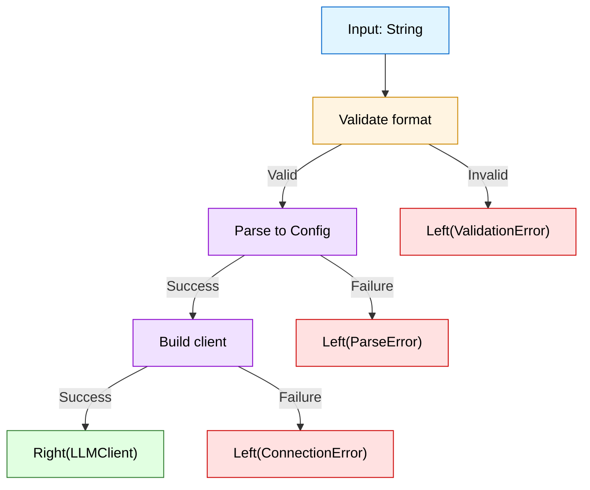
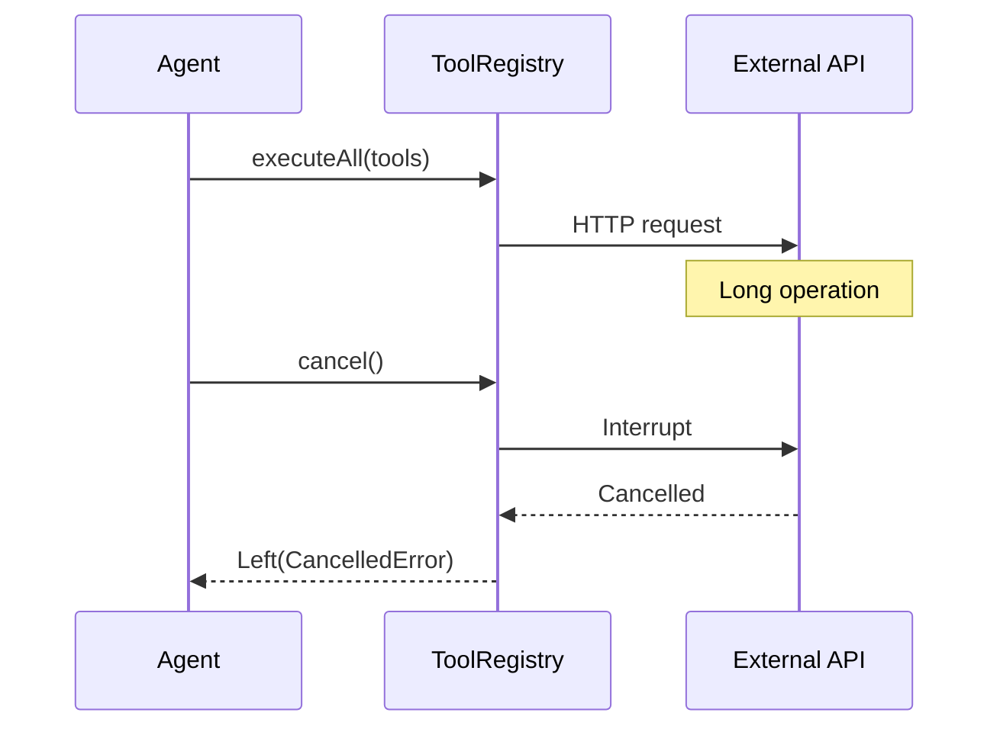
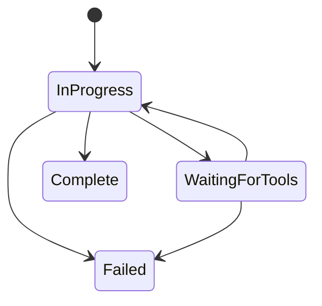

# llm4s Master review guidelines

**Version**: 0.4
**Last Updated**: 2026-01-30
**Purpose**: CI PR review bot policy and human reviewer playbook

{: .note }
> **New contributor?** Start with the [Contributing Guide](contributing) for the step-by-step process of submitting your first PR. This page covers coding standards and patterns.

This document captures coding best practices derived from PR review feedback, particularly from experienced contributors. Following these guidelines will help your PRs pass review faster.

---

## Table of contents

1. [CI review bot contract](#1-ci-review-bot-contract-policy-kernel)
2. [Repository map](#2-repository-map)
3. [Review principles](#3-review-principles-for-llm4s)
4. [PR review workflow](#4-pr-review-workflow-ci-playbook)
5. [Code review checklist](#5-code-review-checklist-llm4s-specific)
6. [API and design review](#6-api-and-design-review-checklist)
7. [Architecture review](#7-architecture-review-checklist)
8. [Functional programming patterns](#8-fp-patterns-in-llm4s)
9. [Design patterns](#9-design-patterns-in-llm4s)
10. [SOLID principles](#10-solid-in-llm4s)
11. [Testing strategy](#11-testing-strategy-review)
12. [Documentation review](#12-documentation-review)
13. [Build, CI, DevOps](#13-build-release-ci-devops-review)
14. [Security and dependencies](#14-security-and-dependency-hygiene)
15. [Performance and resources](#15-performance-and-resource-safety)
16. [Common PR smells](#16-common-pr-smells-and-how-to-comment)
17. [Mermaid diagrams in reviews](#17-mermaid-diagrams-in-reviews)

- [Appendix A: Comment templates](#appendix-a-comment-templates)
- [Appendix B: Examples index](#appendix-b-examples-index)
- [Appendix C: Changelog](#appendix-c-changelog)

---

## 1. CI review bot contract (Policy Kernel)

### 1.1 How CI bots must use this document

**Input**: PR diff (files changed, lines added/removed)
**Output**: Structured review comment with:

1. **Summary** (2-3 sentences: what changed, overall risk)
2. **Risk Assessment** (Low/Medium/High with reasoning)
3. **Must-Fix Issues** (blocking - cite section, provide fix)
4. **Should-Fix Issues** (non-blocking - cite section, suggest improvement)
5. **Questions** (clarifications needed)
6. **Acknowledgment** (praise good patterns)

### 1.2 Severity rubric

| Severity     | When to apply                                                     | Blocking? | Example                                                                               |
|--------------|-------------------------------------------------------------------|-----------|---------------------------------------------------------------------------------------|
| **CRITICAL** | Breaks build, violates safety invariant, security risk            | YES       | Exception in domain logic, secret in code, non-exhaustive match on ADT                |
| **HIGH**     | API breakage, concurrency bug, resource leak, type unsafety       | YES       | Missing `Resource` wrapper, mutable state in pure function, depends on concrete class |
| **MEDIUM**   | Style violation, missing test, unclear naming, minor inefficiency | NO        | Variable name `x`, missing ScalaDoc on public API, unnecessary `.toList`              |
| **LOW**      | Nitpick, suggestion, alternative approach                         | NO        | Could use `traverse` instead of `map().sequence`, consider caching                    |

### 1.3 Comment format rules

**Structure**:

```markdown
[SEVERITY] Issue description (cite guideline section)

**Problem**: One-sentence explanation
**Fix**: Concrete code suggestion or action
**Reference**: Section X.Y.Z of review guidelines
```

**Location**: Always cite file path and line range from PR diff.

**Tone**: Direct, technical, respectful. No "you should consider", just "Change X to Y because Z".

### 1.4 Bot prompt template

```
You are reviewing a PR for llm4s (Scala 2.13 + 3.x LLM library).

INPUTS:
- PR diff: {files_changed}
- llm4s review guidelines (this document)
- CLAUDE.md (project conventions)

TASK:
1. Scan diff for violations of guidelines sections 2-17
2. Prioritize: Result[A] usage (5.1), config safety (5.2), type safety (5.3), API breaks (6), security (14)
3. Generate review comment per section 1.2-1.3 format
4. For each issue: severity, problem, fix, reference
5. Include at least one acknowledgment of good code if present

CONSTRAINTS:
- Only review changed lines, not entire files
- Cite specific line numbers from diff
- No false positives on library code (uPickle, Cats, etc.)
- No style nitpicks unless severity HIGH+
- Must provide actionable fix for each issue

OUTPUT FORMAT: See section 1.1
```

### 1.5 Low-noise rules

**Do NOT flag**:

- Correct usage of library code (Cats, uPickle, ujson, pureconfig, Spark, etc.)
- Style preferences with no semantic impact
- Patterns explicitly allowed in sections 8-10
- Code in `samples/` or `workspace/` modules (lower bar)

**Always flag**:

- Exceptions in `org.llm4s.{core, error, types, agent, llmconnect, toolapi}` (see 5.1)
- `sys.env`, `ConfigFactory` in core (see 5.2)
- Non-exhaustive pattern matches on sealed traits (see 5.3)
- API signature changes without migration (see 6.1)
- Secrets or API keys in code/logs (see 14.1)

---

## 2. Repository map

### 2.1 Module structure

```
llm4s/
├── modules/core/           # Published library (strict review)
│   └── src/main/scala/org/llm4s/
│       ├── agent/          # Agent, guardrails, memory, handoffs
│       ├── config/         # Llm4sConfig (ONLY place for env reads)
│       ├── llmconnect/     # LLMClient, providers (OpenAI, Anthropic, etc.)
│       ├── toolapi/        # Tool calling, ToolFunction, ToolRegistry
│       ├── types/          # Result[A], newtypes (ModelName, ApiKey, etc.)
│       ├── error/          # LLMError ADT
│       ├── rag/            # Embeddings, vector stores
│       └── trace/          # Langfuse, observability
├── modules/samples/        # Examples (relaxed review)
├── modules/workspace/      # Docker runner (relaxed review)
└── modules/crossTest/      # Scala 2.13 + 3.x behavior tests
```

### 2.2 Key API surfaces

| Package      | Key Types                                 | Review Focus                |
|--------------|-------------------------------------------|-----------------------------|
| `types`      | `Result[A]`, `ModelName`, `ApiKey`        | Newtypes, no primitives     |
| `llmconnect` | `LLMClient`, `Conversation`, `Completion` | Trait abstractions, DIP     |
| `agent`      | `Agent`, `AgentState`, `Handoff`          | Pure state transformations  |
| `toolapi`    | `ToolFunction`, `ToolRegistry`            | Type-safe schemas           |
| `config`     | `Llm4sConfig`                             | Config boundary enforcement |
| `error`      | `LLMError`                                | ADT, no exceptions          |

### 2.3 Architecture invariants

| Invariant                | Enforcement                               | Violation Example                                   |
|--------------------------|-------------------------------------------|-----------------------------------------------------|
| **Result[A] everywhere** | No exceptions in domain logic             | `throw new Exception` in `Agent`                    |
| **Config boundary**      | Scalafix: ban `sys.env` outside `config/` | `sys.env("OPENAI_API_KEY")` in `LLMClient`          |
| **Purity**               | IO at edges only                          | `scala.io.Source.fromFile` in validation logic      |
| **Type safety**          | Newtypes, not primitives                  | `def setModel(name: String)` instead of `ModelName` |
| **Cross-build**          | Single source, `ScalaCompat` shims        | Version-specific logic in shared source             |

### 2.4 Scalafix enforcements

| Rule               | Banned                 | Allowed In                           | Severity |
|--------------------|------------------------|--------------------------------------|----------|
| `NoConfigFactory`  | `ConfigFactory.load()` | `org.llm4s.config`                   | CRITICAL |
| `NoSysEnv`         | `sys.env(...)`         | `config/`, `samples/`, `workspace/`  | CRITICAL |
| `NoSystemGetenv`   | `System.getenv(...)`   | Same as above                        | CRITICAL |
| `NoKeywordTry`     | `try { ... }`          | `core.safety`, `agent.orchestration` | HIGH     |
| `NoInfixOperators` | `list map f`           | Use `list.map(f)`                    | MEDIUM   |

---

## 3. Review principles for llm4s

### 3.1 Contributor Philosophy (Merged from concise guide)


#### Keep It Simple

LLM4S follows a **soft functional** style: immutable data and pure functions by default, without being religious about pure FP. Pragmatism over purity.

- Prefer immutable data structures
- Write pure functions where practical
- Use `Result[A]` for error handling instead of exceptions
- Don't over-abstract or over-engineer
- If the simple solution works, use it

#### Quality Over Speed

In a library/SDK, security bugs and tech debt accumulate quickly. We prefer slower, careful merges over rapid churn.

**Signs of rushed PRs that will need revision:**
- Lots of changes with weak explanation of the "why"
- Missing edge cases and failure tests
- Auto-generated or tool-produced code without human review
- Changes to areas the contributor hasn't fully understood

**Reviews are teaching moments** - especially for changes touching core, config, security, concurrency, or public APIs.

---


**P1. Functional purity over imperative mutation**
Pure functions, immutable data, explicit effects via `Result[A]`.

**P2. Type safety over runtime validation**
Use newtypes, ADTs, phantom types. Make illegal states unrepresentable.

**P3. Explicitness over magic**
No implicits for core logic. Type class instances OK. Config must be traceable.

**P4. Fail fast at compile time, recover gracefully at runtime**
Sealed traits force exhaustiveness. `Result[A]` for runtime errors.

**P5. Simple over clever**
Prefer straightforward ADT over advanced type-level programming unless justified.

**P6. API stability over rapid iteration**
Breaking changes require deprecation cycle. Semver strictly enforced.

**P7. Soft functional style - pragmatism over purity**
Immutable data and pure functions by default, without being religious about pure FP. If the simple solution works, use
it.

**P8. Quality over speed - careful reviews prevent tech debt**
In libraries, security bugs and tech debt accumulate quickly. Prefer slower, careful merges. Reviews are teaching
moments, especially for core, config, security, concurrency, or public APIs.

---

## 4. PR review workflow (CI playbook)

### 4.0 PR best practices (Merged from concise guide)


#### Keep PRs Small and Focused

**One change, one reason.** Large PRs are hard to review and often hide bugs.

- Each PR should do one thing well
- If you're fixing a bug, just fix the bug - don't refactor nearby code
- If you're adding a feature, don't also reorganize the package structure
- Big refactors should start as an issue or design note for discussion first

#### Explain the "Why"

Your PR description should answer:

- **Why** is this change needed?
- **What** tradeoffs did you consider?
- **What** did you test? How?
- **What** could break?

A PR with "Add feature X" and no context will get more questions and take longer to merge.

#### Test New Behavior and Failure Cases

Every PR with new code needs tests. This includes:

- Happy path tests
- Edge cases (empty inputs, nulls, boundary values)
- **Failure cases** - what happens when things go wrong?
- Concurrency tests if applicable

See the [Testing Guide](testing-guide.md) for details.

#### Be Careful with Public APIs

Avoid changing public APIs unless clearly needed. When you do:

- **Call it out explicitly** in the PR description
- Explain why the change is necessary
- Consider backward compatibility
- Document migration path if breaking

Adding a method to a trait is a breaking change for implementers. Adding a required parameter breaks all callers.

---


### 4.1 Five-minute triage

**Goal**: Classify PR risk and routing.

**PR quality pre-checks**:

- [ ] **Keep PRs small and focused** - one change, one reason. If fixing a bug, just fix the bug. Don't bundle
  refactoring.
- [ ] **Explain the "why"** - PR description answers: Why needed? What tradeoffs? What tested? What could break?
- [ ] **Test failure cases** - tests include happy path, edge cases (empty inputs, boundaries), and failure scenarios
- [ ] **Call out API changes** - breaking changes explicitly documented with migration path

| Check             | Action                                               | Risk flag |
|-------------------|------------------------------------------------------|-----------|
| **Files changed** | `core/` > 10 files OR `llmconnect/` provider changes | HIGH      |
| **API surface**   | Public trait/case class signature change             | HIGH      |
| **Build config**  | `build.sbt`, `Common.scala`, `Deps.scala` modified   | MEDIUM    |
| **Tests**         | No tests for logic changes in `core/`                | HIGH      |
| **Scalafix**      | `.scalafix.conf` or rule changes                     | CRITICAL  |
| **Secrets**       | Grep for `sk-`, `api_key`, hardcoded tokens          | CRITICAL  |

**Outcome**:

- CRITICAL/HIGH: Deep review required (section 4.2)
- MEDIUM: Focused review on changed areas
- LOW: Quick scan + approval

### 4.2 Deep review checklist

Run through sections 5-17 in order for HIGH-risk PRs.

**Mandatory checks**:

- [ ] All domain logic returns `Result[A]` (see 5.1)
- [ ] No `sys.env` or `ConfigFactory` outside `config/` (see 5.2)
- [ ] Pattern matches on sealed traits are exhaustive (see 5.3)
- [ ] Public APIs use newtypes, not primitives (see 5.4)
- [ ] Cross-build compatibility (Scala 2.13 + 3.x) (see 5.5)
- [ ] New public APIs have ScalaDoc (see 12.1)
- [ ] Logic changes have tests (see 11.1)
- [ ] No secrets in code/logs (see 14.1)

---

## 5. Code review checklist (llm4s specific)

### 5.0 Practical contributor code-quality patterns (Merged from concise guide)


#### 1. Error Handling - Use `Result[A]`, Not Exceptions

LLM4S uses `Result[A]` (an alias for `Either[LLMError, A]`) for error handling. Avoid throwing exceptions for control flow.

**Best Practices:**

```scala
// GOOD - Return Result directly
def parseConfig(json: String): Result[Config] =
  if (json.isEmpty) Left(ValidationError("Empty JSON"))
  else Right(Config.parse(json))

// BAD - Throwing inside Try
def parseConfig(json: String): Result[Config] = Try {
  if (json.isEmpty) throw new IllegalArgumentException("Empty")
  Config.parse(json)
}.toResult

// GOOD - Use .toResult for external code that may throw
Try(externalLibrary.parse(json)).toResult
```

**Preserve error causes:**

```scala
// BAD - Dropping the cause
Try { ... }.toEither.left.map(e => ProcessingError(e.getMessage))

// GOOD - Preserve stack traces
Try { ... }.toEither.left.map(e => ProcessingError(e.getMessage, cause = Some(e)))
```

---

#### 2. Configuration - Dependency Injection, Not Direct Access

Core code should not read configuration directly. Configuration loading belongs at the application edge (samples, CLIs, tests), and typed settings should be injected into core code.

**Best Practices:**

```scala
// BAD - Reading config in tool/core code
class BraveSearchTool {
  def search(query: String): Result[String] = {
    val config = Llm4sConfig.loadBraveSearchTool()  // DON'T DO THIS
    // ...
  }
}

// GOOD - Accept config as parameter (DI style)
object BraveSearchTool {
  def create(config: BraveToolConfig): BraveSearchTool =
    new BraveSearchTool(config)
}

// At app edge (samples/CLI):
for {
  config <- Llm4sConfig.loadBraveSearchTool()
  tool = BraveSearchTool.create(config)
} yield tool
```

Scalafix enforces this: imports of `Llm4sConfig`, `ConfigSource.default`, `sys.env`, or `System.getenv` are blocked in core main sources (except inside `org.llm4s.config`).

---

#### 3. Type Safety - Avoid `Any`

Using `Any` hides type errors until runtime. Prefer typed alternatives.

**Best Practices:**

```scala
// BAD - Using Any
def setParameter(stmt: PreparedStatement, idx: Int, value: Any): Unit

// GOOD - Use a typed ADT
sealed trait SqlParam
case class StringParam(value: String) extends SqlParam
case class IntParam(value: Int) extends SqlParam
case class TimestampParam(value: Timestamp) extends SqlParam

def setParameter(stmt: PreparedStatement, idx: Int, param: SqlParam): Unit = param match {
  case StringParam(v) => stmt.setString(idx, v)
  case IntParam(v) => stmt.setInt(idx, v)
  case TimestampParam(v) => stmt.setTimestamp(idx, v)
}

// GOOD - For JSON, use ujson types instead of Any
val params: ujson.Obj = ujson.Obj("key" -> "value")
```

---

#### 4. Resource Management - Close What You Open

Resources like HTTP backends, database connections, and file handles must be properly closed to avoid leaks.

**Best Practices:**

```scala
// BAD - Resource leak
def fetchUrl(url: String): String = {
  val backend = DefaultSyncBackend()  // Never closed!
  basicRequest.get(uri"$url").send(backend).body
}

// GOOD - Using.resource ensures cleanup
def fetchUrl(url: String): String =
  Using.resource(DefaultSyncBackend()) { backend =>
    basicRequest.get(uri"$url").send(backend).body
  }

// GOOD - For JDBC
def withConnection[A](f: Connection => A): A =
  Using.resource(dataSource.getConnection)(f)
```

---

#### 5. Constructor Side Effects - Keep Construction Pure

Side effects in constructors make code harder to test and reason about. Prefer explicit initialization via factory methods.

**Best Practices:**

```scala
// BAD - Side effects in constructor
class PostgresStore(config: Config) {
  initializeSchema()  // Side effect during construction
}

// GOOD - Factory method makes initialization explicit
class PostgresStore private (config: Config, dataSource: DataSource) { ... }

object PostgresStore {
  def create(config: Config): Result[PostgresStore] =
    for {
      dataSource <- initializeDataSource(config)
      _ <- initializeSchema(dataSource)
    } yield new PostgresStore(config, dataSource)
}
```

---

#### 6. Thread Safety - Synchronize Iterations

When using synchronized collections, individual operations are thread-safe but iterations are not.

**Best Practices:**

```scala
// BAD - Iteration not thread-safe
val syncMap = Collections.synchronizedMap(new LinkedHashMap)
syncMap.entrySet().asScala.foreach { ... }  // UNSAFE!

// GOOD - Synchronize the entire iteration
syncMap.synchronized {
  syncMap.entrySet().asScala.foreach { ... }
}

// BETTER - Use proper concurrent collections
val cache = new ConcurrentHashMap[K, V]()
```

---

#### 7. JSON Handling - Use Libraries, Don't Roll Your Own

Manual JSON encoding is error-prone and misses edge cases. Use ujson, which is already a project dependency.

**Best Practices:**

```scala
// BAD - Manual JSON encoding (misses escapes!)
def toJson(map: Map[String, String]): String =
  map.map { case (k, v) => s""""$k":"${v.replace("\"", "\\\"")}"""" }.mkString("{", ",", "}")

// GOOD - Use ujson
import ujson._

def toJson(map: Map[String, String]): String = ujson.write(map)

def fromJson(json: String): Map[String, String] =
  ujson.read(json).obj.map { case (k, v) => k -> v.str }.toMap
```

---

#### 8. Validation - Validate Config and Inputs

Validate inputs early with clear error messages. This prevents security issues and improves debuggability.

**Best Practices:**

```scala
// GOOD - Validate in config constructors
case class CacheConfig(
  similarityThreshold: Double,
  ttlSeconds: Long,
  maxSize: Int
) {
  require(similarityThreshold >= 0.0 && similarityThreshold <= 1.0,
    s"threshold must be 0-1, got $similarityThreshold")
  require(ttlSeconds > 0, s"ttl must be positive, got $ttlSeconds")
  require(maxSize > 0, s"maxSize must be positive, got $maxSize")
}

// GOOD - Validate for security (e.g., SQL injection prevention)
private val ValidTableNamePattern = "^[a-zA-Z_][a-zA-Z0-9_]{0,62}$".r

case class Config(tableName: String) {
  require(ValidTableNamePattern.matches(tableName),
    s"Invalid table name: must match [a-zA-Z_][a-zA-Z0-9_]*")
}
```

---

#### 9. Silent Failures - Fail Loudly or Log Clearly

Silent failures hide bugs and confuse users. Make failures explicit through errors or logging.

**Best Practices:**

```scala
// BAD - Silent failure
case _ => ("FALSE", Seq.empty)  // Returns nothing, user doesn't know why

// GOOD Option A - Throw/return error to make it explicit
case unsupported =>
  throw new UnsupportedOperationException(
    s"Filter ${unsupported.getClass.getSimpleName} not supported")

// GOOD Option B - Log warning and return sensible default
case unsupported =>
  logger.warn(s"Unsupported filter: ${unsupported.getClass.getSimpleName}")
  ("TRUE", Seq.empty)  // Return all, not empty
```

---

#### 10. Testing Best Practices

Every new feature needs unit tests. See the [Testing Guide](testing-guide.md) for comprehensive guidance.

**Key points:**

- Every PR with new code should include tests
- Avoid `Thread.sleep` in tests - use controlled time
- Don't use `???` in mocks - use `Left(...)` or proper stubs
- Test edge cases: empty inputs, special characters, boundary values
- Never call real LLM APIs in unit tests

```scala
// BAD - Sharp edge in mock
def complete(conv: Conversation): Result[Response] = ???

// GOOD - Safe stub
def complete(conv: Conversation): Result[Response] =
  Left(ProcessingError("Mock not configured for this call"))
```

---

#### 11. Naming and Config Consistency

Maintain consistent naming between configuration files and Scala code.

**Best Practices:**

- Config keys should match Scala field names (PureConfig convention)
- Be consistent: `openTelemetry` in both HOCON and Scala, not mixed
- Update comments when changing behavior
- Keep naming consistent across related components

---

#### 12. Don't Commit Generated/Large Files

Generated files and logs should never be committed to the repository.

**Best Practices:**

- Add generated files to `.gitignore`
- Never commit log files, build artifacts, or large binary files
- Review `git status` before committing

---

#### 13. Sensitive Data in Telemetry/Logging

Be careful not to leak sensitive data through logs or telemetry.

**Best Practices:**

- Truncate or redact potentially sensitive data before logging/tracing
- Don't export full LLM responses or tool outputs to external systems
- Be careful with parameters that might contain API keys
- Consider what data could end up in error messages

---

#### 14. API Stability - Consider Breaking Changes

Changes to public traits and classes can break downstream code.

**Best Practices:**

- Adding new methods or parent traits is a breaking change
- Prefer optional methods with defaults: `def shutdown(): Unit = ()`
- Document breaking changes in release notes
- Consider backward compatibility for widely-used APIs

---

#### 15. Idiomatic Scala Patterns

Prefer idiomatic Scala over imperative Java-style code.

**Best Practices:**

```scala
// Less idiomatic
val results = new ArrayBuffer[Row]()
while (rs.next()) {
  results += extractRow(rs)
}
results.toSeq

// More idiomatic
Iterator.continually(rs).takeWhile(_.next()).map(extractRow).toSeq
```

---

#### 16. Avoid Casting - Use Pattern Matching

Direct casting with `asInstanceOf` hides type errors and can cause runtime `ClassCastException`. Use pattern matching with proper error handling instead.

**Best Practices:**

```scala
// BAD - Direct casting can fail at runtime
val connection: HttpURLConnection =
  url.openConnection().asInstanceOf[HttpURLConnection]

// GOOD - Pattern match and return Result
val connection: Result[HttpURLConnection] = url.openConnection() match {
  case httpConn: HttpURLConnection => Right(httpConn)
  case other => Left(ProcessingError(
    s"Expected HttpURLConnection but got ${other.getClass.getName}"))
}

// GOOD - When you're certain of the type, use collect with match
val httpConnections: Seq[HttpURLConnection] = connections.collect {
  case http: HttpURLConnection => http
}
```

**Why this matters:**
- `asInstanceOf` throws `ClassCastException` at runtime if types don't match
- Pattern matching makes the type check explicit and handles failures gracefully
- Easier to debug when you get a proper error message instead of a stack trace

---


### 5.1 Result[A] usage (CRITICAL)

**Rule**: All domain logic returns `Result[A] = Either[LLMError, A]`. No exceptions.

**Check**:

- [ ] No `throw` in `types/`, `agent/`, `llmconnect/`, `toolapi/`
- [ ] Functions that can fail return `Result[T]`, not raw `T`
- [ ] Use `for`-comprehensions or `.flatMap` to chain `Result[A]`
- [ ] Convert `Try[A]` to `Result[A]` at boundaries via `.toResult`

**Violations**:

```scala
// BAD
def parseConfig(json: String): Config =
  throw new Exception("Invalid JSON")

// GOOD
def parseConfig(json: String): Result[Config] =
  Try(ujson.read(json)).toResult.map(toConfig)
```

### 5.2 Config safety (CRITICAL)

**Rule**: Only `org.llm4s.config.Llm4sConfig` reads env vars. Enforced by Scalafix.

**Check**:

- [ ] No `sys.env(...)` outside `config/`
- [ ] No `System.getenv(...)` outside `config/`
- [ ] No `ConfigFactory.load()` outside `config/`
- [ ] Core code receives config via constructor injection

**Violations**:

```scala
// BAD - in org.llm4s.llmconnect
val apiKey = sys.env("OPENAI_API_KEY")

// GOOD
class OpenAIClient(config: OpenAIConfig) // Injected from Llm4sConfig

// BAD - Tool reading config directly
class BraveSearchTool {
  def search(query: String): Result[String] = {
    val config = Llm4sConfig.loadBraveSearchTool() // DON'T DO THIS
    // ...
  }
}

// GOOD - Accept config as parameter (DI style)
object BraveSearchTool {
  def create(config: BraveToolConfig): BraveSearchTool =
    new BraveSearchTool(config)
}

// At app edge (samples/CLI):
for {
  config <- Llm4sConfig.loadBraveSearchTool()
  tool = BraveSearchTool.create(config)
} yield tool
```

**Config validation**:

```scala
// GOOD - Validate in config constructors
case class CacheConfig(
                        similarityThreshold: Double,
                        ttlSeconds: Long
                      ) {
  require(similarityThreshold >= 0.0 && similarityThreshold <= 1.0,
    s"threshold must be 0-1, got $similarityThreshold")
  require(ttlSeconds > 0, s"ttl must be positive, got $ttlSeconds")
}
```

### 5.3 Type safety (HIGH)

**Rule**: ADTs with sealed traits, exhaustive pattern matching, newtypes over primitives.

**Check**:

- [ ] Sealed traits for finite types (`LLMProvider`, `AgentStatus`, etc.)
- [ ] Pattern matches handle all cases (no wildcard `case _` on ADTs)
- [ ] Newtypes for domain concepts (`ModelName`, `ApiKey`, `ConversationId`)
- [ ] No `String`, `Int` for typed concepts in public APIs

**Violations**:

```scala
// BAD - non-exhaustive match
config match {
  case OpenAIConfig(_) => buildOpenAI()
  // Missing AnthropicConfig case - runtime failure!
}

// GOOD
config match {
  case cfg: OpenAIConfig => buildOpenAI(cfg)
  case cfg: AnthropicConfig => buildAnthropic(cfg)
  case cfg: GeminiConfig => buildGemini(cfg)
} // Compiler warns on new cases

// BAD - Direct casting can fail at runtime
val connection: HttpURLConnection =
  url.openConnection().asInstanceOf[HttpURLConnection]

// GOOD - Pattern match and return Result
val connection: Result[HttpURLConnection] = url.openConnection() match {
  case httpConn: HttpURLConnection => Right(httpConn)
  case other => Left(ProcessingError(
    s"Expected HttpURLConnection but got ${other.getClass.getName}"))
}
```

**Check for casting**:

- [ ] No `asInstanceOf[T]` - use pattern matching with error handling
- [ ] Use `.collect` for safe type filtering in collections

### 5.4 Cross-build compatibility (MEDIUM)

**Rule**: Single source tree for Scala 2.13.16 and 3.7.1. Use `ScalaCompat` for shims.

**Check**:

- [ ] No Scala 3-only syntax in shared source (`src/main/scala/`)
- [ ] Version-specific code in `src/main/scala-2.13/` or `src/main/scala-3/`
- [ ] Run `sbt +test` before merge
- [ ] No `import scala.language.experimental.*` in Scala 2 code

### 5.5 Error handling patterns (HIGH)

**Rule**: Use `Result[A]`, `Validated[E, A]`, or `EitherT[F, E, A]` for errors. No try/catch.

**Check**:

- [ ] Use `Result[A]` for single error
- [ ] Use `ValidatedNel[E, A]` for accumulating errors (e.g., form validation)
- [ ] Use `EitherT[F, E, A]` when composing with `F[_]` effects
- [ ] Convert Java exceptions via `Try(...).toResult`

### 5.6 Resource management (HIGH)

**Rule**: Resources must be closed with `Using.resource()` or `Resource[F, A]`. No manual `.close()`.

**Check**:

- [ ] HTTP backends wrapped in `Using.resource()`
- [ ] Database connections use bracket pattern
- [ ] File handles properly closed

**Violations**:

```scala
// BAD - Resource leak
def fetchUrl(url: String): String = {
  val backend = DefaultSyncBackend() // Never closed
  basicRequest.get(uri"$url").send(backend).body
}

// GOOD
def fetchUrl(url: String): String =
  Using.resource(DefaultSyncBackend()) { backend =>
    basicRequest.get(uri"$url").send(backend).body
  }
```

### 5.7 JSON handling (MEDIUM)

**Rule**: Use `ujson` library, never manual JSON string building.

**Check**:

- [ ] Use `ujson.write()` and `ujson.read()` for JSON serialization
- [ ] No manual string concatenation for JSON
- [ ] No custom escaping logic

**Violations**:

```scala
// BAD - Manual encoding misses escapes
def toJson(map: Map[String, String]): String =
  map.map { case (k, v) => s""""$k":"$v"""" }.mkString("{", ",", "}")

// GOOD
def toJson(map: Map[String, String]): String = ujson.write(map)
```

### 5.8 Constructor side effects (HIGH)

**Rule**: No side effects in constructors. Use factory methods with `Result[A]`.

**Check**:

- [ ] Constructors only assign fields, no IO or mutations
- [ ] Initialization logic in companion object factory methods
- [ ] Factory methods return `Result[A]` for failable initialization

**Violations**:

```scala
// BAD
class PostgresStore(config: Config) {
  initializeSchema() // Side effect in constructor
}

// GOOD
class PostgresStore private(config: Config, dataSource: DataSource)

object PostgresStore {
  def create(config: Config): Result[PostgresStore] =
    for {
      dataSource <- initializeDataSource(config)
      _ <- initializeSchema(dataSource)
    } yield new PostgresStore(config, dataSource)
}
```

### 5.9 Thread safety (HIGH)

**Rule**: Synchronize entire iteration blocks on synchronized collections.

**Check**:

- [ ] No bare iteration on `Collections.synchronizedMap/List`
- [ ] Wrap iteration blocks with `.synchronized { ... }`
- [ ] Prefer `ConcurrentHashMap` over synchronized wrappers

**Violations**:

```scala
// BAD - Iteration not thread-safe
val syncMap = Collections.synchronizedMap(new LinkedHashMap)
syncMap.entrySet().asScala.foreach {
...
} // UNSAFE

// GOOD
syncMap.synchronized {
  syncMap.entrySet().asScala.foreach {
  ...
  }
}
```

### 5.10 Silent failures (MEDIUM)

**Rule**: Make failures explicit through errors or logging, never silently return defaults.

**Check**:

- [ ] No `case _ => defaultValue` without logging
- [ ] Unsupported operations throw or return Left
- [ ] Log warnings when returning fallback values

**Violations**:

```scala
// BAD - Silent failure
case _ => ("FALSE", Seq.empty) // User doesn't know why

// GOOD - Explicit error
case unsupported =>
  Left(ProcessingError(s"Filter ${unsupported.getClass} not supported"))
```

### 5.11 Idiomatic Scala patterns (MEDIUM)

**Rule**: Use functional patterns over imperative loops.

**Check**:

- [ ] Prefer `Iterator.continually()` over while loops
- [ ] Use `.map`, `.flatMap`, `.filter` instead of mutable builders
- [ ] Pattern matching over type checks and casts

**Violations**:

```scala
// Less idiomatic
val results = new ArrayBuffer[Row]()
while (rs.next()) {
  results += extractRow(rs)
}

// More idiomatic
Iterator.continually(rs).takeWhile(_.next()).map(extractRow).toSeq
```

---

## 6. API and Design review checklist

### 6.1 Public API changes (HIGH)

**Check**:

- [ ] Breaking change? Add to changelog, bump version (major for breaking)
- [ ] Deprecation cycle? Mark `@deprecated`, keep old method for 1 minor version
- [ ] ScalaDoc on all `trait`, `case class`, public `def` with params
- [ ] Binary compatibility check via MiMa (if applicable)

**Template for API change comment**:

```markdown
[HIGH] Breaking API change requires deprecation cycle

**Problem**: Renaming `Agent.execute` to `Agent.run` breaks existing code
**Fix**: Keep `execute` as deprecated wrapper for 1 version:
@deprecated("Use run() instead", "0.x.0")
def execute(q: String): Result[AgentState] = run(q)
**Reference**: Section 6.1
```

### 6.2 Design decisions (MEDIUM)

**Check**:

- [ ] ADT for closed types, trait for open extension
- [ ] Factory pattern returns trait, not concrete class (DIP)
- [ ] Builder pattern for >3 constructor params, consider phantom types
- [ ] No inheritance >2 levels deep

**Quick decision tree**:

```
Need polymorphism?
  ├─ Fixed set of types? → sealed trait + case classes
  └─ Open for extension? → trait + implementations

Need construction?
  ├─ Simple? → Smart constructor (apply in companion)
  └─ Complex? → Builder pattern (ToolBuilder, ClientBuilder)

Need state management?
  ├─ Pure? → State monad or case class .copy()
  └─ Impure? → Ref[F, A] or Actor (rare)
```

---

## 7. Architecture review checklist

### 7.1 Module boundaries (HIGH)

**Check**:

- [ ] Core (`modules/core/`) has no dependencies on samples/workspace
- [ ] Config reads isolated in `org.llm4s.config`
- [ ] IO (HTTP, files) at edges, pure logic in center
- [ ] No circular dependencies between packages

### 7.2 Dependency Injection (HIGH)

**Check**:

- [ ] Dependencies passed via constructor, not global singletons
- [ ] Depend on traits (DIP), not concrete classes
- [ ] No `object` for stateful services (use `class`)

**Example**:

```scala
// BAD - global singleton
object DatabaseConnection {
  var conn: Connection = _
}

class UserService {
  def getUser(id: Int): User = {
    DatabaseConnection.conn.query(s"SELECT * FROM users WHERE id=$id")
  }
}

// GOOD - dependency injection
trait Database {
  def query(sql: String): Result[ResultSet]
}

class UserService(db: Database) {
  def getUser(id: Int): Result[User] =
    db.query(s"SELECT * FROM users WHERE id=$id").map(parseUser)
}
```

### 7.3 Resource management (HIGH)

**Check**:

- [ ] HTTP clients, DB connections use `Resource[F, A]` pattern
- [ ] No manual `close()` calls, use bracket/`Resource.make`
- [ ] No leaked threads (check `ExecutionContext` lifecycle)

**Example**:

```scala
// BAD - manual close, error-prone
def processFile(path: String): Result[Data] = {
  val source = scala.io.Source.fromFile(path)
  try {
    val data = parseData(source.mkString)
    Right(data)
  } catch {
    case e: Exception => Left(LLMError.FileError(e.getMessage))
  } finally {
    source.close() // If parsing throws, this might not run
  }
}

// GOOD - Resource pattern
def processFile(path: String): Result[Data] =
  Resource.make(
      Try(scala.io.Source.fromFile(path)).toResult
    )(source => Try(source.close()).toResult.void)
    .use(source => parseData(source.mkString))
```

---

## 8. Functional programming patterns in llm4s

### 8.1 Preferred patterns

| Pattern                | When to use                 | llm4s example                                  |
|------------------------|-----------------------------|------------------------------------------------|
| **ADT (sealed trait)** | Finite set of types         | `LLMProvider`, `AgentStatus`, `ToolCallStatus` |
| **Smart constructor**  | Validation on creation      | `ApiKey.apply` (redacts on toString)           |
| **for-comprehension**  | Chaining `Result[A]`        | `Agent.run` chains validation + execution      |
| **Type classes**       | Polymorphic behavior        | `Show[LLMError]`, `Encoder[Message]`           |
| **Newtype**            | Prevent primitive confusion | `ModelName`, `ConversationId` (not `String`)   |
| **`Result[A]`**        | Error handling              | Return type for all fallible ops               |

### 8.2 Banned patterns

| Pattern                      | Why Banned                      | Alternative                      |
|------------------------------|---------------------------------|----------------------------------|
| **Exceptions in domain**     | Breaks referential transparency | `Result[A]`                      |
| **Null checks**              | Type unsafety                   | `Option[A]`                      |
| **Var in pure functions**    | Mutation breaks purity          | Immutable collections, `.copy()` |
| **Wildcard `case _` on ADT** | Non-exhaustive match            | Handle all cases explicitly      |
| **Implicit conversions**     | Magic, hard to debug            | Explicit `.toX` methods          |

### 8.3 Code examples

**ADT example**:

```scala
sealed trait ProviderConfig

case class OpenAIConfig(apiKey: ApiKey, model: ModelName) extends ProviderConfig

case class AnthropicConfig(apiKey: ApiKey, model: ModelName) extends ProviderConfig
```

**Smart constructor**:

```scala
object ApiKey {
  def apply(raw: String): Result[ApiKey] =
    if (raw.startsWith("sk-")) Right(new ApiKey(raw))
    else Left(LLMError.ConfigError("Invalid API key format"))
}
```

**For-Comprehension**:

```scala
for {
  config <- Llm4sConfig.provider()
  client <- LLMConnect.getClient(config)
  result <- client.complete(conversation)
} yield result
```

**Type class instance**:

```scala
implicit val showLLMError: Show[LLMError] = new Show[LLMError] {
  def show(e: LLMError): String = e match {
    case LLMError.ConfigError(msg) => s"Config error: $msg"
    case LLMError.ValidationError(msg) => s"Validation error: $msg"
    case LLMError.ConnectionError(msg, _) => s"Connection error: $msg"
  }
}
```

For advanced patterns (Kleisli, State monad, Tagless Final, etc.),
see [FP Patterns Reference](../fp-patterns-reference.md).

---

## 9. Design patterns in llm4s

### 9.1 When to use each pattern

| Pattern       | Use when                       | llm4s example                        | Review checklist                                         |
|---------------|--------------------------------|--------------------------------------|----------------------------------------------------------|
| **Factory**   | Creating polymorphic instances | `LLMConnect.getClient(config)`       | Returns trait, not class? Uses smart constructors?       |
| **Builder**   | >3 constructor params          | `ToolBuilder`, `CompletionOptions`   | Immutable intermediate states? Phantom types for safety? |
| **Adapter**   | Wrapping external API          | Type classes for JSON, HTTP          | Non-intrusive? ISP (focused interface)?                  |
| **Strategy**  | Swappable behavior             | ADT + pattern match, not inheritance | Sealed trait? Exhaustive match?                          |
| **Decorator** | Composable enhancements        | HOFs like `withRetry`, `withTimeout` | Pure functions? No class explosion?                      |
| **Observer**  | Event streams                  | `agent.runWithEvents()` (fs2.Stream) | Resource-safe? Backpressure?                             |

### 9.2 Pattern examples

**Factory pattern** (return trait, not class):

```scala
// BAD - returns concrete class
object LLMConnect {
  def getClient(config: ProviderConfig): OpenAIClient = config match {
    case cfg: OpenAIConfig => new OpenAIClient(cfg)
    case _ => throw new Exception("Unsupported")
  }
}

// GOOD - returns trait
object LLMConnect {
  def getClient(config: ProviderConfig): Result[LLMClient] = config match {
    case cfg: OpenAIConfig => Right(new OpenAIClient(cfg))
    case cfg: AnthropicConfig => Right(new AnthropicClient(cfg))
    case cfg: GeminiConfig => Right(new GeminiClient(cfg))
  }
}
```

**Builder pattern** (immutable, type-safe):

```scala
// BAD - mutable builder
class ToolBuilder {
  private var name: String = _
  private var description: String = _

  def withName(n: String): this.type = {
    name = n;
    this
  }

  def withDescription(d: String): this.type = {
    description = d;
    this
  }

  def build(): ToolFunction[_, _] = new ToolFunction(name, description)
}

// GOOD - immutable builder
case class ToolBuilder private(
                                name: Option[String] = None,
                                description: Option[String] = None
                              ) {
  def withName(n: String): ToolBuilder = copy(name = Some(n))

  def withDescription(d: String): ToolBuilder = copy(description = Some(d))

  def build(): Result[ToolFunction[_, _]] =
    (name, description) match {
      case (Some(n), Some(d)) => Right(new ToolFunction(n, d))
      case _ => Left(LLMError.ValidationError("Missing name or description"))
    }
}
```

**Strategy pattern** (ADT, not inheritance):

```scala
// BAD - inheritance
trait ExecutionStrategy {
  def execute(tools: Seq[ToolCall]): Result[Seq[ToolResult]]
}

class SequentialStrategy extends ExecutionStrategy {
...
}

class ParallelStrategy extends ExecutionStrategy {
...
}

// GOOD - ADT
sealed trait ExecutionStrategy

case object Sequential extends ExecutionStrategy

case object Parallel extends ExecutionStrategy

def execute(tools: Seq[ToolCall], strategy: ExecutionStrategy): Result[Seq[ToolResult]] =
  strategy match {
    case Sequential => tools.foldLeft(Right(Seq.empty): Result[Seq[ToolResult]]) {
    ...
    }
    case Parallel => tools.parTraverse(executeTool)
  }
```

### 9.3 Pattern decision tree

```
Creating objects?
  ├─ Simple validation? → Smart constructor (companion object apply)
  └─ Complex setup? → Builder pattern

Polymorphism needed?
  ├─ Fixed types? → ADT (sealed trait + cases)
  └─ Open extension? → Trait + implementations

Wrapping external code?
  ├─ Type adaptation? → Type class (Show, Encoder)
  └─ Behavioral? → Adapter pattern (wrap in trait)

Composing operations?
  ├─ Side-effect-free? → Higher-order functions
  └─ Side-effects? → Monad transformers (EitherT, etc.)
```

### 9.4 Anti-patterns to reject

| Anti-pattern             | Why bad                  | Fix                                  |
|--------------------------|--------------------------|--------------------------------------|
| **Deep inheritance**     | Fragile, violates LSP    | Composition or ADT                   |
| **God object**           | Violates SRP             | Split responsibilities               |
| **Singleton with state** | Untestable, violates DIP | Inject dependencies                  |
| **Mutable builder**      | Not thread-safe          | Immutable builder with phantom types |
| **Wildcard match**       | Non-exhaustive           | Handle all ADT cases                 |

---

## 10. SOLID in llm4s

Quick reference for catching SOLID violations in PRs.

| Principle                       | Violation to catch                       | Review question                                   | Fix                                  |
|---------------------------------|------------------------------------------|---------------------------------------------------|--------------------------------------|
| **SRP** (Single Responsibility) | God object, mixed concerns               | Does this class do >1 thing?                      | Split into focused classes/functions |
| **OCP** (Open/Closed)           | Modifying existing code for new features | Can we extend via new case/class instead?         | Add new ADT case or trait impl       |
| **LSP** (Liskov Substitution)   | Subtype breaks parent contract           | Does override honor preconditions/postconditions? | Fix contract or use composition      |
| **ISP** (Interface Segregation) | Fat trait with unused methods            | Can we split this trait?                          | Multiple focused traits              |
| **DIP** (Dependency Inversion)  | Depends on concrete class                | Should this depend on a trait?                    | Inject trait, not class              |

**Examples**:

```scala
// SRP violation - mixed concerns
class Agent {
  def run(): Result[AgentState] = ???

  def logToFile(): Unit = ??? // Logging is separate concern
}
// Fix: Extract logger to separate class

// OCP violation - modifying for new feature
def buildClient(provider: String): LLMClient = provider match {
  case "openai" => new OpenAIClient()
  case "anthropic" => new AnthropicClient()
  // Adding "gemini" requires modifying this function
}
// Fix: Use ADT + pattern match on sealed trait

// LSP violation - subtype breaks contract
trait Connection {
  def send(data: String): Result[Response]
}

class FailingConnection extends Connection {
  def send(data: String): Result[Response] =
    throw new Exception("Not implemented") // Breaks contract!
}
// Fix: Return Left(LLMError.NotImplemented) instead of throw

// ISP violation - fat interface
trait LLMClient {
  def complete(conv: Conversation): Result[Completion]

  def streamComplete(conv: Conversation): Result[Completion]

  def embedText(text: String): Result[Embedding]

  def generateImage(prompt: String): Result[Image]

  def transcribeAudio(audio: Audio): Result[Text]
}
// Fix: Split into LLMClient, EmbeddingClient, ImageClient, AudioClient

// DIP violation - depends on concrete class
class Agent(client: OpenAIClient) { // Should depend on LLMClient trait
  def run(): Result[AgentState] = client.complete(.

..)
}
// Fix: class Agent(client: LLMClient)
```

### 10.1 SOLID review checklist

**For every class/trait in PR, ask**:

| SOLID   | Check                      | Red flag                                  | Green flag                              |
|---------|----------------------------|-------------------------------------------|-----------------------------------------|
| **SRP** | Count responsibilities     | >1 public method group, mixed I/O + logic | Single focused responsibility           |
| **OCP** | Check modification pattern | Modifying existing match/if for new case  | New case class, no mod to existing code |
| **LSP** | Verify substitution        | Subtype changes behavior unexpectedly     | All subtypes honor parent contract      |
| **ISP** | Count unused methods       | Trait forces clients to stub methods      | All methods used by implementers        |
| **DIP** | Check dependencies         | Depends on concrete `class`               | Depends on `trait` or ADT               |

**Detailed SOLID violation patterns**:

**SRP violations to catch**:

```scala
// VIOLATION: Parsing + validation + transformation
class MessageProcessor {
  def process(json: String): Result[ProcessedMessage] = {
    // Parsing (responsibility 1)
    val parsed = parseJson(json)
    // Validation (responsibility 2)
    val validated = validateStructure(parsed)
    // Transformation (responsibility 3)
    val transformed = transformToMessage(validated)
    // I/O (responsibility 4)
    saveToDatabase(transformed)
  }
}

// FIX: Separate responsibilities
object MessageParser {
  def parse(json: String): Result[JsonValue] = ???
}

object MessageValidator {
  def validate(json: JsonValue): Result[ValidatedJson] = ???
}

object MessageTransformer {
  def transform(validated: ValidatedJson): Message = ???
}

trait MessageRepository {
  def save(msg: Message): Result[Unit]
}
```

**OCP violations to catch**:

```scala
// VIOLATION: Must modify for new guardrail type
class GuardrailExecutor {
  def execute(guardrail: Guardrail, input: String): Result[String] = {
    guardrail match {
      case g: LengthCheck => checkLength(input, g.min, g.max)
      case g: ProfanityFilter => filterProfanity(input, g.words)
      // Adding RegexValidator requires modifying this function
    }
  }
}

// FIX: Each guardrail knows how to execute itself
sealed trait Guardrail {
  def execute(input: String): Result[String]
}

case class LengthCheck(min: Int, max: Int) extends Guardrail {
  def execute(input: String): Result[String] =
    if (input.length >= min && input.length <= max) Right(input)
    else Left(LLMError.ValidationError(s"Length must be $min-$max"))
}

case class ProfanityFilter(words: Set[String]) extends Guardrail {
  def execute(input: String): Result[String] = ???
}

// Adding RegexValidator doesn't modify existing code
case class RegexValidator(pattern: String) extends Guardrail {
  def execute(input: String): Result[String] = ???
}
```

**LSP violations to catch**:

```scala
// VIOLATION: Subtype has stricter precondition
trait FileStorage {
  // Precondition: accepts any non-empty path
  def save(path: String, content: String): Result[Unit]
}

class SecureFileStorage extends FileStorage {
  // VIOLATION: Requires path to start with "/secure"
  def save(path: String, content: String): Result[Unit] =
    if (!path.startsWith("/secure"))
      Left(LLMError.ValidationError("Path must be in /secure"))
    else writeFile(path, content)
}

// FIX: Honor parent contract
class SecureFileStorage(basePath: String = "/secure") extends FileStorage {
  def save(path: String, content: String): Result[Unit] = {
    val fullPath = s"$basePath/$path" // Transform, don't reject
    writeFile(fullPath, content)
  }
}
```

**ISP violations to catch**:

```scala
// VIOLATION: Fat interface forces unused methods
trait DataProcessor {
  def processText(text: String): Result[String]

  def processImage(image: Image): Result[Image]

  def processAudio(audio: Audio): Result[Audio]

  def processVideo(video: Video): Result[Video]
}

class TextOnlyProcessor extends DataProcessor {
  def processText(text: String): Result[String] = ???

  // VIOLATION: Forced to implement unused methods
  def processImage(image: Image): Result[Image] =
    Left(LLMError.NotImplemented("Images not supported"))

  def processAudio(audio: Audio): Result[Audio] =
    Left(LLMError.NotImplemented("Audio not supported"))

  def processVideo(video: Video): Result[Video] =
    Left(LLMError.NotImplemented("Video not supported"))
}

// FIX: Segregated interfaces
trait TextProcessor {
  def processText(text: String): Result[String]
}

trait ImageProcessor {
  def processImage(image: Image): Result[Image]
}

trait AudioProcessor {
  def processAudio(audio: Audio): Result[Audio]
}

class TextOnlyProcessor extends TextProcessor {
  def processText(text: String): Result[String] = ???
  // No forced implementations
}
```

---

## 11. Testing strategy review

### 11.1 Test coverage requirements

| Code type                     | Coverage target | Test style                  |
|-------------------------------|-----------------|-----------------------------|
| Domain logic (pure functions) | 90%+            | Unit tests, property-based  |
| Integration (HTTP, DB)        | 70%+            | Mocks/stubs, testcontainers |
| Samples                       | 50%+            | Smoke tests                 |

### 11.2 Test checklist

**For logic changes**:

- [ ] Unit tests for new functions/methods
- [ ] Edge cases tested (empty, null via Option, errors)
- [ ] Property-based tests for pure transformations (ScalaCheck)

**For integration changes**:

- [ ] Mock external services (HTTP, LLM APIs)
- [ ] Test both success and failure paths
- [ ] Resource cleanup verified (no leaked connections)

**For API changes**:

- [ ] Backward compatibility test (if applicable)
- [ ] Migration example in docs

### 11.3 Test quality checks

**Check**:

- [ ] Tests are deterministic (no random data, fixed time)
- [ ] Tests are isolated (no shared mutable state)
- [ ] Tests are fast (<100ms per unit test)
- [ ] Test names describe behavior, not implementation
- [ ] Assertions are specific (not just `assert(result.isRight)`)

**Example**:

```scala
// BAD - vague test name, no assertion details
"parseConfig" should "work" in {
  val result = parseConfig(json)
  assert(result.isRight)
}

// GOOD - descriptive name, specific assertion
"parseConfig" should "return ValidationError for empty JSON" in {
  val result = parseConfig("")
  result shouldBe Left(LLMError.ValidationError("Empty JSON"))
}

"parseConfig" should "return Config with correct model for valid JSON" in {
  val json = """{"model": "gpt-4", "apiKey": "sk-test"}"""
  val result = parseConfig(json)
  result.map(_.model) shouldBe Right(ModelName("gpt-4"))
}
```

### 11.4 Test Anti-patterns to reject

**Flaky tests (no Thread.sleep, no timing assertions)**:

```scala
// BAD - non-deterministic
"agent" should "process within timeout" in {
  val start = System.currentTimeMillis()
  agent.run(query)
  val elapsed = System.currentTimeMillis() - start
  elapsed should be < 1000L // Fails on slow CI
}

// BAD - Thread.sleep makes tests slow and flaky
Thread.sleep(1000) // DON'T DO THIS

// GOOD - test behavior, not timing
"agent" should "return result for valid query" in {
  val result = agent.run(query)
  result shouldBe a[Right[_, _]]
}
```

**Unsafe mocks (no ??? in stubs)**:

```scala
// BAD - Sharp edge in mock
def complete(conv: Conversation): Result[Response] = ???

// GOOD - Safe stub
def complete(conv: Conversation): Result[Response] =
  Left(ProcessingError("Mock not configured for this call"))
```

**Shared mutable state**:

```scala
// BAD - tests interfere with each other
class AgentSpec extends AnyFlatSpec {
  val sharedAgent = new Agent(client) // Mutable shared state

  "run" should "process query" in {
    sharedAgent.run("query1")
    sharedAgent.state should ===(expectedState)
  }

  "run" should "handle errors" in {
    // This test depends on previous test's state!
    sharedAgent.run("query2")
    ???
  }
}

// GOOD - isolated tests
class AgentSpec extends AnyFlatSpec {
  def freshAgent(): Agent = new Agent(mockClient)

  "run" should "process query" in {
    val agent = freshAgent()
    agent.run("query1")
    agent.state should ===(expectedState)
  }
}
```

**Testing implementation, not behavior**:

```scala
// BAD - testing internal implementation
"parseConfig" should "call ujson.read" in {
  val spy = mock[UJsonLib]
  parseConfig(json, spy)
  verify(spy).read(json) // Implementation detail
}

// GOOD - testing behavior
"parseConfig" should "return Config with correct model for valid JSON" in {
  val json = """{"model": "gpt-4"}"""
  val result = parseConfig(json)
  result.map(_.model) shouldBe Right(ModelName("gpt-4"))
}
```

---

## 12. Documentation review

### 12.1 Required documentation

| Change type     | Required docs               | Location          |
|-----------------|-----------------------------|-------------------|
| Public API      | ScalaDoc on trait/class/def | Inline            |
| New feature     | User guide + example        | `docs/examples/`  |
| Config change   | Environment variable table  | `README.md`       |
| Breaking change | Migration guide             | `docs/migration/` |

### 12.2 ScalaDoc standards

**Minimum**:

- `@param` for all parameters
- `@return` for non-Unit returns
- `@throws` never (we use `Result[A]`)
- Example code for non-obvious APIs

**Example**:

```scala
/**
 * Executes agent with tool calling and guardrails.
 *
 * @param query      user input message
 * @param tools      available tools for agent to call
 * @param guardrails input/output validation rules
 * @return Right(AgentState) on success, Left(LLMError) on failure
 */
def run(
         query: String,
         tools: ToolRegistry,
         guardrails: Seq[Guardrail] = Seq.empty
       ): Result[AgentState]
```

### 12.3 Internal documentation

**Check**:

- [ ] Complex algorithms have comments explaining "why", not "what"
- [ ] Non-obvious type class instances documented
- [ ] Performance trade-offs documented (e.g., "O(n) here vs O(1) with HashMap")
- [ ] Thread-safety assumptions documented

---

## 13. Build, Release, CI, DevOps review

### 13.1 Build Config changes

**Check**:

- [ ] `build.sbt`: Version bump follows semver
- [ ] `Deps.scala`: Library updates checked for CVEs
- [ ] `.scalafix.conf`: Rule changes documented in PR
- [ ] `Common.scala`: Cross-build settings preserve Scala 2.13 + 3.x

### 13.2 CI/CD changes

**Check**:

- [ ] `.github/workflows/`: No secrets in workflow files
- [ ] New workflow tested in fork before merge
- [ ] Docker images use specific tags, not `latest`

---

## 14. Security and dependency hygiene

### 14.1 Secret handling (CRITICAL)

**Check**:

- [ ] No hardcoded API keys (`sk-`, `api_key`, etc.)
- [ ] `ApiKey.toString` redacts value
- [ ] No secrets in logs (use `ApiKey` newtype, not `String`)
- [ ] `.env` files in `.gitignore`

**Violations**:

```scala
// BAD
println(s"Using API key: $apiKey") // Logs secret

// GOOD
println(s"Using API key: ${apiKey.redacted}") // ApiKey newtype redacts
```

**Sensitive data in telemetry/logging**:

- [ ] Truncate or redact potentially sensitive data before logging/tracing
- [ ] Don't export full LLM responses to external systems
- [ ] Be careful with parameters that might contain API keys or PII
- [ ] Consider what data could end up in error messages

### 14.2 Tool Calling security (HIGH)

**Check**:

- [ ] File operations tools restricted to safe paths
- [ ] Command execution tools sandboxed (if any)
- [ ] User input sanitized before tool execution
- [ ] Tool permissions documented (read-only vs read-write)

### 14.3 Dependency management (MEDIUM)

#### Additional dependency guidance (Merged from concise guide)


#### Don't Add Heavy Dependencies to Core

The core module should stay lean. Before adding a dependency:

- **Discuss with maintainers first** - open an issue
- Consider if it can be optional via `build.sbt`
- If optional, keep it in a separate module

```scala
// BAD - Adding heavyweight dependency to core
libraryDependencies += "org.heavy" %% "framework" % "1.0"

// GOOD - Optional module for optional functionality
lazy val traceOpenTelemetry = project
  .in(file("modules/trace-opentelemetry"))
  .dependsOn(core)
  .settings(
    libraryDependencies += "io.opentelemetry" % "opentelemetry-sdk" % "1.0"
  )
```

#### Use Existing Dependencies

Before adding a new library, check if an existing dependency already provides what you need:

- **JSON**: Use `ujson` (already included)
- **HTTP client**: Use `sttp` (already included)
- **Config**: Use `PureConfig` (already included)
- **Testing**: Use `ScalaTest` (already included)

---


**Don't add heavy dependencies to core**:

- [ ] Discuss with maintainers before adding core dependencies (open issue)
- [ ] Consider if it can be optional via separate module
- [ ] Keep heavyweight frameworks in optional modules

**Use existing dependencies**:

- [ ] Check if existing deps provide functionality: `ujson` (JSON), `sttp` (HTTP), `PureConfig` (config), `ScalaTest` (
  testing)
- [ ] Run `sbt dependencyCheck` for CVEs
- [ ] Major version bumps tested across Scala 2.13 + 3.x
- [ ] Strictly NO use of dependencies (libraries) which are in development version (0.x or 0.x.x)

**Don't commit generated/large files**:

- [ ] Add generated files to `.gitignore`
- [ ] Never commit log files, build artifacts, or large binaries
- [ ] Review `git status` before committing

---

## 15. Performance and Resource safety

### 15.1 Resource leaks (HIGH)

**Check**:

- [ ] HTTP clients use `Resource[F, A]` or equivalent
- [ ] No manual `.close()` calls (use bracket)
- [ ] `ExecutionContext` lifecycle managed (no global `import ExecutionContext.Implicits.global` in blocking code)

### 15.2 Performance Anti-patterns (MEDIUM)

**Check**:

- [ ] No `.toList.toVector.toSeq` chains
- [ ] Avoid `++` in loops (use `Builder` or `LazyList`)
- [ ] Large collections use `Iterator` or `LazyList`, not eager `List`

---

## 16. Common PR smells and how to comment

### 16.1 Null checks in Option[A] code

**Smell**:

```scala
def getModel(id: String): Option[Model] = {
  val model = findModel(id)
  if (model != null) Some(model) else None
}
```

**Comment**:

```markdown
[MEDIUM] Null check in Option code (Section 16.1)

**Problem**: Mixing null checks with Option[A] is unsafe and non-idiomatic.
**Fix**:
def getModel(id: String): Option[Model] = Option(findModel(id))
**Reference**: Use Option.apply to wrap nullable values.
```

### 16.2 Exceptions in domain logic

**Smell**:

```scala
def parseConfig(json: String): Config =
  if (json.isEmpty) throw new Exception("Empty JSON")
  else ujson.read(json)
```

**Comment**:

```markdown
[CRITICAL] Exception in domain logic (Section 5.1)

**Problem**: Throws exception instead of returning Result[A]. Violates llm4s error model.
**Fix**:
def parseConfig(json: String): Result[Config] =
if (json.isEmpty) Left(LLMError.ValidationError("Empty JSON"))
else Try(ujson.read(json)).toResult.map(toConfig)
**Reference**: Section 5.1 - All domain logic returns Result[A].
```

### 16.3 Direct Config reads

**Smell**:

```scala
class OpenAIClient {
  private val apiKey = sys.env("OPENAI_API_KEY")
}
```

**Comment**:

```markdown
[CRITICAL] Direct environment variable read (Section 5.2)

**Problem**: Violates config boundary. Only org.llm4s.config may read env vars (enforced by Scalafix).
**Fix**: Inject config via constructor:
class OpenAIClient(config: OpenAIConfig)
**Reference**: Section 2.4 Scalafix enforcements.
```

### 16.4 Non-exhaustive pattern match

**Smell**:

```scala
config match {
  case OpenAIConfig(key, model) => buildOpenAI(key, model)
  case _ => buildAnthropic() // Wildcard hides AnthropicConfig, GeminiConfig
}
```

**Comment**:

```markdown
[HIGH] Non-exhaustive pattern match on ADT (Section 5.3)

**Problem**: Wildcard `case _` on sealed trait hides missing cases. Runtime failure if new provider added.
**Fix**: Handle all cases explicitly:
config match {
case cfg: OpenAIConfig => buildOpenAI(cfg)
case cfg: AnthropicConfig => buildAnthropic(cfg)
case cfg: GeminiConfig => buildGemini(cfg)
}
**Reference**: Compiler will warn when new case added.
```

### 16.5 Blocking on Global ExecutionContext

**Smell**:

```scala
import scala.concurrent.ExecutionContext.Implicits.global

Await.result(future, Duration.Inf)
```

**Comment**:

```markdown
[HIGH] Blocking on global ExecutionContext (Section 15.2)

**Problem**: Blocks global thread pool, causes starvation in async code.
**Fix**: Use dedicated blocking context or avoid Await:
import scala.concurrent.ExecutionContext
implicit val blockingEC: ExecutionContext = ExecutionContext.fromExecutor(...)
**Reference**: Section 15.2 Performance anti-patterns.
```

### 16.6 Missing Error cause

**Smell**:

```scala
case Left(err)
=> Left(LLMError.ConnectionError("Failed to connect"))
```

**Comment**:

```markdown
[MEDIUM] Lost error cause (Section 5.5)

**Problem**: Original error `err` is discarded, making debugging impossible.
**Fix**: Chain errors:
case Left(err) => Left(LLMError.ConnectionError("Failed to connect", Some(err)))
**Reference**: LLMError constructors accept `cause: Option[Throwable]`.
```

### 16.7 Fail-fast vs accumulation mismatch

**Smell**:

```scala
def validateForm(data: FormData): Result[ValidForm] = {
  for {
    name <- validateName(data.name)
    email <- validateEmail(data.email)
    age <- validateAge(data.age)
  } yield ValidForm(name, email, age)
}
// Stops at first error, user sees only one issue
```

**Comment**:

```markdown
[MEDIUM] Use Validated for accumulating errors (Section 5.5)

**Problem**: for-comprehension fails fast. User must fix errors one at a time.
**Fix**: Use ValidatedNel to collect all errors:
(validateName(data.name).toValidatedNel,
validateEmail(data.email).toValidatedNel,
validateAge(data.age).toValidatedNel
).mapN(ValidForm.apply)
**Reference**: Section 5.5 Error handling patterns.
```

### 16.8 Unsafe partial function

**Smell**:

```scala
val modelNames = configs.map(_.model.get) // .get on Option
```

**Comment**:

```markdown
[HIGH] Unsafe .get on Option (Section 5.3)

**Problem**: Throws NoSuchElementException if Option is None.
**Fix**: Use pattern matching or .getOrElse:
val modelNames = configs.flatMap(_.model)
**Reference**: Section 8.2 - Prefer flatMap, fold, or getOrElse.
```

### 16.9 Primitive Newtype comparison

**Smell**:

```scala
if (modelName == "gpt-4") // modelName is ModelName newtype
```

**Comment**:

```markdown
[MEDIUM] Comparing newtype to primitive (Section 5.3)

**Problem**: Mixing ModelName with String bypasses type safety.
**Fix**: Use ModelName constructor:
if (modelName == ModelName("gpt-4"))
**Reference**: Section 2.3 - Newtypes prevent primitive confusion.
```

### 16.10 Leaking resources

**Smell**:

```scala
def readFile(path: String): String = {
  val source = scala.io.Source.fromFile(path)
  source.mkString // No close() - resource leak!
}
```

**Comment**:

```markdown
[HIGH] Resource leak - file not closed (Section 7.3)

**Problem**: Source.fromFile creates resource that's never closed. Memory/FD leak.
**Fix**: Use Resource pattern:
def readFile(path: String): Result[String] =
Resource.make(Try(scala.io.Source.fromFile(path)).toResult)(s =>
Try(s.close()).toResult.void
).use(source => Right(source.mkString))
**Reference**: Section 7.3 - All resources must use Resource[F, A] or bracket.
```

### 16.11 Blocking I/O in async context

**Smell**:

```scala
def fetchData(url: String)(implicit ec: ExecutionContext): Future[Data] = Future {
  val connection = new URL(url).openConnection()
  val data = scala.io.Source.fromInputStream(connection.getInputStream).mkString
  parseData(data) // Blocking I/O on async thread pool!
}
```

**Comment**:

```markdown
[HIGH] Blocking I/O in async context (Section 15.1)

**Problem**: Blocking I/O operations run on async ExecutionContext, causes thread starvation.
**Fix**: Use blocking ExecutionContext or async HTTP client:
import scala.concurrent.blocking
Future {
blocking {
val connection = new URL(url).openConnection()
scala.io.Source.fromInputStream(connection.getInputStream).mkString
}
}
// Or better: use async HTTP client (sttp, http4s)
**Reference**: Section 15.1 - Separate blocking/async execution contexts.
```

### 16.12 Mutable collection in public API

**Smell**:

```scala
case class AgentState(messages: mutable.ListBuffer[Message], // Mutable!
                      status: AgentStatus)
```

**Comment**:

```markdown
[HIGH] Mutable collection in public API (Section 3 - P1)

**Problem**: Exposes mutable collection in case class. Breaks functional purity, allows external modification.
**Fix**: Use immutable collection:
case class AgentState(
messages: List[Message], // Immutable
status: AgentStatus
) {
def addMessage(msg: Message): AgentState = copy(messages = messages :+ msg)
}
**Reference**: Section 3 P1 - Functional purity over imperative mutation.
```

---

## 17. Mermaid diagrams in reviews

### 17.1 When to use Mermaid

Use diagrams to explain:

- **Control flow complexity**: Nested pattern matches, multiple error paths, decision trees with 3+ branches
- **Architecture boundaries**: Module dependencies, trait hierarchies, provider selection logic
- **Sequence of events**: Async operations, tool call flows, handoff sequences, retry/backoff logic
- **State machines**: AgentStatus transitions, conversation lifecycle, connection states
- **Error propagation**: How errors flow through Result chains, where recovery happens

**Example scenarios**: PR adds complex validation with multiple error paths → use flowchart. PR changes agent
execution flow → use sequence diagram. PR refactors provider selection → use flowchart showing match cases.

### 17.2 When NOT to use Mermaid

Skip diagrams for:

- **Trivial logic** that fits in 1-2 sentences
- **Restating code**: Don't just translate code to diagram form
- **Large diagrams**: >10 nodes become unreadable in PR comments
- **Simple linear flows**: "A calls B calls C" doesn't need a diagram

**Rule**: If you can explain it clearly in 3 sentences, don't diagram it.

### 17.3 Size and readability rules

- Maximum 10 nodes per diagram (preferably 5-7)
- Maximum 12 edges/connections
- Keep node labels under 50 characters
- One diagram per comment
- Always include plain-text summary above diagram
- Always cite file path and line range

### 17.4 Flowchart template

**[Severity]** Complex control flow needs clarification

**Guideline**: [Section Name]

**Issue**: The nested pattern match has unclear error paths:



**Suggestion**: Extract validation to separate function.

**Location**: `path/to/file.scala:42-68`

### 17.5 Sequence diagram template

**[Severity]** Unclear cancellation semantics

**Guideline**: Architecture Review - Effect Boundaries

**Issue**: Cancellation flow between agent and tool execution is unclear:



**Suggestion**: Use `ManagedResource` for connection cleanup on cancellation.

**Location**: `modules/core/.../ToolRegistry.scala:85-120`

### 17.6 State machine template

**[Should-fix]** State transitions not exhaustive

**Guideline**: Pattern matching

**Issue**: AgentStatus transitions don't handle all cases:



note right of WaitingForTools: Missing: WaitingForTools -> Complete?
**Suggestion**: Add explicit transitions or document why they're invalid.

**Location**: `modules/core/.../AgentState.scala:28-45`

### 17.7 Color standards

**Semantic colors** (always use all three: fill, stroke, color):

```
style NodeName fill:#e1f5ff,stroke:#0066cc,color:#000
```

- **Start/Input**: `fill:#e1f5ff,stroke:#0066cc,color:#000` (blue)
- **Process**: `fill:#fff4e1,stroke:#cc8800,color:#000` (orange)
- **Decision**: `fill:#f0e1ff,stroke:#8800cc,color:#000` (purple)
- **Success/Done**: `fill:#e1ffe1,stroke:#2d7a2d,color:#000` (green)
- **Error/Failed**: `fill:#ffe1e1,stroke:#cc0000,color:#000` (red)

---

## Appendix A: Comment templates

### A.1 Must-fix (Blocking)

```markdown
[CRITICAL|HIGH] <Short issue description>

**Problem**: <One-sentence explanation>
**Fix**: <Concrete code change or action>
**Reference**: Section X.Y.Z
```

### A.2 Should-fix (Non-blocking)

```markdown
[MEDIUM] <Improvement suggestion>

**Current**: <What code does now>
**Suggested**: <Better approach>
**Why**: <Benefit of change>
**Reference**: Section X.Y.Z
```

### A.3 Question

```markdown
**Question**: <Clarification needed>

**Context**: <Why this is unclear>
**Options**:

1. <Possibility A>
2. <Possibility B>

Please clarify intent or add comment explaining choice.
```

### A.4 Praise

```markdown
**Nice!** <What was done well>

<Why this is good: follows pattern, improves safety, clear naming, etc.>
```

### A.5 PR submission checklist

#### Additional concise checklist wording (Merged)


Before submitting a PR, verify:

**PR Quality:**
- [ ] PR is small and focused - one change, one reason
- [ ] PR description explains the "why", tradeoffs, and what was tested
- [ ] No unnecessary refactoring bundled with the change
- [ ] Breaking API changes are called out explicitly

**Code Quality:**
- [ ] No exceptions for control flow - use `Result[A]`
- [ ] Config loaded at app edge, injected into core code
- [ ] No `Any` types - use ADTs or typed collections
- [ ] No `asInstanceOf` casting - use pattern matching
- [ ] Resources closed with `Using.resource()`
- [ ] No side effects in constructors
- [ ] Thread-safe iteration on synchronized collections
- [ ] JSON handled with ujson, not manual string building
- [ ] Input validation with clear error messages
- [ ] No silent failures - log or error explicitly

**Testing:**
- [ ] Unit tests for new behavior
- [ ] Tests for failure/edge cases
- [ ] Tests pass with `sbt +test`

**Hygiene:**
- [ ] No new heavy dependencies in core without discussion
- [ ] No generated files committed
- [ ] Sensitive data not leaked to logs/traces
- [ ] Code formatted with `sbt scalafmtAll`

---


Before submitting a PR, verify:

**PR Quality**:

- [ ] PR is small and focused - one change, one reason
- [ ] PR description explains the "why", tradeoffs, and what was tested
- [ ] No unnecessary refactoring bundled with the change
- [ ] Breaking API changes are called out explicitly

**Code Quality**:

- [ ] No exceptions for control flow - use `Result[A]`
- [ ] Config loaded at app edge, injected into core code
- [ ] No `Any` types - use ADTs or typed collections
- [ ] No `asInstanceOf` casting - use pattern matching
- [ ] Resources closed with `Using.resource()`
- [ ] No side effects in constructors
- [ ] JSON handled with ujson, not manual string building
- [ ] Input validation with clear error messages
- [ ] No silent failures - log or error explicitly

**Testing**:

- [ ] Unit tests for new behavior
- [ ] Tests for failure/edge cases
- [ ] Tests pass with `sbt +test`
- [ ] No `Thread.sleep` or timing assertions
- [ ] No `???` in mocks - use safe stubs

**Hygiene**:

- [ ] No new heavy dependencies in core without discussion
- [ ] No generated files committed
- [ ] Sensitive data not leaked to logs/traces
- [ ] Code formatted with `sbt scalafmtAll`

---

## Appendix B: Examples index

### B.0 Related documentation (Merged from concise guide)


- [Testing Guide](testing-guide.md) - Detailed testing practices
- [Configuration Boundary](configuration-boundary.md) - Config architecture
- [Scalafix Rules](scalafix.md) - Automated enforcement

---

Quick reference for finding code examples in llm4s codebase.

| Pattern/Concept         | File Path                                | Symbol                                |
|-------------------------|------------------------------------------|---------------------------------------|
| **Result[A] usage**     | `types/package.scala`                    | `type Result[+A]`                     |
| **Smart constructor**   | `types/ApiKey.scala`                     | `ApiKey.apply`                        |
| **ADT**                 | `llmconnect/config/ProviderConfig.scala` | `sealed trait ProviderConfig`         |
| **Factory pattern**     | `llmconnect/LLMConnect.scala`            | `LLMConnect.getClient`                |
| **Builder pattern**     | `toolapi/ToolBuilder.scala`              | `class ToolBuilder`                   |
| **for-comprehension**   | `agent/Agent.scala`                      | `Agent.run` method                    |
| **Config boundary**     | `config/Llm4sConfig.scala`               | `Llm4sConfig.provider()`              |
| **Error ADT**           | `error/LLMError.scala`                   | `sealed trait LLMError`               |
| **Newtype**             | `types/ModelName.scala`                  | `case class ModelName(value: String)` |
| **Resource management** | `agent/orchestration/`                   | `Resource[F, A]` usage                |

---

## Appendix C: Changelog

| Version | Date       | Changes                                                                                                                                                                                                                                                                                                 |
|---------|------------|---------------------------------------------------------------------------------------------------------------------------------------------------------------------------------------------------------------------------------------------------------------------------------------------------------|
| **0.4** | 2026-01-30 | Patched from reference guidelines. Added resource management, JSON handling, constructor side effects, thread safety, silent failures, idiomatic patterns, casting rules, config DI, validation, dependency management, sensitive data, PR quality, testing anti-patterns, and PR submission checklist. |
| **0.3** | 2026-01-30 | Added SOLID violation patterns with code examples. Added test anti-patterns. Added 12 PR smells.                                                                                                                                                                                                        |
| **0.2** | 2026-01-30 | Added Mermaid diagram templates. Added design pattern examples. Added architecture code examples.                                                                                                                                                                                                       |
| **0.1** | 2026-01-30 | Initial version with CI bot contract, review checklists, comment templates, and Scalafix rules.                                                                                                                                                                                                         |

---

*This guide is based on actual PR review feedback. Suggestions for improvement are welcome.*


---
