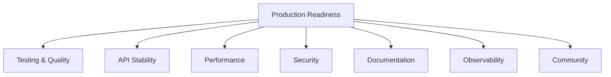
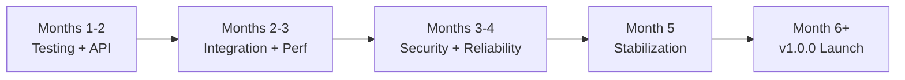

# LLM4S Roadmap

The single source of truth for LLM4S project status and future direction.

---

## Quick Status

| | |
|---|---|
| **Version** | 0.1.0-SNAPSHOT (Pre-release) |
| **Stability** | Active development, API stabilizing |
| **Target** | v1.0.0 Production-Ready |
| **Timeline** | Q2-Q3 2025 |

---

## What's Complete

### Core Platform Features

| Category | Feature | Status | Documentation |
|----------|---------|--------|---------------|
| **LLM Connectivity** | Multi-Provider Support | ✅ Complete | [Providers](/guide/providers) |
| | OpenAI Integration | ✅ Complete | [Basic Usage](/guide/basic-usage) |
| | Anthropic Integration | ✅ Complete | [Providers](/guide/providers) |
| | Google Gemini Integration | ✅ Complete | [Providers](/guide/providers) |
| | Azure OpenAI Integration | ✅ Complete | [Providers](/guide/providers) |
| | DeepSeek Integration | ✅ Complete | [Providers](/guide/providers) |
| | Ollama (Local Models) | ✅ Complete | [Providers](/guide/providers) |
| | Streaming Responses | ✅ Complete | [Streaming](/guide/streaming) |
| | Model Metadata API | ✅ Complete | [API Reference](/api/llm-client) |
| **Content** | Image Generation | ✅ Complete | [Image Generation](/guide/image-generation) |
| | Speech-to-Text (STT) | ✅ Complete | [Speech](/guide/speech) |
| | Text-to-Speech (TTS) | ✅ Complete | [Speech](/guide/speech) |
| | Embeddings API | ✅ Complete | [Embeddings](/guide/embeddings) |
| **Tools** | Tool Calling API | ✅ Complete | [Tools](/guide/tools) |
| | MCP Server Support | ✅ Complete | [MCP](/guide/mcp) |
| | Built-in Tools Module | ✅ Complete | [Examples](/examples/#tool-examples) |
| | Workspace Isolation | ✅ Complete | [Workspace](/advanced/workspace) |
| **Infrastructure** | Type-Safe Configuration | ✅ Complete | [Configuration](/guide/configuration) |
| | Result-Based Errors | ✅ Complete | [Error Handling](/guide/error-handling) |
| | Langfuse Observability | ✅ Complete | [Observability](/guide/observability) |
| | OpenTelemetry Tracing | ✅ Complete | [Tracing](/guide/observability) |
| | Cross-Version (2.13/3.x) | ✅ Complete | [Installation](/getting-started/installation) |

### Agent Framework

The agent framework extends core LLM4S with advanced capabilities. [Detailed design →](https://github.com/llm4s/llm4s/blob/main/docs/design/agent-framework-roadmap.md)

| Phase | Feature | Status | Key Capabilities |
|-------|---------|--------|------------------|
| 1.0 | Core Agent | ✅ Complete | Basic execution, tool calling, streaming |
| 1.1 | Conversations | ✅ Complete | Immutable state, `continueConversation()`, pruning |
| 1.2 | Guardrails | ✅ Complete | Input/output validation, LLM-as-Judge |
| 1.3 | Handoffs | ✅ Complete | Agent-to-agent delegation, context preservation |
| 1.4 | Memory | ✅ Complete | Short/long-term memory, SQLite, vector search |
| 2.1 | Streaming Events | ✅ Complete | Lifecycle events, `runWithEvents()` |
| 2.2 | Async Tools | ✅ Complete | Parallel execution strategies |
| 3.2 | Built-in Tools | ✅ Complete | DateTime, Calculator, HTTP, file ops |
| 4.1 | Reasoning Modes | ✅ Complete | Extended thinking for o1/o3, Claude |
| 4.3 | Serialization | ✅ Complete | AgentState save/load to JSON |

---

## Production Readiness

### The Seven Pillars

Production readiness is measured across seven pillars:

### Pillar Status

| Pillar | Goal | Status | Key Deliverable |
|--------|------|--------|-----------------|
| **Testing & Quality** | Catch bugs before runtime | 🚧 In Progress | 80%+ coverage target |
| **API Stability** | Safe upgrades with clear compatibility | 🚧 In Progress | MiMa checks, SemVer policy |
| **Performance** | Predictable behavior under load | 📋 Planned | JMH benchmarks, baselines |
| **Security** | Prevent data leaks, audit data flows | 📋 Planned | Threat model, dependency scanning |
| **Documentation** | Clone to working example quickly | 🚧 In Progress | Complete guides, Scaladoc |
| **Observability** | See what's happening in production | ✅ Complete | Langfuse, OpenTelemetry, structured logging |
| **Community** | Healthy contributor ecosystem | 🚧 In Progress | 10+ contributors target |

### Additional Completed Features

The following features have been implemented and are production-ready but were not part of the original roadmap:

| Feature | Status | Description | Documentation |
|---------|--------|-------------|---------------|
| **Google Gemini Provider** | ✅ Complete | Full integration with Google's Gemini models (2.0-flash, 1.5-pro) | [Providers](/guide/providers) |
| **DeepSeek Provider** | ✅ Complete | Support for DeepSeek LLM models including reasoning-capable deepseek-reasoner | [Providers](/guide/providers) |
| **OpenTelemetry Module** | ✅ Complete | Dedicated tracing module with OTLP export support | [Observability](/guide/observability) |
| **Metrics Collection** | ✅ Complete | Token usage tracking, cost estimation, latency metrics | [API Reference](/api/llm-client) |
| **Prometheus Metrics** | ✅ Complete | Production-grade metrics with PrometheusMetrics, MetricsCollector, PrometheusEndpoint, health checks | [Metrics Samples](/samples/metrics) |
| **Context Management System** | ✅ Complete | Multi-layered context compression: LLMCompressor, DeterministicCompressor, ToolOutputCompressor, HistoryCompressor, SemanticBlocks, TokenWindow, ConversationTokenCounter, ContextManager | [Context Samples](/samples/context) |
| **Assistant API** | ✅ Complete | Interactive assistant framework with AssistantAgent, SessionManager, SessionState, ConsoleInterface | [Assistant Samples](/samples/assistant) |
| **Image Processing/Vision** | ✅ Complete | Vision capabilities for image understanding with OpenAI Vision and Anthropic Claude Vision support | [Image Processing Examples](/samples/basic) |
| **Enhanced Error Context** | ✅ Complete | Detailed error messages with provider-specific diagnostics | [Error Handling](/guide/error-handling) |
| **Tracing Composition** | ✅ Complete | Compose multiple tracing backends (Langfuse + Console + OpenTelemetry) | [Examples](/examples/) |
| **Agent Context Bundling** | ✅ Complete | Unified AgentContext for cross-cutting concerns | [Agent Framework](/examples/#agent-examples) |
| **Exa Search Tool** | ✅ Complete | Built-in tool for web search using Exa API | [Built-in Tools](/examples/#tool-examples) |
| **Voyage AI Embeddings** | ✅ Complete | Support for Voyage AI embedding models (voyage-3, voyage-code-3) | [Embedding Providers](/guide/embeddings) |
| **Reasoning Modes** | ✅ Complete | Support for reasoning LLMs: OpenAI o1/o3, DeepSeek reasoner with configurable effort levels | [Reasoning Examples](/samples/reasoning) |
| **Session Serialization** | ✅ Complete | Save and restore agent state including conversation history for long-running workflows | [Agent Persistence](/design/phase-4.3-session-serialization)

### Known Limitations (v1.0)

- Tool registries are not serialized; tools must be re-attached when restoring `AgentState`
- Reasoning modes are provider-specific and may not be available on all models
- Memory stores have size and TTL limits; long-term retention belongs in external systems
- Hardware design extension is in proposal stage; not yet implemented in production

---

## Ongoing Features in Development

| Feature | Progress | Description | Status |
|---------|----------|-------------|--------|
| **MCP Full Implementation** | ~60% | Complete Model Context Protocol implementation with bidirectional communication, server scaffolding, and standardized tool protocols | Active development - client complete, server in progress |
| **Advanced Embedding Cache** | ~40% | Multi-layer caching for embeddings (in-memory + persistent) to reduce API costs and latency | Design phase - initial prototypes exist |
| **Prompt Optimization System** | ~30% | A/B testing framework, regression testing, systematic prompt improvement with performance tracking | Planning - initial issue templates created |
| **RAG Cost Tracking** | ~25% | Per-query cost tracking, embedding drift detection, latency percentiles (p50/p95/p99) | Requirements gathering |
| **Hardware Design Extension** | ~10% | LLM-powered hardware design toolkit for Chisel/FIRRTL ecosystem with agents for verification, DSE, and documentation | Proposal stage - comprehensive roadmap defined in [llm4s-hardware-design-roadmap.md](/roadmap/llm4s-hardware-design-roadmap) |
| **Output Grounding System** | ~15% | Claim extraction, fact-checking against RAG sources, hallucination detection, citation verification | Scoping phase |
| **HITL Evaluation System** | ~20% | Human-in-the-loop feedback collection, rating infrastructure, training signal generation for agent improvement | Architecture design |
| **BigQuery Observability** | ~10% | Production telemetry export to BigQuery for SQL-based analytics and dashboarding | Requirements  definition |
| **Vertex AI Provider** | ~15% | Google Cloud Vertex AI integration with ADC authentication, streaming, and tool calling support | Initial exploration |

---

## What's In Progress

| Feature | Progress | Blocking Issues |
|---------|----------|-----------------|
| **RAG Core Engine** | ✅ Complete | Retrieval pipeline shipped |
| **RAG Evaluation** | ✅ Complete | RAGAS metrics + benchmarking harness |
| **RAG Benchmarking** | ✅ Complete | Chunking, fusion, embedding comparison |
| **RAG in a Box** | ✅ Complete | [Separate project](https://github.com/llm4s/rag_in_a_box) - 194 tests, production-ready |
| **MCP Full Implementation** | ~50% | Full protocol, server implementation |
| **Advanced Embeddings** | ~60% | Multi-provider support, caching |
| **Enhanced Observability** | Planning | Plugin architecture, multi-backend |

### RAG Pipeline Roadmap

The RAG pipeline follows a 5-phase roadmap toward a production-grade retrieval system. The core library (Phases 1-3) lives in LLM4S; deployment tooling (Phase 5) is provided by the separate [RAG in a Box](https://github.com/llm4s/rag_in_a_box) project.

#### Phase 1: Foundation ✅ COMPLETE

| Component | Status | Notes |
|-----------|--------|-------|
| VectorStore Abstraction | ✅ Complete | Backend-agnostic trait |
| SQLite Backend | ✅ Complete | File-based and in-memory |
| pgvector Backend | ✅ Complete | PostgreSQL + pgvector extension |
| Qdrant Backend | ✅ Complete | REST API, local + cloud |
| BM25 Keyword Index | ✅ Complete | SQLite FTS5 + PostgreSQL native full-text search |
| Hybrid Search Fusion | ✅ Complete | RRF + weighted score strategies |

#### Phase 2: Intelligence ✅ COMPLETE

| Component | Status | Notes |
|-----------|--------|-------|
| Reranking Pipeline | ✅ Complete | Cohere + LLM-based reranking |
| Document Chunking | ✅ Complete | Simple, sentence-aware, markdown-aware, semantic chunkers |
| Ollama Embeddings | ✅ Complete | Local embedding support |

#### Phase 3: Evaluation & Quality ✅ COMPLETE

| Component | Status | Notes |
|-----------|--------|-------|
| RAGAS Evaluation | ✅ Complete | Faithfulness, answer relevancy, context precision/recall metrics |
| RAG Benchmarking Harness | ✅ Complete | Systematic comparison of chunking, fusion, embedding strategies |
| RAG-Specific Guardrails | ✅ Complete | PII detection/masking, prompt injection, grounding, context relevance, source attribution, topic boundary |
| RAG Cost Tracking | 📋 Planned | Per-query cost, latency percentiles (p50/p95/p99) |
| Embedding Drift Detection | 📋 Planned | Monitor embedding quality over time |
| Prompt Tuning & Optimization | 📋 Planned | Systematic prompt improvement, A/B testing, performance tracking |

#### Phase 4: Extended Integrations 📋 PLANNED

| Component | Status | Notes |
|-----------|--------|-------|
| Milvus Backend | 📋 Planned | GPU-accelerated vector search |
| Pinecone Backend | 📋 Planned | Cloud-managed vector DB |
| Cohere Embeddings | 📋 Planned | Multilingual embed-v3 |
| ONNX Embeddings | 📋 Planned | Local sentence-transformers |
| Embedding Cache | 📋 Planned | Reduce redundant embedding calls |
| Metadata Extraction | 📋 Planned | Titles, TOC, links, code blocks |

#### Phase 5: RAG in a Box Server ✅ COMPLETE

RAG in a Box is a production-ready RAG server built on the LLM4S framework, providing a complete REST API for document ingestion, semantic search, and AI-powered question answering.

| Component | Status | Notes |
|-----------|--------|-------|
| REST API Layer | ✅ Complete | Document ingestion, query endpoints, streaming responses |
| Docker Compose | ✅ Complete | Single-command deployment with PostgreSQL/pgvector |
| Kubernetes | ✅ Complete | Namespace, ConfigMap, Secrets, Deployments, Ingress templates |
| Admin UI | ✅ Complete | Vue.js dashboard with real-time stats, document browser, chunking preview |
| Security | ✅ Complete | JWT auth, PBKDF2 password hashing, CORS, input validation |
| Observability | ✅ Complete | Prometheus metrics, health checks (/health, /ready, /live) |
| CI/CD | ✅ Complete | 194 backend tests, security scanning (OWASP, Anchore) |

**Key Features:**
- Multi-format document ingestion (text, markdown, PDF, URLs)
- Configurable chunking strategies (simple, sentence, markdown, semantic)
- Collection-based organization with per-collection settings
- Hybrid search with RRF fusion (vector + keyword)
- Multi-provider support for embeddings (OpenAI, Voyage, Ollama) and LLM (OpenAI, Anthropic, Ollama)
- Production infrastructure: HikariCP connection pooling, structured logging, graceful shutdown

**Repository:** [github.com/llm4s/rag_in_a_box](https://github.com/llm4s/rag_in_a_box)

---

## What's Planned

### Near Term (Q1-Q2 2025)

| Feature | Priority | Description |
|---------|----------|-------------|
| RAG Vector Integrations | ✅ Done | SQLite, pgvector, Qdrant complete |
| RAG Hybrid Search | ✅ Done | BM25 + vector fusion with RRF |
| RAG Reranking Pipeline | ✅ Done | Cohere cross-encoder + LLM-based |
| RAG Document Chunking | ✅ Done | Sentence-aware, semantic, markdown chunking |
| **RAGAS Evaluation** | ✅ Done | Context precision/recall, faithfulness, answer relevancy |
| **RAG Benchmarking Harness** | ✅ Done | Systematic comparison of RAG configurations |
| **RAG Guardrails** | ✅ Done | PII detection/masking, prompt injection, grounding, context relevance, source attribution, topic boundary |
| Reliable Calling | P0 | Retry with backoff, circuit breakers, deadlines |
| Performance Benchmarks | P1 | JMH framework, baseline metrics |
| Security Audit | P1 | Threat model, vulnerability scanning |

### Medium Term (H2 2025)

| Feature | Priority | Description |
|---------|----------|-------------|
| **Prompt Tuning & Optimization** | P1 | Systematic prompt improvement, A/B testing, variant tracking |
| **RAG Cost & Latency Tracking** | P1 | Per-query metrics, embedding drift detection |
| Prompt Management | P2 | Template system with variable substitution |
| Caching Layer | P2 | LLM response + embedding caching for cost/latency |
| Cost Tracking | P2 | Token usage tracking and estimation |
| Provider Expansion | P2 | Cohere, Mistral, Gemini, LiteLLM |
| **Extended Vector DBs** | P2 | Milvus (GPU), Pinecone (cloud) |
| **ONNX Embeddings** | P2 | Local sentence-transformers runtime |

### Long Term (Post-1.0)

| Feature | Description |
|---------|-------------|
| Fine-tuning Support | Model adaptation, LoRA integration |
| Workflow Engines | Camunda/Temporal integration |
| Plugin Architecture | Community-contributed providers and tools |
| Advanced Multi-Agent | DAG orchestration, complex workflows |
| ~~**RAG in a Box**~~ | ✅ Complete - See [RAG in a Box](https://github.com/llm4s/rag_in_a_box) |

---

## Timeline Overview

| Phase | Focus | Key Outcomes |
|-------|-------|--------------|
| Months 1-2 | Testing + API audit | Coverage audit, public API documented |
| Months 2-3 | Integration + performance | Integration tests, JMH benchmarks |
| Months 3-4 | Security + reliability | Threat model, reliable calling |
| Month 5 | Stabilization | RC releases, API freeze |
| Month 6+ | Launch | v1.0.0 release, ecosystem growth |

---

## Reference Deployments

Three deployment patterns will be documented for production use:

| Pattern | Use Case | Key Components |
|---------|----------|----------------|
| **Laptop/Dev** | Experiments, learning | Single-node, local Ollama or single provider, console tracing |
| **Small K8s** | Single-tenant production | llm4s app + workspace, Langfuse, pgvector, K8s secrets |
| **Enterprise VPC** | Multi-tenant, regulated | Private networking, Vault, centralized logging, audit trails |

---

## Success Metrics (v1.0 Targets)

| Category | Metric | Current | Target |
|----------|--------|---------|--------|
| Quality | Statement Coverage | ~21% | 80% |
| Quality | Critical Bugs | - | 0 |
| Community | Contributors | 6 | 10+ |
| Adoption | Maven Downloads | - | 500/mo |
| Docs | ScalaDoc Coverage | <50% | 100% |

---

## Design Documents

Detailed technical designs are in [docs/design](https://github.com/llm4s/llm4s/tree/main/docs/design):

| Document | Purpose |
|----------|---------|
| [Agent Framework Roadmap](https://github.com/llm4s/llm4s/blob/main/docs/design/agent-framework-roadmap.md) | Comprehensive agent feature comparison and roadmap |
| [Phase 1.1: Conversations](https://github.com/llm4s/llm4s/blob/main/docs/design/phase-1.1-functional-conversation-management.md) | Functional conversation management design |
| [Phase 1.2: Guardrails](https://github.com/llm4s/llm4s/blob/main/docs/design/phase-1.2-guardrails-framework.md) | Input/output validation framework |
| [Phase 1.3: Handoffs](https://github.com/llm4s/llm4s/blob/main/docs/design/phase-1.3-handoff-mechanism.md) | Agent-to-agent delegation |
| [Phase 1.4: Memory](https://github.com/llm4s/llm4s/blob/main/docs/design/phase-1.4-memory-system.md) | Short/long-term memory system |
| [Phase 2.1: Streaming](https://github.com/llm4s/llm4s/blob/main/docs/design/phase-2.1-streaming-events.md) | Agent lifecycle events |
| [Phase 2.2: Async Tools](https://github.com/llm4s/llm4s/blob/main/docs/design/phase-2.2-async-tools.md) | Parallel tool execution |
| [Phase 3.2: Built-in Tools](https://github.com/llm4s/llm4s/blob/main/docs/design/phase-3.2-builtin-tools.md) | Standard tool library |
| [Phase 4.1: Reasoning](https://github.com/llm4s/llm4s/blob/main/docs/design/phase-4.1-reasoning-modes.md) | Extended thinking support |
| [Phase 4.3: Serialization](https://github.com/llm4s/llm4s/blob/main/docs/design/phase-4.3-session-serialization.md) | State persistence |

---

## Get Involved

- **Discord**: [Join the community](https://discord.gg/4uvTPn6qww)
- **GitHub**: [llm4s/llm4s](https://github.com/llm4s/llm4s)
- **Feature Requests**: [GitHub Issues](https://github.com/llm4s/llm4s/issues)
- **Dev Hour**: Sundays 9am London time

---

## Release Schedule

| Type | Frequency |
|------|-----------|
| SNAPSHOT builds | Weekly |
| Feature previews | Monthly |
| Milestone releases | Quarterly |
| **v1.0.0** | Q2-Q3 2025 |

After 1.0.0: Semantic Versioning with MiMa binary compatibility checks.
