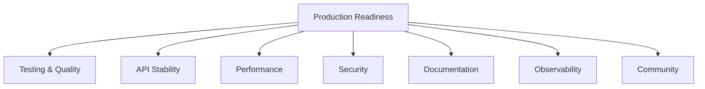
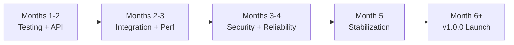

# LLM4S Roadmap

The single source of truth for LLM4S project status and future direction.

---

## Quick Status

| | |
|---|---|
| **Version** | 0.1.0-SNAPSHOT (Pre-release) |
| **Stability** | Active development, API stabilizing |
| **Target** | v1.0.0 Production-Ready |
| **Timeline** | Q2-Q3 2025 |

---

## What's Complete

### Core Platform Features

| Category | Feature | Status | Documentation |
|----------|---------|--------|---------------|
| **LLM Connectivity** | Multi-Provider Support | ✅ Complete | [Providers](/guide/providers) |
| | OpenAI Integration | ✅ Complete | [Basic Usage](/guide/basic-usage) |
| | Anthropic Integration | ✅ Complete | [Providers](/guide/providers) |
| | Azure OpenAI Integration | ✅ Complete | [Providers](/guide/providers) |
| | Ollama (Local Models) | ✅ Complete | [Providers](/guide/providers) |
| | Streaming Responses | ✅ Complete | [Streaming](/guide/streaming) |
| | Model Metadata API | ✅ Complete | [API Reference](/api/llm-client) |
| **Content** | Image Generation | ✅ Complete | [Image Generation](/guide/image-generation) |
| | Speech-to-Text (STT) | ✅ Complete | [Speech](/guide/speech) |
| | Text-to-Speech (TTS) | ✅ Complete | [Speech](/guide/speech) |
| | Embeddings API | ✅ Complete | [Embeddings](/guide/embeddings) |
| **Tools** | Tool Calling API | ✅ Complete | [Tools](/guide/tools) |
| | MCP Server Support | ✅ Complete | [MCP](/guide/mcp) |
| | Built-in Tools Module | ✅ Complete | [Examples](/examples/#tool-examples) |
| | Workspace Isolation | ✅ Complete | [Workspace](/advanced/workspace) |
| **Infrastructure** | Type-Safe Configuration | ✅ Complete | [Configuration](/guide/configuration) |
| | Result-Based Errors | ✅ Complete | [Error Handling](/guide/error-handling) |
| | Langfuse Observability | ✅ Complete | [Observability](/guide/observability) |
| | Cross-Version (2.13/3.x) | ✅ Complete | [Installation](/getting-started/installation) |

### Agent Framework

The agent framework extends core LLM4S with advanced capabilities. [Detailed design →](https://github.com/llm4s/llm4s/blob/main/docs/design/agent-framework-roadmap.md)

| Phase | Feature | Status | Key Capabilities |
|-------|---------|--------|------------------|
| 1.0 | Core Agent | ✅ Complete | Basic execution, tool calling, streaming |
| 1.1 | Conversations | ✅ Complete | Immutable state, `continueConversation()`, pruning |
| 1.2 | Guardrails | ✅ Complete | Input/output validation, LLM-as-Judge |
| 1.3 | Handoffs | ✅ Complete | Agent-to-agent delegation, context preservation |
| 1.4 | Memory | ✅ Complete | Short/long-term memory, SQLite, vector search |
| 2.1 | Streaming Events | ✅ Complete | Lifecycle events, `runWithEvents()` |
| 2.2 | Async Tools | ✅ Complete | Parallel execution strategies |
| 3.2 | Built-in Tools | ✅ Complete | DateTime, Calculator, HTTP, file ops |
| 4.1 | Reasoning Modes | ✅ Complete | Extended thinking for o1/o3, Claude |
| 4.3 | Serialization | ✅ Complete | AgentState save/load to JSON |

---

## Production Readiness

### The Seven Pillars

Production readiness is measured across seven pillars:

### Pillar Status

| Pillar | Goal | Status | Key Deliverable |
|--------|------|--------|-----------------|
| **Testing & Quality** | Catch bugs before runtime | 🚧 In Progress | 80%+ coverage target |
| **API Stability** | Safe upgrades with clear compatibility | 🚧 In Progress | MiMa checks, SemVer policy |
| **Performance** | Predictable behavior under load | 📋 Planned | JMH benchmarks, baselines |
| **Security** | Prevent data leaks, audit data flows | 📋 Planned | Threat model, dependency scanning |
| **Documentation** | Clone to working example quickly | 🚧 In Progress | Complete guides, Scaladoc |
| **Observability** | See what's happening in production | ✅ Complete | Langfuse, structured logging |
| **Community** | Healthy contributor ecosystem | 🚧 In Progress | 10+ contributors target |

### Known Limitations (v1.0)

- Tool registries are not serialized; tools must be re-attached when restoring `AgentState`
- Reasoning modes are provider-specific and may not be available on all models
- Memory stores have size and TTL limits; long-term retention belongs in external systems

---

## What's In Progress

| Feature | Progress | Blocking Issues |
|---------|----------|-----------------|
| **RAG Pipeline** | ~70% | Vector store integrations, chunking strategies |
| **MCP Full Implementation** | ~50% | Full protocol, server implementation |
| **Advanced Embeddings** | ~60% | Multi-provider support, caching |
| **Enhanced Observability** | Planning | Plugin architecture, multi-backend |

---

## What's Planned

### Near Term (Q1-Q2 2025)

| Feature | Priority | Description |
|---------|----------|-------------|
| RAG Vector Integrations | P0 | pgvector, Qdrant, Weaviate, Elasticsearch |
| RAG Document Chunking | P0 | Smart chunking for different document types |
| Reliable Calling | P0 | Retry with backoff, circuit breakers, deadlines |
| Performance Benchmarks | P1 | JMH framework, baseline metrics |
| Security Audit | P1 | Threat model, vulnerability scanning |

### Medium Term (H2 2025)

| Feature | Priority | Description |
|---------|----------|-------------|
| Prompt Management | P2 | Template system with variable substitution |
| Caching Layer | P2 | LLM response caching for cost/latency |
| Cost Tracking | P2 | Token usage tracking and estimation |
| Provider Expansion | P2 | Cohere, Mistral, Gemini, LiteLLM |

### Long Term (Post-1.0)

| Feature | Description |
|---------|-------------|
| Fine-tuning Support | Model adaptation, LoRA integration |
| Workflow Engines | Camunda/Temporal integration |
| Plugin Architecture | Community-contributed providers and tools |
| Advanced Multi-Agent | DAG orchestration, complex workflows |

---

## Timeline Overview

| Phase | Focus | Key Outcomes |
|-------|-------|--------------|
| Months 1-2 | Testing + API audit | Coverage audit, public API documented |
| Months 2-3 | Integration + performance | Integration tests, JMH benchmarks |
| Months 3-4 | Security + reliability | Threat model, reliable calling |
| Month 5 | Stabilization | RC releases, API freeze |
| Month 6+ | Launch | v1.0.0 release, ecosystem growth |

---

## Reference Deployments

Three deployment patterns will be documented for production use:

| Pattern | Use Case | Key Components |
|---------|----------|----------------|
| **Laptop/Dev** | Experiments, learning | Single-node, local Ollama or single provider, console tracing |
| **Small K8s** | Single-tenant production | llm4s app + workspace, Langfuse, pgvector, K8s secrets |
| **Enterprise VPC** | Multi-tenant, regulated | Private networking, Vault, centralized logging, audit trails |

---

## Success Metrics (v1.0 Targets)

| Category | Metric | Current | Target |
|----------|--------|---------|--------|
| Quality | Statement Coverage | ~21% | 80% |
| Quality | Critical Bugs | - | 0 |
| Community | Contributors | 6 | 10+ |
| Adoption | Maven Downloads | - | 500/mo |
| Docs | ScalaDoc Coverage | <50% | 100% |

---

## Design Documents

Detailed technical designs are in [docs/design](https://github.com/llm4s/llm4s/tree/main/docs/design):

| Document | Purpose |
|----------|---------|
| [Agent Framework Roadmap](https://github.com/llm4s/llm4s/blob/main/docs/design/agent-framework-roadmap.md) | Comprehensive agent feature comparison and roadmap |
| [Phase 1.1: Conversations](https://github.com/llm4s/llm4s/blob/main/docs/design/phase-1.1-functional-conversation-management.md) | Functional conversation management design |
| [Phase 1.2: Guardrails](https://github.com/llm4s/llm4s/blob/main/docs/design/phase-1.2-guardrails-framework.md) | Input/output validation framework |
| [Phase 1.3: Handoffs](https://github.com/llm4s/llm4s/blob/main/docs/design/phase-1.3-handoff-mechanism.md) | Agent-to-agent delegation |
| [Phase 1.4: Memory](https://github.com/llm4s/llm4s/blob/main/docs/design/phase-1.4-memory-system.md) | Short/long-term memory system |
| [Phase 2.1: Streaming](https://github.com/llm4s/llm4s/blob/main/docs/design/phase-2.1-streaming-events.md) | Agent lifecycle events |
| [Phase 2.2: Async Tools](https://github.com/llm4s/llm4s/blob/main/docs/design/phase-2.2-async-tools.md) | Parallel tool execution |
| [Phase 3.2: Built-in Tools](https://github.com/llm4s/llm4s/blob/main/docs/design/phase-3.2-builtin-tools.md) | Standard tool library |
| [Phase 4.1: Reasoning](https://github.com/llm4s/llm4s/blob/main/docs/design/phase-4.1-reasoning-modes.md) | Extended thinking support |
| [Phase 4.3: Serialization](https://github.com/llm4s/llm4s/blob/main/docs/design/phase-4.3-session-serialization.md) | State persistence |

---

## Get Involved

- **Discord**: [Join the community](https://discord.gg/4uvTPn6qww)
- **GitHub**: [llm4s/llm4s](https://github.com/llm4s/llm4s)
- **Feature Requests**: [GitHub Issues](https://github.com/llm4s/llm4s/issues)
- **Dev Hour**: Sundays 9am London time

---

## Release Schedule

| Type | Frequency |
|------|-----------|
| SNAPSHOT builds | Weekly |
| Feature previews | Monthly |
| Milestone releases | Quarterly |
| **v1.0.0** | Q2-Q3 2025 |

After 1.0.0: Semantic Versioning with MiMa binary compatibility checks.
