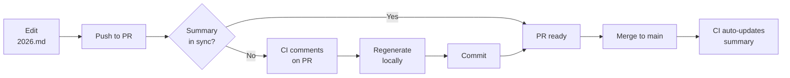

# GSoC Summary Generation

## Overview

This script automatically generates `GSOC-2026-SUMMARY.md` from `Project Ideas/2026.md`.

## Usage

### Manual Generation

```bash
scala-cli scripts/GenerateGSoCSummary.scala
```

This will:
- Parse all projects from `Project Ideas/2026.md`
- Extract project metadata (mentors, difficulty, hours)
- Generate a complete summary with statistics
- Write to `Google Summer of Code/GSOC-2026-SUMMARY.md`

### Automatic via GitHub Actions

The workflow `.github/workflows/gsoc-summary-sync.yml` runs automatically:

**On Pull Requests:**
- Checks if summary matches project ideas
- Posts a comment if regeneration is needed or not
- Prevents merge of stale summaries

**On Main Branch Push:**
- Automatically regenerates and commits updated summary
- Keeps summary synchronized without manual intervention

## Requirements

- Scala CLI (installed via GitHub Actions or locally)
- Read access to `Google Summer of Code/Project Ideas/2026.md`
- Write access to `Google Summer of Code/GSOC-2026-SUMMARY.md`

## What It Does

1. **Parses Project Structure**
   - Numbered projects (#1-48)
   - llm4s-tripper projects (numbered 49-63)
   - Extracts from markdown tables: Mentor, Co-mentor, Difficulty, Expected Hours

2. **Generates Statistics**
   - Total project count
   - Breakdown by difficulty (Easy/Medium/Hard)
   - Breakdown by duration (175h/350h)
   - Percentage calculations

3. **Creates Complete Summary**
   - Project table with clickable GitHub links
   - Mentor contact information
   - Statistical breakdowns
   - Repository links
   - Community information

## Benefits

- Always Synchronized - Summary auto-updates when source changes  
- No Manual Work - Run one command or let CI handle it  
- Prevents Errors - No risk of forgetting to update counts  
- Consistent Format - Generated markdown is always properly formatted  
- Audit Trail - Git commits show when/why summary changed

## Workflow



## Example Output

```
Reading: Google Summer of Code/Project Ideas/2026.md
Parsing projects...
✓ Found 63 projects
Generating summary...
Writing: Google Summer of Code/GSOC-2026-SUMMARY.md
✓ Summary generated successfully!
   Total: 63 projects
   Easy: 3
   Medium: 30
   Hard: 30
```
